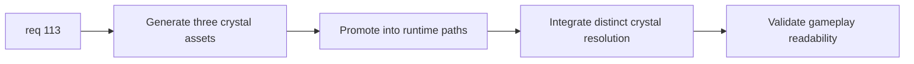

## item_389_define_three_crystal_asset_generation_promotion_and_runtime_integration - Define three crystal asset generation, promotion, and runtime integration
> From version: 0.6.1+c2d57bc
> Schema version: 1.0
> Status: Done
> Understanding: 98%
> Confidence: 95%
> Progress: 100%
> Complexity: Medium
> Theme: Graphics
> Reminder: Update status/understanding/confidence/progress and linked task references when you edit this doc.

# Problem
- After the trio is framed, `req_113` still needs generation, promotion, and runtime coverage.
- Without that slice, the three crystal variants can remain conceptual or gallery-only.

# Scope
- In:
- define generation/promotion workflow for the three crystal assets
- define runtime integration so the three types resolve distinct assets
- define gameplay-scale validation expectations
- Out:
- broader pickup-family redesign
- shell archive work beyond what runtime coverage needs

# Acceptance criteria
- AC1: The slice defines a generation/promotion workflow for the three crystal assets.
- AC2: The slice defines runtime integration so the three crystal types no longer collapse to one shared asset.
- AC3: The slice defines gameplay-scale validation for the resulting variants.
- AC4: The slice stays bounded to the crystal trio.

# AC Traceability
- AC1 -> Scope: generation/promotion. Proof: workflow explicit.
- AC2 -> Scope: runtime integration. Proof: distinct crystal resolution required.
- AC3 -> Scope: gameplay validation. Proof: in-scene readability checks identified.
- AC4 -> Scope: bounded trio. Proof: no broader pickup overhaul.

# Decision framing
- Product framing: Required
- Product signals: pickup readability, tier recognition
- Product follow-up: later shell/archive use can come separately.
- Architecture framing: Required
- Architecture signals: asset pipeline, runtime resolution, tier mapping
- Architecture follow-up: none unless crystal taxonomy expands later.

# Links
- Product brief(s): `prod_017_graphical_asset_direction_for_runtime_readability_and_shell_identity`
- Architecture decision(s): `adr_052_adopt_a_content_driven_graphical_asset_pipeline_for_runtime_and_shell_surfaces`
- Request: `req_113_define_three_distinct_generated_assets_for_the_three_crystal_types`
- Primary task(s): `task_073_orchestrate_boss_cleanup_seed_archive_and_crystal_persistence_wave`

# AI Context
- Summary: Define generation, promotion, and runtime integration for the three crystal assets.
- Keywords: crystal asset workflow, promotion, runtime integration, tiered pickups
- Use when: Use when implementing req 113.
- Skip when: Skip when only framing crystal identity.

# References
- `src/game/entities/render/entityPresentation.ts`
- `src/game/entities/render/EntityScene.tsx`
- `scripts/assets/generateFirstWaveAssets.mjs`
- `scripts/assets/promoteFirstWaveAssets.mjs`
