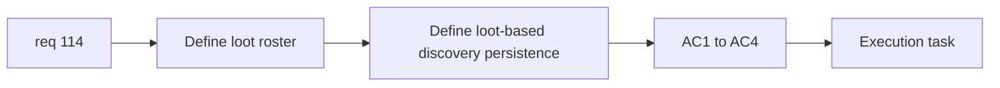

## item_390_define_loot_archive_roster_taxonomy_and_discovery_persistence - Define loot archive roster, taxonomy, and discovery persistence
> From version: 0.6.1+c2d57bc
> Schema version: 1.0
> Status: Done
> Understanding: 98%
> Confidence: 96%
> Progress: 100%
> Complexity: Medium
> Theme: UI
> Reminder: Update status/understanding/confidence/progress and linked task references when you edit this doc.

# Problem
- `req_114` needs the loot roster and discovery persistence contract before the shell surface is built.
- Without that, the archive can ship with mismatched item categories or no stable unlock rule.

# Scope
- In:
- define the first loot archive roster
- define lightweight category/taxonomy posture
- define discovery persistence by actual loot collection
- Out:
- main menu routing
- loot archive UI composition

# Acceptance criteria
- AC1: The slice defines the first loot archive roster in scope.
- AC2: The slice defines a lightweight category/taxonomy posture for those drops.
- AC3: The slice defines that unlocks are driven by actual loot collection.
- AC4: The slice stays focused on data/discovery persistence rather than shell layout.

# AC Traceability
- AC1 -> Scope: roster. Proof: drop families listed explicitly.
- AC2 -> Scope: taxonomy. Proof: bounded grouping posture explicit.
- AC3 -> Scope: discovery persistence. Proof: loot-driven unlock seam explicit.
- AC4 -> Scope: bounded slice. Proof: no UI composition creep.

# Decision framing
- Product framing: Required
- Product signals: archive trust, coherent discovery
- Product follow-up: none before shell surface work.
- Architecture framing: Required
- Architecture signals: persistence seam, loot discovery source of truth
- Architecture follow-up: none unless archive types later multiply.

# Links
- Product brief(s): `prod_017_graphical_asset_direction_for_runtime_readability_and_shell_identity`
- Architecture decision(s): `adr_052_adopt_a_content_driven_graphical_asset_pipeline_for_runtime_and_shell_surfaces`
- Request: `req_114_define_a_loot_archive_screen_with_loot_gated_drop_discovery`
- Primary task(s): `task_073_orchestrate_boss_cleanup_seed_archive_and_crystal_persistence_wave`

# AI Context
- Summary: Define the loot archive roster, taxonomy, and loot-driven persistence contract.
- Keywords: loot archive, roster, discovery, persistence, drops
- Use when: Use when preparing req 114 implementation.
- Skip when: Skip when only laying out the shell screen.

# References
- `src/app/model/metaProgression.ts`
- `games/emberwake/src/content/entities/entityData.ts`
- `games/emberwake/src/runtime/entitySimulation.ts`
