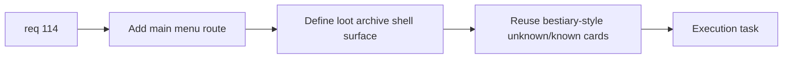

## item_391_define_loot_archive_main_menu_entry_and_bestiary_style_shell_surface - Define loot archive main menu entry and bestiary-style shell surface
> From version: 0.6.1+c2d57bc
> Schema version: 1.0
> Status: Draft
> Understanding: 98%
> Confidence: 95%
> Progress: 0%
> Complexity: Medium
> Theme: UI
> Reminder: Update status/understanding/confidence/progress and linked task references when you edit this doc.

# Problem
- Once the loot roster and persistence exist, `req_114` still needs the actual shell route and screen posture.
- Without that slice, the archive remains conceptual and inaccessible from the main menu.

# Scope
- In:
- define the new main menu entry
- define the loot archive shell scene posture
- define bestiary-like known/unknown presentation behavior
- Out:
- inventory/stash semantics
- broader bestiary redesign

# Acceptance criteria
- AC1: The slice defines the main menu entry and route to the loot archive.
- AC2: The slice defines the shell surface posture for the loot archive.
- AC3: The slice defines bestiary-like known/unknown presentation behavior.
- AC4: The slice stays bounded away from inventory semantics.

# AC Traceability
- AC1 -> Scope: menu route. Proof: entry and route explicit.
- AC2 -> Scope: shell surface. Proof: scene posture explicit.
- AC3 -> Scope: archive style. Proof: redacted/known behavior explicit.
- AC4 -> Scope: bounded shell archive. Proof: no inventory semantics.

# Decision framing
- Product framing: Required
- Product signals: discoverability, shell coherence
- Product follow-up: possible future archive expansion.
- Architecture framing: Optional
- Architecture signals: scene registration and shell component reuse
- Architecture follow-up: none unless archive scenes proliferate.

# Links
- Product brief(s): `prod_017_graphical_asset_direction_for_runtime_readability_and_shell_identity`
- Architecture decision(s): `adr_052_adopt_a_content_driven_graphical_asset_pipeline_for_runtime_and_shell_surfaces`
- Request: `req_114_define_a_loot_archive_screen_with_loot_gated_drop_discovery`
- Primary task(s): `task_073_orchestrate_boss_cleanup_seed_archive_and_crystal_persistence_wave`

# AI Context
- Summary: Define the main menu entry and bestiary-style shell surface for the loot archive.
- Keywords: main menu, loot archive, shell scene, bestiary style
- Use when: Use when implementing req 114 UI.
- Skip when: Skip when only defining discovery persistence.

# References
- `src/app/model/appScene.ts`
- `src/app/components/AppMetaScenePanel.tsx`
- `src/app/components/CodexArchiveScene.tsx`
