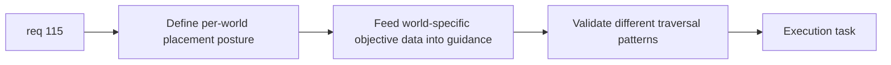

## item_393_define_per_world_mission_objective_placement_and_guidance_integration - Define per-world mission objective placement and guidance integration
> From version: 0.6.1+c2d57bc
> Schema version: 1.0
> Status: Done
> Understanding: 98%
> Confidence: 95%
> Progress: 100%
> Complexity: Medium
> Theme: Gameplay
> Reminder: Update status/understanding/confidence/progress and linked task references when you edit this doc.

# Problem
- After world-specific objective rosters exist, `req_115` still needs distinct placement and guidance integration.
- Without that slice, mission names can differ while traversal still feels identical.

# Scope
- In:
- define distinct per-world objective placement posture
- define how guidance consumes world-specific objective metadata
- define validation for different traversal patterns across worlds
- Out:
- optional side objectives
- broad campaign graph work

# Acceptance criteria
- AC1: The slice defines distinct per-world objective placement posture.
- AC2: The slice defines how mission/guidance systems consume world-specific objective data.
- AC3: The slice defines validation for differentiated traversal patterns across worlds.
- AC4: The slice stays bounded to placement and guidance integration.

# AC Traceability
- AC1 -> Scope: placement posture. Proof: distinct per-world placement explicit.
- AC2 -> Scope: guidance integration. Proof: world-specific data consumption explicit.
- AC3 -> Scope: validation. Proof: traversal differentiation checks identified.
- AC4 -> Scope: bounded integration. Proof: no side-quest creep.

# Decision framing
- Product framing: Required
- Product signals: world differentiation through traversal
- Product follow-up: none before implementation.
- Architecture framing: Required
- Architecture signals: mission metadata flow into runtime/guidance
- Architecture follow-up: none unless mission graph becomes broader.

# Links
- Product brief(s): (none yet)
- Architecture decision(s): (none yet)
- Request: `req_115_define_unique_per_world_primary_mission_objectives_with_distinct_names_and_positions`
- Primary task(s): `task_073_orchestrate_boss_cleanup_seed_archive_and_crystal_persistence_wave`

# AI Context
- Summary: Define placement and guidance integration for per-world mission objective data.
- Keywords: objective placement, world-specific guidance, traversal differentiation
- Use when: Use when implementing req 115.
- Skip when: Skip when only framing mission naming.

# References
- `games/emberwake/src/runtime/entitySimulation.ts`
- `src/shared/model/worldProfiles.ts`
- `src/app/components/ActiveRuntimeShellContent.tsx`
