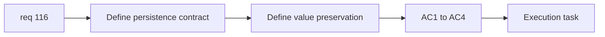

## item_394_define_crystal_persistence_and_value_preservation_rules - Define crystal persistence and value preservation rules
> From version: 0.6.1+c2d57bc
> Schema version: 1.0
> Status: Done
> Understanding: 98%
> Confidence: 96%
> Progress: 100%
> Complexity: Small
> Theme: Gameplay
> Reminder: Update status/understanding/confidence/progress and linked task references when you edit this doc.

# Problem
- `req_116` first needs an explicit persistence and value-preservation contract for crystals.
- Without that contract, compaction logic can still feel like deletion or silent reward loss.

# Scope
- In:
- define that crystal reward value must persist until collection or bounded fusion
- define exact value-preservation expectations during fusion
- define what counts as unacceptable disappearance
- Out:
- distance/density tuning and runtime validation detail
- broader pickup-family persistence

# Acceptance criteria
- AC1: The slice defines that crystal reward value must persist until collection or bounded fusion.
- AC2: The slice defines exact value-preservation expectations during fusion/compaction.
- AC3: The slice defines what counts as unacceptable crystal disappearance.
- AC4: The slice stays at persistence/value contract level.

# AC Traceability
- AC1 -> Scope: persistence contract. Proof: persistence rule explicit.
- AC2 -> Scope: value preservation. Proof: exact preservation posture explicit.
- AC3 -> Scope: disappearance boundary. Proof: unacceptable loss cases named.
- AC4 -> Scope: bounded framing. Proof: no tuning creep.

# Decision framing
- Product framing: Required
- Product signals: player trust, reward fairness
- Product follow-up: none before tuning.
- Architecture framing: Required
- Architecture signals: stack value preservation, pickup contract ownership
- Architecture follow-up: none unless broader pickup persistence later appears.

# Links
- Product brief(s): (none yet)
- Architecture decision(s): (none yet)
- Request: `req_116_define_a_crystal_persistence_and_compaction_posture_for_far_and_dense_runtime_pickups`
- Primary task(s): `task_073_orchestrate_boss_cleanup_seed_archive_and_crystal_persistence_wave`

# AI Context
- Summary: Define crystal persistence and exact value-preservation rules before compaction tuning starts.
- Keywords: crystal persistence, value preservation, reward trust, compaction
- Use when: Use when framing req 116.
- Skip when: Skip when already tuning distance/density behavior.

# References
- `games/emberwake/src/runtime/entitySimulation.ts`
- `games/emberwake/src/runtime/entitySimulationCombat.ts`
- `games/emberwake/src/runtime/pickupContract.ts`
