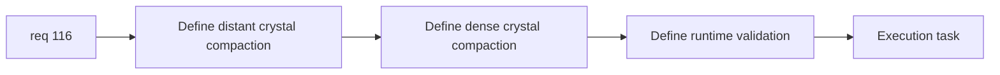

## item_395_define_far_dense_crystal_compaction_tuning_and_runtime_validation - Define far/dense crystal compaction tuning and runtime validation
> From version: 0.6.1+c2d57bc
> Schema version: 1.0
> Status: Done
> Understanding: 98%
> Confidence: 95%
> Progress: 100%
> Complexity: Medium
> Theme: Gameplay
> Reminder: Update status/understanding/confidence/progress and linked task references when you edit this doc.

# Problem
- After persistence/value rules are clear, `req_116` still needs distance/density compaction tuning and validation.
- Without that slice, crystals may remain technically preserved but still perform or read badly in long sessions.

# Scope
- In:
- define compaction posture for distant crystals
- define compaction posture for overly dense crystal populations
- define runtime validation for trustworthy long-session behavior
- Out:
- pickup art changes
- broad loot-system redesign

# Acceptance criteria
- AC1: The slice defines compaction posture for distant crystals.
- AC2: The slice defines compaction posture for overly dense crystal populations.
- AC3: The slice defines runtime validation for trustworthy long-session crystal behavior.
- AC4: The slice stays bounded to crystal tuning and validation.

# AC Traceability
- AC1 -> Scope: distant compaction. Proof: far-away compaction posture explicit.
- AC2 -> Scope: dense compaction. Proof: overpopulation compaction posture explicit.
- AC3 -> Scope: validation. Proof: long-session checks identified.
- AC4 -> Scope: bounded tuning. Proof: no art/economy creep.

# Decision framing
- Product framing: Required
- Product signals: crystal trust, readable pickup behavior
- Product follow-up: possible later extension to gold if still needed.
- Architecture framing: Required
- Architecture signals: stackable pickup compaction, runtime validation seams
- Architecture follow-up: none unless generalized pickup compaction later appears.

# Links
- Product brief(s): (none yet)
- Architecture decision(s): (none yet)
- Request: `req_116_define_a_crystal_persistence_and_compaction_posture_for_far_and_dense_runtime_pickups`
- Primary task(s): `task_073_orchestrate_boss_cleanup_seed_archive_and_crystal_persistence_wave`

# AI Context
- Summary: Define distance/density compaction tuning and runtime validation for crystal persistence.
- Keywords: crystal compaction, distant pickups, dense pickups, runtime validation
- Use when: Use when implementing req 116.
- Skip when: Skip when only framing value preservation rules.

# References
- `games/emberwake/src/runtime/entitySimulation.ts`
- `games/emberwake/src/runtime/entitySimulationCombat.ts`
- `games/emberwake/src/config/gameplayTuning.ts`
