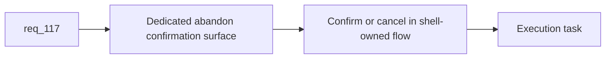

## item_396_define_a_dedicated_runtime_shell_abandon_confirmation_surface - Define a dedicated runtime shell abandon confirmation surface
> From version: 0.7.0+1b1dda6
> Schema version: 1.0
> Status: Done
> Understanding: 98%
> Confidence: 96%
> Progress: 100%
> Complexity: Medium
> Theme: Shell
> Reminder: Update status/understanding/confidence/progress and linked task references when you edit this doc.

# Problem
- `req_117` is clear, but the repo still routes `Abandon run` through a generic confirmation path.
- A terminal runtime action should be confirmed in a shell-owned way instead of borrowing the global modal system.

# Scope
- In:
- define the dedicated in-run abandon confirmation surface and its entry from the live shell menu
- define confirm/cancel behavior, focus posture, and safe return to the in-run menu
- remove abandon confirmation’s dependency on the generic modal system
- Out:
- redesigning other confirmations
- changing abandon gameplay consequences

# Acceptance criteria
- AC1: The slice defines a dedicated shell-owned abandon confirmation surface.
- AC2: The slice defines confirm and cancel outcomes from that surface.
- AC3: The slice removes abandon confirmation’s dependency on the generic modal system.
- AC4: The slice stays bounded to abandon confirmation UX.

# AC Traceability
- AC1 -> Scope: dedicated surface. Proof: explicit runtime shell confirmation state defined.
- AC2 -> Scope: confirm/cancel flow. Proof: safe terminal and cancel return paths identified.
- AC3 -> Scope: modal decoupling. Proof: generic modal path not used for abandon.
- AC4 -> Scope: bounded UX slice. Proof: no unrelated confirmation redesign in scope.

# Decision framing
- Product framing: Not needed
- Product signals: run-ending clarity, input safety
- Product follow-up: none expected if scoped to abandon only.
- Architecture framing: Required
- Architecture signals: shell scene ownership, runtime/menu boundaries
- Architecture follow-up: add ADR only if a broader shell confirmation seam emerges.

# Links
- Product brief(s): (none yet)
- Architecture decision(s): (none yet)
- Request: `req_117_define_a_dedicated_in_run_abandon_confirmation_surface_instead_of_the_generic_modal_system`
- Primary task(s): `task_074_orchestrate_shell_confirmation_seeded_missions_and_miniboss_reward_wave`

# AI Context
- Summary: Replace generic modal-based abandon confirmation with a dedicated runtime shell confirmation surface.
- Keywords: abandon, confirmation, shell, runtime menu, modal removal
- Use when: Use when implementing req 117.
- Skip when: Skip when changing abandon consequences or global modal architecture.

# References
- `src/app/AppShell.tsx`
- `src/app/components/ShellMenu.tsx`
- `src/app/components/ActiveRuntimeShellContent.tsx`
