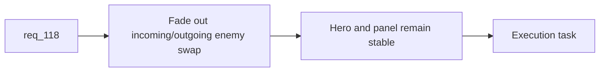

## item_397_define_a_fade_transition_contract_for_rotating_main_screen_enemy_backdrops - Define a fade transition contract for rotating main-screen enemy backdrops
> From version: 0.7.0+1b1dda6
> Schema version: 1.0
> Status: Done
> Understanding: 98%
> Confidence: 96%
> Progress: 100%
> Complexity: Low
> Theme: Shell
> Reminder: Update status/understanding/confidence/progress and linked task references when you edit this doc.

# Problem
- `req_118` calls for smoother main-screen enemy swaps, but the repo still lacks a concrete transition contract.
- Without a bounded fade posture, the main-screen backdrop rotation will keep feeling abrupt.

# Scope
- In:
- define fade-out/fade-in behavior for rotating enemy backdrop swaps
- keep hero and central panel stable
- validate desktop and mobile shell layouts
- Out:
- full shell animation redesign
- changing rotation roster or cadence beyond transition support

# Acceptance criteria
- AC1: The slice defines a bounded fade transition for rotating enemy backdrop swaps.
- AC2: The slice keeps the hero and menu panel stable during the transition.
- AC3: The slice includes desktop and mobile shell validation expectations.
- AC4: The slice stays bounded to main-screen backdrop rotation transition.

# AC Traceability
- AC1 -> Scope: fade posture. Proof: explicit enemy swap transition contract defined.
- AC2 -> Scope: stability. Proof: hero/panel excluded from the fade target.
- AC3 -> Scope: validation. Proof: desktop/mobile checks identified.
- AC4 -> Scope: bounded shell slice. Proof: no broader shell animation redesign in scope.

# Decision framing
- Product framing: Not needed
- Product signals: main-menu polish, perceived quality
- Product follow-up: none expected if kept bounded.
- Architecture framing: Not needed
- Architecture signals: (none detected)
- Architecture follow-up: none.

# Links
- Product brief(s): (none yet)
- Architecture decision(s): (none yet)
- Request: `req_118_define_a_fade_in_fade_out_transition_posture_for_main_screen_background_entity_rotation`
- Primary task(s): `task_074_orchestrate_shell_confirmation_seeded_missions_and_miniboss_reward_wave`

# AI Context
- Summary: Define a fade transition contract for rotating enemy backdrops on the main screen.
- Keywords: main menu, fade, enemy rotation, backdrop, shell polish
- Use when: Use when implementing req 118.
- Skip when: Skip when changing gameplay rendering or full shell animation systems.

# References
- `src/app/components/AppMetaScenePanel.tsx`
- `src/app/styles/app.css`
