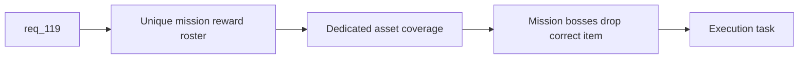

## item_398_define_unique_primary_mission_reward_item_roster_and_asset_coverage - Define unique primary mission reward item roster and asset coverage
> From version: 0.7.0+1b1dda6
> Schema version: 1.0
> Status: Done
> Understanding: 98%
> Confidence: 96%
> Progress: 100%
> Complexity: High
> Theme: Gameplay
> Reminder: Update status/understanding/confidence/progress and linked task references when you edit this doc.

# Problem
- `req_119` identifies that mission reward labels differ but real mission reward items still collapse to a generic pickup.
- Without explicit content and asset coverage, the mission loop still feels generic despite per-world naming.

# Scope
- In:
- define a unique reward item roster for every current world/stage mission objective
- define dedicated runtime asset coverage for those mission reward items
- define the mission-boss drop seam so the correct objective-specific item is produced
- Out:
- seeded objective placement logic
- side quests or broader loot system redesign

# Acceptance criteria
- AC1: The slice defines a unique mission reward item roster for the current world/stage objective set.
- AC2: The slice defines dedicated runtime asset identities for those mission reward items.
- AC3: The slice defines the drop seam so mission bosses emit the correct objective-specific item.
- AC4: The slice stays bounded to reward identity and asset coverage.

# AC Traceability
- AC1 -> Scope: reward roster. Proof: explicit world/stage item roster defined.
- AC2 -> Scope: asset coverage. Proof: dedicated asset ids required.
- AC3 -> Scope: drop seam. Proof: mission-boss reward mapping identified.
- AC4 -> Scope: bounded slice. Proof: seeded placement excluded.

# Decision framing
- Product framing: Required
- Product signals: mission identity, collectible clarity, archive coherence
- Product follow-up: later loot archive expansion may consume the same reward roster.
- Architecture framing: Required
- Architecture signals: pickup/content contracts, asset catalog growth
- Architecture follow-up: add ADR only if mission reward item taxonomy becomes a reusable system seam.

# Links
- Product brief(s): (none yet)
- Architecture decision(s): (none yet)
- Request: `req_119_define_unique_per_world_mission_reward_items_and_seeded_objective_positions`
- Primary task(s): `task_074_orchestrate_shell_confirmation_seeded_missions_and_miniboss_reward_wave`

# AI Context
- Summary: Define unique mission reward items and dedicated asset coverage for every primary mission objective.
- Keywords: mission rewards, unique items, mission drops, assets, world objectives
- Use when: Use when implementing the reward-identity half of req 119.
- Skip when: Skip when only working on seeded objective placement.

# References
- `games/emberwake/src/runtime/missionLoop.ts`
- `games/emberwake/src/runtime/entitySimulation.ts`
- `src/assets/assetCatalog.ts`
- `games/emberwake/src/content/entities/entityData.ts`
