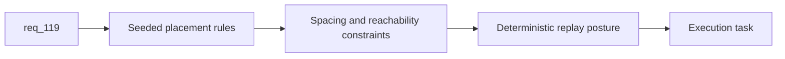

## item_399_define_seeded_world_specific_primary_mission_objective_placement - Define seeded world-specific primary mission objective placement
> From version: 0.7.0+1b1dda6
> Schema version: 1.0
> Status: Draft
> Understanding: 98%
> Confidence: 96%
> Progress: 0%
> Complexity: High
> Theme: Gameplay
> Reminder: Update status/understanding/confidence/progress and linked task references when you edit this doc.

# Problem
- `req_119` asks for objective positions to vary deterministically by run seed, but the current mission loop still uses fixed coordinates per world.
- Without a seeded placement contract, runs on the same world keep the same traversal pattern forever.

# Scope
- In:
- define seeded mission objective placement rules derived from selected world plus run seed
- define spacing, reachability, and world-appropriateness constraints
- define deterministic replay expectations for same player/world inputs
- Out:
- mission reward asset coverage
- arbitrary procedural quest generation

# Acceptance criteria
- AC1: The slice defines seeded mission objective placement rules from world plus derived run seed.
- AC2: The slice defines spacing and reachability constraints for seeded objectives.
- AC3: The slice defines deterministic replay posture for identical inputs.
- AC4: The slice stays bounded to seeded placement rather than full procedural quest generation.

# AC Traceability
- AC1 -> Scope: placement rules. Proof: world/seed-derived objective placement seam defined.
- AC2 -> Scope: constraints. Proof: spacing/reachability rules listed.
- AC3 -> Scope: replay. Proof: same inputs same layout behavior required.
- AC4 -> Scope: bounded generation. Proof: full quest generator out of scope.

# Decision framing
- Product framing: Required
- Product signals: replayability, traversal freshness, mission identity
- Product follow-up: later side-quest variation may reuse seeded placement ideas.
- Architecture framing: Required
- Architecture signals: world/seed ownership, mission metadata, deterministic generation
- Architecture follow-up: add ADR only if seeded mission placement becomes a foundational world-generation seam.

# Links
- Product brief(s): (none yet)
- Architecture decision(s): (none yet)
- Request: `req_119_define_unique_per_world_mission_reward_items_and_seeded_objective_positions`
- Primary task(s): `task_074_orchestrate_shell_confirmation_seeded_missions_and_miniboss_reward_wave`

# AI Context
- Summary: Define seeded, world-specific placement rules for primary mission objectives instead of fixed per-world coordinates.
- Keywords: mission objectives, seeded placement, deterministic world, traversal
- Use when: Use when implementing the placement half of req 119.
- Skip when: Skip when only working on mission reward items/assets.

# References
- `games/emberwake/src/runtime/missionLoop.ts`
- `src/shared/model/worldSeed.ts`
- `src/shared/model/worldProfiles.ts`
