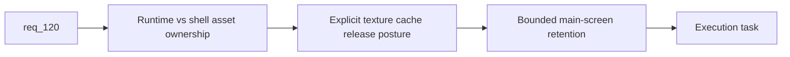

## item_400_define_terminal_runtime_texture_cache_release_and_asset_ownership_boundaries - Define terminal runtime texture-cache release and asset-ownership boundaries
> From version: 0.7.0+1b1dda6
> Schema version: 1.0
> Status: Done
> Understanding: 98%
> Confidence: 96%
> Progress: 100%
> Complexity: Medium
> Theme: Performance
> Reminder: Update status/understanding/confidence/progress and linked task references when you edit this doc.

# Problem
- `req_120` is clear that terminal run cleanup must release more than gameplay state, but the repo still lacks a concrete ownership boundary for texture caches.
- Without that boundary, terminal returns to the main screen can keep heavy runtime texture memory alive.

# Scope
- In:
- define which runtime texture caches are terminal-cleanup responsibility
- define explicit release/destroy posture for runtime-owned textures
- define bounded shell/main-screen asset retention ownership
- Out:
- full asset streaming rewrite
- browser-wide memory management beyond the app seams

# Acceptance criteria
- AC1: The slice defines which runtime texture caches are terminal cleanup responsibility.
- AC2: The slice defines explicit release/destroy posture for runtime-owned textures.
- AC3: The slice defines bounded shell/main-screen asset retention ownership.
- AC4: The slice stays bounded to terminal cleanup ownership and release seams.

# AC Traceability
- AC1 -> Scope: ownership boundary. Proof: runtime cache responsibility explicit.
- AC2 -> Scope: release posture. Proof: destroy/release behavior identified.
- AC3 -> Scope: allowlist retention. Proof: main-screen shell retention posture defined.
- AC4 -> Scope: bounded slice. Proof: no full streaming redesign in scope.

# Decision framing
- Product framing: Not needed
- Product signals: main-menu return smoothness, memory sanity
- Product follow-up: none expected if kept bounded.
- Architecture framing: Required
- Architecture signals: runtime teardown, asset lifecycle, Pixi texture ownership
- Architecture follow-up: ADR likely only if a reusable asset-lifecycle contract emerges.

# Links
- Product brief(s): (none yet)
- Architecture decision(s): (none yet)
- Request: `req_120_define_a_terminal_runtime_texture_and_asset_cache_cleanup_posture_for_main_screen_return`
- Primary task(s): `task_074_orchestrate_shell_confirmation_seeded_missions_and_miniboss_reward_wave`

# AI Context
- Summary: Define runtime texture-cache release boundaries and bounded shell asset retention for terminal cleanup.
- Keywords: memory, textures, cache, teardown, ownership, main menu
- Use when: Use when implementing the ownership half of req 120.
- Skip when: Skip when only validating memory behavior.

# References
- `src/app/AppShell.tsx`
- `src/assets/useResolvedAssetTexture.ts`
- `src/game/entities/render/EntityScene.tsx`
- `src/game/world/render/WorldScene.tsx`
