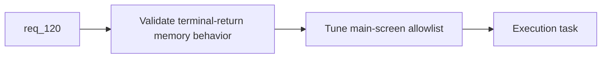

## item_401_define_terminal_memory_cleanup_validation_and_runtime_main_screen_allowlist_tuning - Define terminal memory cleanup validation and runtime main-screen allowlist tuning
> From version: 0.7.0+1b1dda6
> Schema version: 1.0
> Status: Draft
> Understanding: 98%
> Confidence: 95%
> Progress: 0%
> Complexity: Medium
> Theme: Performance
> Reminder: Update status/understanding/confidence/progress and linked task references when you edit this doc.

# Problem
- After ownership/release seams are clear, `req_120` still needs a validation slice to prove cleanup actually improves post-run memory behavior.
- Without validation and allowlist tuning, cleanup may be either too timid or too aggressive.

# Scope
- In:
- define validation posture for terminal-return memory behavior
- define how to inspect cache counts or equivalent diagnostics
- tune any bounded main-screen allowlist to balance memory release and menu responsiveness
- Out:
- general-purpose performance benchmarking unrelated to terminal returns
- broad runtime optimization outside the cleanup seam

# Acceptance criteria
- AC1: The slice defines validation posture for terminal-return memory behavior.
- AC2: The slice defines inspectable evidence such as cache counters or equivalent diagnostics.
- AC3: The slice defines tuning posture for any bounded main-screen asset allowlist.
- AC4: The slice stays bounded to cleanup validation and tuning.

# AC Traceability
- AC1 -> Scope: validation. Proof: terminal-return checks identified.
- AC2 -> Scope: inspectability. Proof: counters/evidence seam defined.
- AC3 -> Scope: allowlist tuning. Proof: warm asset retention tuning covered.
- AC4 -> Scope: bounded tuning. Proof: no broad perf work in scope.

# Decision framing
- Product framing: Not needed
- Product signals: perceived return smoothness, lower retained memory
- Product follow-up: none expected if kept bounded.
- Architecture framing: Required
- Architecture signals: diagnostics visibility, cache instrumentation
- Architecture follow-up: none unless cleanup metrics become a reusable diagnostics contract.

# Links
- Product brief(s): (none yet)
- Architecture decision(s): (none yet)
- Request: `req_120_define_a_terminal_runtime_texture_and_asset_cache_cleanup_posture_for_main_screen_return`
- Primary task(s): `task_074_orchestrate_shell_confirmation_seeded_missions_and_miniboss_reward_wave`

# AI Context
- Summary: Define how to validate terminal-return memory cleanup and tune any bounded main-screen asset allowlist.
- Keywords: memory validation, allowlist, cleanup tuning, diagnostics
- Use when: Use when implementing the validation half of req 120.
- Skip when: Skip when only defining ownership/release boundaries.

# References
- `src/app/AppShell.tsx`
- `src/assets/useResolvedAssetTexture.ts`
