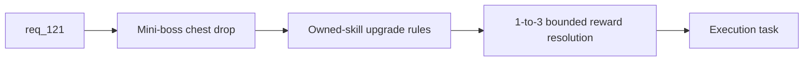

## item_402_define_miniboss_chest_reward_resolution_and_owned_skill_upgrade_rules - Define miniboss chest reward resolution and owned-skill upgrade rules
> From version: 0.7.0+1b1dda6
> Schema version: 1.0
> Status: Done
> Understanding: 98%
> Confidence: 96%
> Progress: 100%
> Complexity: High
> Theme: Gameplay
> Reminder: Update status/understanding/confidence/progress and linked task references when you edit this doc.

# Problem
- `req_121` asks for mini-boss chests that improve owned skills, but the repo still lacks a concrete reward-resolution contract.
- Without clear owned-skill upgrade rules, the chest may feel random, unfair, or overpowered.

# Scope
- In:
- define mini-boss chest drop posture
- define 1-to-3 owned-skill upgrade resolution rules and candidate selection
- define duplicate/stacking posture within one chest resolution
- Out:
- toast UX details
- fallback salvage presentation tuning
- mission-boss reward changes

# Acceptance criteria
- AC1: The slice defines a mini-boss chest drop posture.
- AC2: The slice defines owned-skill candidate selection and upgrade resolution rules.
- AC3: The slice defines bounded 1-to-3 reward resolution behavior.
- AC4: The slice stays bounded to mini-boss chest reward rules and excludes mission-boss reward changes.

# AC Traceability
- AC1 -> Scope: chest drop. Proof: mini-boss reward seam explicit.
- AC2 -> Scope: owned-skill rules. Proof: candidate pool and upgrade logic identified.
- AC3 -> Scope: bounded reward count. Proof: 1-to-3 resolution posture defined.
- AC4 -> Scope: bounded mini-boss slice. Proof: mission-boss reward changes excluded.

# Decision framing
- Product framing: Required
- Product signals: boss payoff, build progression, reward clarity
- Product follow-up: later mission-boss or world-specific boss rewards may diverge.
- Architecture framing: Required
- Architecture signals: build upgrade seams, pickup resolution, mini-boss reward ownership
- Architecture follow-up: ADR only if chest rewards become a reusable generalized reward system.

# Links
- Product brief(s): (none yet)
- Architecture decision(s): (none yet)
- Request: `req_121_define_a_boss_chest_reward_flow_with_random_skill_upgrades_and_fallback_salvage`
- Primary task(s): `task_074_orchestrate_shell_confirmation_seeded_missions_and_miniboss_reward_wave`

# AI Context
- Summary: Define mini-boss chest reward rules that upgrade already owned skills 1 to 3 times.
- Keywords: mini-boss chest, skill upgrades, reward rules, owned skills
- Use when: Use when implementing the reward-rules half of req 121.
- Skip when: Skip when working only on feedback toasts or fallback salvage presentation.

# References
- `games/emberwake/src/runtime/entitySimulation.ts`
- `games/emberwake/src/runtime/buildSystem.ts`
- `games/emberwake/src/runtime/entitySimulationCombat.ts`
