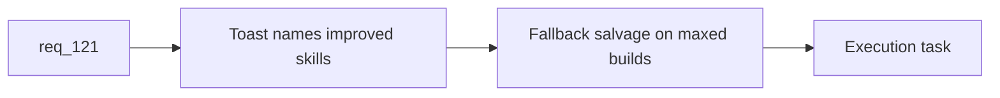

## item_403_define_miniboss_reward_toast_feedback_and_maxed_build_fallback_salvage - Define miniboss reward toast feedback and maxed-build fallback salvage
> From version: 0.7.0+1b1dda6
> Schema version: 1.0
> Status: Done
> Understanding: 98%
> Confidence: 96%
> Progress: 100%
> Complexity: Medium
> Theme: Gameplay
> Reminder: Update status/understanding/confidence/progress and linked task references when you edit this doc.

# Problem
- After chest reward rules are clear, `req_121` still needs readable player feedback and a dead-end fallback when no upgrades remain.
- Without that slice, a chest may resolve silently or feel wasted on maxed builds.

# Scope
- In:
- define toast feedback that names improved skills
- define fallback salvage posture as health plus gold when all owned skills are maxed
- define whether fallback occurs pre-spawn or at resolution time
- Out:
- owned-skill reward resolution rules
- mission-boss reward changes

# Acceptance criteria
- AC1: The slice defines toast feedback that names the improved skills.
- AC2: The slice defines fallback salvage as health plus gold when no valid upgrades remain.
- AC3: The slice defines when fallback salvage replaces or resolves from the chest reward.
- AC4: The slice stays bounded to feedback and fallback presentation.

# AC Traceability
- AC1 -> Scope: toast feedback. Proof: improved-skill naming posture explicit.
- AC2 -> Scope: fallback salvage. Proof: health-plus-gold fallback explicit.
- AC3 -> Scope: resolution timing. Proof: replacement/resolution seam defined.
- AC4 -> Scope: bounded slice. Proof: reward rules excluded.

# Decision framing
- Product framing: Required
- Product signals: reward readability, satisfaction on capped builds
- Product follow-up: later richer reward VFX or archive hooks remain out of scope.
- Architecture framing: Not needed
- Architecture signals: (none detected)
- Architecture follow-up: none.

# Links
- Product brief(s): (none yet)
- Architecture decision(s): (none yet)
- Request: `req_121_define_a_boss_chest_reward_flow_with_random_skill_upgrades_and_fallback_salvage`
- Primary task(s): `task_074_orchestrate_shell_confirmation_seeded_missions_and_miniboss_reward_wave`

# AI Context
- Summary: Define toast feedback for mini-boss chest upgrades and fallback salvage when the build is maxed.
- Keywords: toast, fallback salvage, health, gold, mini-boss rewards
- Use when: Use when implementing the feedback/fallback half of req 121.
- Skip when: Skip when working on owned-skill upgrade rules.

# References
- `src/app/AppShell.tsx`
- `src/app/components/ShellToastStack.tsx`
- `games/emberwake/src/runtime/entitySimulationCombat.ts`
