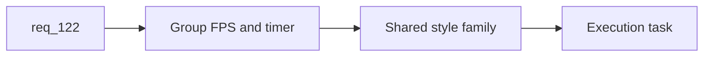

## item_404_define_a_grouped_runtime_hud_cluster_for_fps_and_timer - Define a grouped runtime HUD cluster for FPS and timer
> From version: 0.7.0+1b1dda6
> Schema version: 1.0
> Status: Done
> Understanding: 99%
> Confidence: 97%
> Progress: 100%
> Complexity: Low
> Theme: HUD
> Reminder: Update status/understanding/confidence/progress and linked task references when you edit this doc.

# Problem
- `req_122` asks to stack the timer under the FPS counter, but the repo still lacks a concrete HUD regrouping slice.
- Without a dedicated slice, the timer and FPS readouts will remain visually scattered.

# Scope
- In:
- define grouped HUD layout with timer stacked under FPS
- define shared style family for both readouts
- validate desktop and mobile readability
- Out:
- changing timer logic
- full HUD redesign

# Acceptance criteria
- AC1: The slice defines a grouped HUD layout with the timer stacked under the FPS readout.
- AC2: The slice defines a shared style family for both readouts.
- AC3: The slice defines desktop and mobile readability validation.
- AC4: The slice stays bounded to HUD regrouping.

# AC Traceability
- AC1 -> Scope: grouped layout. Proof: timer-under-FPS layout explicit.
- AC2 -> Scope: style family. Proof: aligned readout style required.
- AC3 -> Scope: validation. Proof: desktop/mobile readability checks listed.
- AC4 -> Scope: bounded HUD slice. Proof: no full HUD redesign in scope.

# Decision framing
- Product framing: Not needed
- Product signals: HUD scanability, runtime readability
- Product follow-up: none expected if kept bounded.
- Architecture framing: Not needed
- Architecture signals: (none detected)
- Architecture follow-up: none.

# Links
- Product brief(s): (none yet)
- Architecture decision(s): (none yet)
- Request: `req_122_define_a_runtime_hud_posture_with_the_timer_stacked_under_the_fps_counter`
- Primary task(s): `task_074_orchestrate_shell_confirmation_seeded_missions_and_miniboss_reward_wave`

# AI Context
- Summary: Define a grouped HUD cluster so the timer sits directly under the FPS readout.
- Keywords: timer, fps, hud, runtime overlay, grouping
- Use when: Use when implementing req 122.
- Skip when: Skip when changing timer logic or diagnostics semantics.

# References
- `src/app/components/ActiveRuntimeShellContent.tsx`
- `src/app/components/ActiveRuntimeShellContent.css`
- `src/game/debug/ShellDiagnosticsPanel.tsx`
