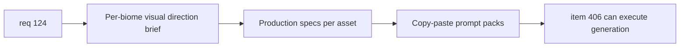

## item_405_define_per_biome_terrain_visual_direction_production_specs_and_prompt_packs - Define per-biome terrain visual direction, production specs, and prompt packs
> From version: 0.7.2
> Schema version: 1.0
> Status: Ready
> Understanding: 100%
> Confidence: 98%
> Progress: 0%
> Complexity: Medium
> Theme: Graphics
> Reminder: Update status/understanding/confidence/progress and linked task references when you edit this doc.

# Problem
- The three terrain assets for Emberplain, Glowfen, and Obsidian are visual duplicates of the Ashfield reference and carry no distinct identity.
- Before generation can be executed, each biome needs an explicit visual direction brief and an actionable prompt pack that can be fed to the OpenAI Images API without ambiguity.

# Scope
- In:
  - document the visual direction for each of the three biomes (Emberplain, Glowfen, Obsidian) derived from `worldProfiles.ts` descriptions
  - define the production spec for each asset: 512×512 px, WebP, no alpha, seamless tile, dark floor, edge-continuity constraint
  - write the prompt pack for each biome (one or more copy-paste prompts per asset, model-agnostic)
- Out:
  - actually running the generation (covered by `item_406`)
  - changing the Ashfield asset
  - modifying any source code or world profiles

# Acceptance criteria
- AC1: The slice produces a visual direction brief for each of the three biomes that derives clearly from the world description and explains how the terrain should differ from Ashfield.
- AC2: The slice defines the production spec shared by all three assets: 512×512 px WebP, no alpha, full-coverage, seamless tile, dark enough for entity readability, edge-continuity zone matching Ashfield's dark border tone.
- AC3: The slice produces at least one copy-paste prompt per biome that encodes the visual direction, production constraints, and edge-continuity requirement without requiring additional clarification.
- AC4: The slice confirms the Ashfield asset remains unchanged and locked as the technical reference.

# AC Traceability
- AC1 -> visual direction. Proof: per-biome brief explicit for Emberplain, Glowfen, Obsidian.
- AC2 -> production specs. Proof: size, format, tiling, darkness, edge-continuity all documented.
- AC3 -> prompt packs. Proof: copy-paste prompts produced per biome.
- AC4 -> Ashfield locked. Proof: no change to ashfield asset or catalog.

# Decision framing
- Product framing: Required
- Product signals: world identity distinctness, unlock reward legibility
- Product follow-up: if a generated output is weak, iterate prompt before regenerating.
- Architecture framing: Optional
- Architecture signals: none — pure asset production input
- Architecture follow-up: none expected.

# Links
- Product brief(s): `prod_017_graphical_asset_direction_for_runtime_readability_and_shell_identity`
- Architecture decision(s): `adr_052_adopt_a_content_driven_graphical_asset_pipeline_for_runtime_and_shell_surfaces`
- Request: `req_124_define_distinct_per_biome_terrain_asset_variation_for_emberplain_glowfen_and_obsidian`
- Primary task(s): `task_075_orchestrate_per_biome_terrain_asset_variation_generation_promotion_and_validation_wave`

# AI Context
- Summary: Document visual direction, production specs, and prompt packs for the three terrain assets that need to replace the current Ashfield duplicates.
- Keywords: terrain, biome, visual direction, prompt pack, production spec, emberplain, glowfen, obsidian, edge-continuity
- Use when: Use when preparing the brief and prompts before executing OpenAI terrain generation.
- Skip when: Skip when generation or promotion is already underway.

# References
- `src/assets/map/runtime/map.terrain.ashfield.runtime.webp`
- `src/shared/model/worldProfiles.ts`
- `src/shared/config/assetPipeline.ts`
- `logics/request/req_124_define_distinct_per_biome_terrain_asset_variation_for_emberplain_glowfen_and_obsidian.md`
