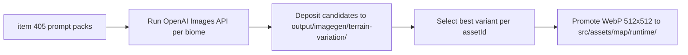

## item_406_execute_openai_terrain_generation_curation_and_runtime_promotion_for_three_biomes - Execute OpenAI terrain generation, curation, and runtime promotion for three biomes
> From version: 0.7.2
> Schema version: 1.0
> Status: Ready
> Understanding: 100%
> Confidence: 97%
> Progress: 0%
> Complexity: Medium
> Theme: Graphics
> Reminder: Update status/understanding/confidence/progress and linked task references when you edit this doc.

# Problem
- Prompt packs from `item_405` exist but the three terrain assets remain Ashfield duplicates until generation is actually executed and approved files are promoted into the runtime pipeline.
- Without a bounded generation and promotion loop, the scratch outputs stay in `output/imagegen/` and never reach `src/assets/map/runtime/`.

# Scope
- In:
  - write the terrain-variation generation script (or adapt an existing one from `scripts/assets/`) to submit prompts to the OpenAI Images API for each of the three biomes
  - deposit scratch candidates under `output/imagegen/terrain-variation/` with one sub-folder per `assetId`
  - curate the outputs — select the best variant per `assetId`, record the winner in `selection.json`
  - convert/export approved outputs to WebP at 512×512 and promote them into `src/assets/map/runtime/`
- Out:
  - in-game validation (covered by `item_407`)
  - code changes beyond what the scripts require
  - changing the Ashfield asset or any other terrain file

# Acceptance criteria
- AC1: The slice runs the OpenAI Images API for each of the three terrain assets (Emberplain, Glowfen, Obsidian) and produces at least one scratch candidate per biome.
- AC2: The scratch candidates are deposited under `output/imagegen/terrain-variation/<assetId>/` with a `selection.json` recording the promoted winner.
- AC3: The selected variant for each biome is exported as WebP at 512×512, no alpha, and promoted to `src/assets/map/runtime/` under the canonical asset file name.
- AC4: The promoted files pass a visual check for edge-continuity: the outer border zone of each promoted asset matches the dark near-neutral tone of the Ashfield reference.
- AC5: No source code, catalog, or world profile files are modified.

# AC Traceability
- AC1 -> generation. Proof: OpenAI API calls produce candidates for all three biomes.
- AC2 -> scratch and selection. Proof: `output/imagegen/terrain-variation/` populated, `selection.json` written.
- AC3 -> promotion. Proof: three WebP files promoted to `src/assets/map/runtime/`.
- AC4 -> edge-continuity. Proof: visual check against Ashfield border tone before promotion.
- AC5 -> no code changes. Proof: only asset files in `output/` and `src/assets/map/runtime/` change.

# Decision framing
- Product framing: Required
- Product signals: world biome visual distinction, world selection card identity
- Product follow-up: if a promoted asset fails in-game readability validation, regenerate with a refined prompt.
- Architecture framing: Optional
- Architecture signals: script reuse from existing generation/promotion pattern
- Architecture follow-up: prefer adapting `generateFirstWaveAssets.mjs` / `promoteFirstWaveAssets.mjs` rather than writing a new one-off script.

# Links
- Product brief(s): `prod_017_graphical_asset_direction_for_runtime_readability_and_shell_identity`
- Architecture decision(s): `adr_052_adopt_a_content_driven_graphical_asset_pipeline_for_runtime_and_shell_surfaces`
- Request: `req_124_define_distinct_per_biome_terrain_asset_variation_for_emberplain_glowfen_and_obsidian`
- Primary task(s): `task_075_orchestrate_per_biome_terrain_asset_variation_generation_promotion_and_validation_wave`

# AI Context
- Summary: Execute the OpenAI generation loop for three terrain assets, curate the scratch outputs, and promote the approved WebP files into the runtime asset folder.
- Keywords: openai, image generation, terrain promotion, scratch, curation, selection.json, webp, pipeline
- Use when: Use when running the generation and promotion step after prompt packs are ready.
- Skip when: Skip when only defining prompts or validating already-promoted assets.

# References
- `output/imagegen/terrain-variation/`
- `scripts/assets/generateFirstWaveAssets.mjs`
- `scripts/assets/promoteFirstWaveAssets.mjs`
- `src/assets/map/runtime/map.terrain.emberplain.runtime.webp`
- `src/assets/map/runtime/map.terrain.glowfen.runtime.webp`
- `src/assets/map/runtime/map.terrain.obsidian.runtime.webp`
- `logics/request/req_124_define_distinct_per_biome_terrain_asset_variation_for_emberplain_glowfen_and_obsidian.md`
