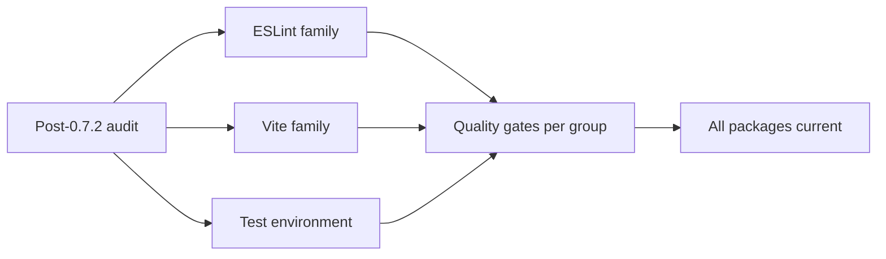

## item_408_execute_quarterly_devdependency_update_pass_for_eslint_vite_jsdom_and_related_packages - Execute quarterly devDependency update pass for ESLint, Vite, jsdom, and related packages
> From version: 0.7.2
> Schema version: 1.0
> Status: Ready
> Understanding: 100%
> Confidence: 96%
> Progress: 0%
> Complexity: Medium
> Theme: Delivery
> Reminder: Update status/understanding/confidence/progress and linked task references when you edit this doc.

# Problem
- Six devDependency packages have accumulated major version distance since the last update pass, creating upgrade cliff risk that compounds if left unaddressed across release cycles.
- Packages affected: `eslint` 9→10, `@eslint/js` 9→10, `vite` 6→8, `vite-plugin-pwa` 0.21→1.x, `@vitejs/plugin-react` 4→6, `jsdom` 26→29, `@types/node` 22→25.

# Scope
- In:
  - update each package to its current stable major version
  - group updates by toolchain family: (1) ESLint family (`eslint`, `@eslint/js`, `typescript-eslint`), (2) Vite family (`vite`, `vite-plugin-pwa`, `@vitejs/plugin-react`), (3) test environment (`jsdom`, `@types/node`)
  - validate each group through the full quality gate sequence before merging: `lint`, `typecheck`, `test`, `build`, `performance:validate`
  - document any configuration changes required in the commit message
- Out:
  - updating production runtime dependencies (`pixi.js`, `@pixi/react`, `react`, `react-dom`)
  - changing gameplay behavior, runtime logic, or shell UX

# Acceptance criteria
- AC1: The slice updates all six packages to their current stable major versions and the repository passes `lint`, `typecheck`, `test`, `build`, and `performance:validate` after each group.
- AC2: Each group that requires configuration changes documents those changes in its commit message.
- AC3: The ESLint architectural boundary rules defined in `eslint.config.js` remain enforced after the ESLint family update — no boundary violation is silently suppressed.
- AC4: No production runtime dependencies are modified.

# AC Traceability
- AC1 -> update pass. Proof: all six packages updated, quality gates pass.
- AC2 -> config transparency. Proof: commit messages document any config changes.
- AC3 -> boundary enforcement. Proof: ESLint architectural rules verified post-update.
- AC4 -> prod deps untouched. Proof: `pixi.js`, `react`, etc. unchanged.

# Decision framing
- Product framing: Optional
- Product signals: none visible to players
- Product follow-up: schedule next quarterly pass after the next major release.
- Architecture framing: Required
- Architecture signals: toolchain and test environment health, ESLint boundary rule survival
- Architecture follow-up: if Vite 8 requires non-trivial `vite.config.ts` changes, document in an ADR addendum.

# Links
- Request: `req_123_define_a_codebase_hygiene_wave_for_dependency_updates_component_size_thresholds_and_weapon_palette_readability`
- Primary task(s): `task_076_orchestrate_codebase_hygiene_wave_for_dependency_updates_component_size_policy_and_weapon_palette_refactor`

# AI Context
- Summary: Update six devDependency packages to their current stable versions, grouped by toolchain family, validated through the full quality gate sequence.
- Keywords: devDependency, eslint, vite, jsdom, update, quarterly, toolchain, quality gates
- Use when: Use when executing the quarterly dependency update pass.
- Skip when: Skip when updating production runtime dependencies or working on feature delivery.

# References
- `package.json`
- `vite.config.ts`
- `eslint.config.js`
