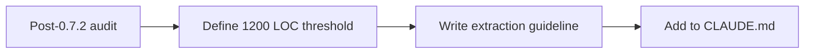

## item_409_define_component_size_threshold_and_extraction_guideline_for_appmetascenepanel_and_activeruntimeshellcontent - Define component size threshold and extraction guideline for AppMetaScenePanel and ActiveRuntimeShellContent
> From version: 0.7.2
> Schema version: 1.0
> Status: Ready
> Understanding: 100%
> Confidence: 98%
> Progress: 0%
> Complexity: Low
> Theme: Delivery
> Reminder: Update status/understanding/confidence/progress and linked task references when you edit this doc.

# Problem
- `AppMetaScenePanel` (1 115 LOC) and `ActiveRuntimeShellContent` (1 000 LOC) are the two largest shell components and are growing steadily with the feature set.
- No explicit size threshold or extraction guideline exists, so future growth has no agreed stopping point and no defined response.

# Scope
- In:
  - define a 1 200 LOC threshold for both components
  - document an extraction guideline that describes what to extract and how when either file crosses the threshold
  - add the guideline to `CLAUDE.md` (a short addition is sufficient — no full ADR required)
- Out:
  - extracting sub-components from either file now (neither currently crosses the threshold)
  - changing any gameplay, runtime behavior, or shell UX

# Acceptance criteria
- AC1: The slice adds a 1 200 LOC threshold for `AppMetaScenePanel` and `ActiveRuntimeShellContent` to `CLAUDE.md`, including the extraction guideline to follow when either file crosses it.
- AC2: The extraction guideline describes what constitutes a good extraction candidate (cohesive callback group, distinct sub-concern, self-contained props) rather than prescribing a specific component structure.
- AC3: No extraction from either file is performed as part of this slice — the deliverable is the documented policy, not a refactor.

# AC Traceability
- AC1 -> policy documented. Proof: CLAUDE.md updated with threshold and guideline.
- AC2 -> guideline quality. Proof: guideline describes extraction criteria, not a fixed structure.
- AC3 -> no refactor now. Proof: component files unchanged.

# Decision framing
- Product framing: Optional
- Product signals: none visible to players
- Product follow-up: apply guideline when either component crosses 1 200 LOC during the next feature wave.
- Architecture framing: Required
- Architecture signals: maintainability guardrail for the two largest shell hub components
- Architecture follow-up: if extraction is needed, open a focused refactor slice at that point.

# Links
- Request: `req_123_define_a_codebase_hygiene_wave_for_dependency_updates_component_size_thresholds_and_weapon_palette_readability`
- Primary task(s): `task_076_orchestrate_codebase_hygiene_wave_for_dependency_updates_component_size_policy_and_weapon_palette_refactor`

# AI Context
- Summary: Document a 1 200 LOC size threshold and extraction guideline for the two largest shell components in CLAUDE.md, without performing any extraction.
- Keywords: component size, threshold, extraction guideline, AppMetaScenePanel, ActiveRuntimeShellContent, CLAUDE.md, maintainability
- Use when: Use when setting the size policy for hub shell components.
- Skip when: Skip when extraction is already triggered or when working on runtime/gameplay.

# References
- `src/app/components/AppMetaScenePanel.tsx`
- `src/app/components/ActiveRuntimeShellContent.tsx`
- `CLAUDE.md`
