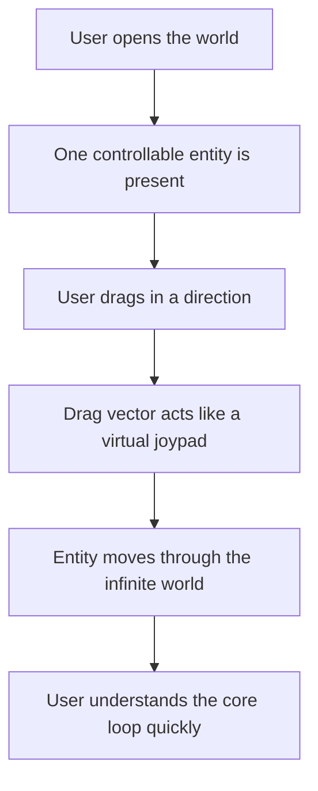

## prod_000_initial_single_entity_navigation_loop - Initial single-entity navigation loop
> Date: 2026-03-17
> Status: Draft
> Related request: `req_006_define_player_interactions_for_world_and_entities`
> Related backlog: (none yet)
> Related task: (none yet)
> Related architecture: `adr_000_adopt_feature_oriented_organic_frontend_structure`, `adr_001_enforce_bounded_file_size_and_isolate_react_side_effects`
> Reminder: Update status, linked refs, scope, decisions, success signals, and open questions when you edit this doc.

# Overview
The first product slice should center on one controllable entity moving through an infinite top-down world. On touch devices, the main interaction should feel like a virtual joypad: dragging in a direction steers the entity in that direction.

# Product problem
The current product direction is still broad, but the project needs a concrete first interactive loop to guide the next implementation slices. Without that, map rendering, entity rendering, and input work risk advancing independently without validating a real player-facing experience.

The simplest useful loop is not a full game system yet. It is the ability to control one entity inside the world and verify that movement, camera readability, world continuity, and touch interaction already feel coherent.

# Target users and situations
- A mobile-first player who opens the app and should immediately understand how to move a controllable entity with a finger.
- A developer or tester who needs one clear interaction loop to validate the map, entity, input, and camera stack.
- A desktop user who may need a practical fallback control path while the product remains touch-first.

# Goals
- Make one entity controllable inside the world from the first meaningful interactive slice.
- Make touch drag direction behave like a virtual joypad rather than like page scrolling or generic camera dragging.
- Validate that the world can feel infinite and explorable even with only one controllable entity.
- Keep the first interaction loop simple enough that movement and control readability are the main thing being tested.
- Keep the controlled entity readable by default through a stable follow-camera behavior rather than a free-camera player workflow.
- Keep the first minute of interaction centered on movement and exploration only, without introducing objectives or layered verbs.

# Non-goals
- Multiple controllable entities or squad-style controls.
- Combat, harvesting, building, or other layered game verbs.
- A full progression loop or objective system.
- A rich HUD or menu-heavy experience.
- Win or lose states for the first interactive slice.

# Scope and guardrails
- In: one controllable entity, top-down infinite world traversal, touch-first directional control, immediate movement feedback, compatibility with desktop fallback controls.
- Out: multi-entity command systems, advanced abilities, combat rules, inventory, economy, scripted missions, or final progression loops.

# Key product decisions
- The first player-facing action is moving one entity, not commanding many systems at once.
- Touch drag should be interpreted as a directional steering input through a visible virtual joypad anchored at the initial touch point.
- The visible control should disappear on release and should not leave permanent HUD chrome on screen.
- The world should remain effectively unbounded from the player's perspective so movement validates infinite-world assumptions early.
- The first interaction loop should stay mobile-first, with keyboard movement used as the practical desktop fallback path.
- Camera behavior should prioritize keeping the controlled entity readable during movement, with entity-follow preferred over free player camera control in the first slice.
- The first movement feel should stay direct and arcade-like rather than inertia-heavy.
- Player-facing zoom and camera rotation should remain out of the first loop and stay debug-oriented at most.
- The controlled entity should stay visually highlighted through minimal feedback such as facing indication, motion readability, or a light focus marker.
- The world should begin relatively low-density so movement, direction, and continuity remain the dominant product signal.
- Onboarding should stay minimal, ideally a short hint equivalent to "Glissez pour déplacer" on first use.

# Success signals
- A first-time user can understand how to move the entity without extra explanation.
- Touch movement feels directional and deliberate rather than confused with page gestures or accidental viewport movement.
- The controlled entity can move continuously through the world while remaining readable and inspectable.
- The loop is simple enough that developers can use it as the baseline scenario for map, entity, and input debugging.
- Desktop fallback controls remain practical without becoming the primary product path.
- The initial world does not visually overwhelm the player before the movement loop is understood.

# References
- `req_001_render_top_down_infinite_chunked_world_map`
- `req_002_render_evolving_world_entities_on_the_map`
- `req_006_define_player_interactions_for_world_and_entities`
- `req_014_define_world_occupancy_navigation_and_interaction_rules`

# Open questions
- When should the camera move from strict follow behavior to a looser or player-adjustable follow mode?
- Should the visible virtual joypad stay fixed to the initial touch point or support floating recentering later?
- How soon should passive nearby entities appear in the player-facing loop instead of only debug contexts?
