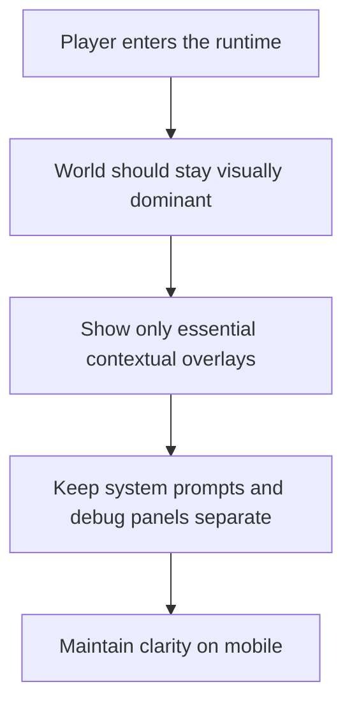

## prod_001_minimal_overlay_and_feedback_for_early_runtime - Minimal overlay and feedback for early runtime
> Date: 2026-03-17
> Status: Draft
> Related request: `req_011_define_ui_hud_and_overlay_system`
> Related backlog: (none yet)
> Related task: (none yet)
> Related architecture: `adr_002_separate_react_shell_from_pixi_runtime_ownership`
> Reminder: Update status, linked refs, scope, decisions, success signals, and open questions when you edit this doc.

# Overview
The early runtime should expose only the minimum overlay and feedback needed to make the world readable and controllable. System UI should stay thin, contextual, and mobile-first instead of turning the first slices into a HUD-heavy experience.

# Product problem
The project already knows it will need fullscreen prompts, inspection surfaces, and debug overlays, but without a product stance the UI layer could become noisy very early. That would weaken the readability of the first movement loop and blur the distinction between world feedback and permanent chrome.

# Target users and situations
- A first-time mobile player who needs immediate control clarity without a cluttered screen.
- A developer or tester who needs contextual information without hiding the world under permanent overlays.
- A desktop user who should still see a coherent screen-space UI model even if mobile remains the primary experience.

# Goals
- Keep the world visually dominant in the first product slices.
- Use contextual overlays rather than permanent HUD bars wherever possible.
- Make essential control and state feedback legible without requiring dense UI.
- Keep debug visibility available without making it part of the default player presentation.

# Non-goals
- A full permanent HUD with many widgets.
- A complete menu system.
- Final visual styling for all overlays.
- Treating debug UI as player-facing UI.

# Scope and guardrails
- In: fullscreen prompt behavior, minimal onboarding hinting, contextual inspection surfaces, lightweight state feedback, mobile readability.
- Out: full meta-navigation, settings menus, inventory surfaces, production-complete HUD composition.

# Key product decisions
- Permanent on-screen chrome should stay very light in the early runtime.
- System prompts and installation/fullscreen prompts should be contextual and disappear when no longer needed.
- The first-loop player should mostly learn from world feedback and one short hint rather than from a dense overlay.
- Debug panels and inspection panels may exist, but they should remain clearly separated from the default player-facing view.
- Feedback for the controlled entity should prioritize clarity over quantity.

# Success signals
- A player can read the world and the controlled entity without UI clutter competing for attention.
- Essential prompts appear when needed and then get out of the way.
- Mobile screens remain readable without stacking multiple permanent overlay layers.
- Debug information remains available for development without polluting the default runtime view.

# References
- `req_011_define_ui_hud_and_overlay_system`
- `req_000_bootstrap_fullscreen_2d_react_pwa_shell`
- `prod_000_initial_single_entity_navigation_loop`

# Open questions
- What is the minimum persistent on-screen element that still helps the player in the first slice?
- Should entity inspection initially appear as a lightweight tooltip, a side sheet, or a bottom sheet on mobile?
- When should a permanent HUD become justified rather than remaining contextual?
