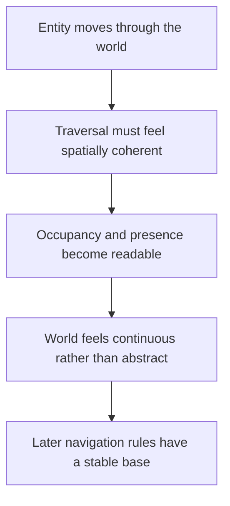

## prod_002_readable_world_traversal_and_presence - Readable world traversal and presence
> Date: 2026-03-17
> Status: Draft
> Related request: `req_014_define_world_occupancy_navigation_and_interaction_rules`
> Related backlog: (none yet)
> Related task: (none yet)
> Related architecture: `adr_003_define_coordinate_spaces_and_camera_contract`, `adr_005_make_world_identity_deterministic_from_seed_and_coordinates`
> Reminder: Update status, linked refs, scope, decisions, success signals, and open questions when you edit this doc.

# Overview
World traversal should feel continuous, readable, and spatially believable from the start. Even before collisions or pathfinding become rich systems, entities should feel present in the world rather than visually detached from it.

# Product problem
The project already defines a moving entity in an infinite world, but if traversal remains visually abstract or spatially weak, the first interaction loop will feel like moving a marker on a surface instead of moving something that belongs to that world. Product-wise, that weakens immersion and readability long before advanced gameplay exists.

# Target users and situations
- A player moving a single entity through the early world who should feel that the entity occupies and traverses real space.
- A developer or tester validating that chunk transitions, movement continuity, and world presence remain readable.

# Goals
- Make entity movement feel spatially continuous through the world.
- Preserve a clear sense that the entity belongs to the map rather than hovering above it conceptually.
- Keep traversal readable even while the occupancy and navigation systems are still simple.
- Prepare the player-facing feel of movement before full collision or pathfinding systems exist.

# Non-goals
- Full collision resolution.
- Advanced pathfinding behavior.
- Complex terrain traversal rules.
- Combat-grade positional interactions.

# Scope and guardrails
- In: readable occupancy, coherent traversal, continuity across chunks, simple presence cues, future compatibility with richer navigation.
- Out: full physics, combat spacing, tactical positioning systems, final terrain-rule richness.

# Key product decisions
- The world should feel continuous when the entity moves; chunk structure must not leak into player perception.
- The entity should read as occupying space in the world, not as a purely symbolic cursor.
- Early traversal may stay mechanically simple, but it must still feel visually and spatially coherent.
- Overlaps and simplified occupancy may exist technically early on, but the player-facing result should still prioritize readability.

# Success signals
- Movement across the world feels continuous and believable, not broken into chunk-sized or tile-sized artifacts.
- The controlled entity feels grounded in the world rather than detached from it.
- Early traversal remains easy to read on mobile-sized screens.
- Future navigation and occupancy work can build on this base without changing the player’s mental model of presence.

# References
- `req_014_define_world_occupancy_navigation_and_interaction_rules`
- `req_001_render_top_down_infinite_chunked_world_map`
- `req_002_render_evolving_world_entities_on_the_map`
- `prod_000_initial_single_entity_navigation_loop`

# Open questions
- What minimal visual cues best communicate occupancy in the first slice: footprint, shadow, halo, trail, or combination?
- When should simplified overlaps stop being acceptable from a player-facing perspective?
- How much terrain variation is needed before traversal starts feeling meaningfully different?
