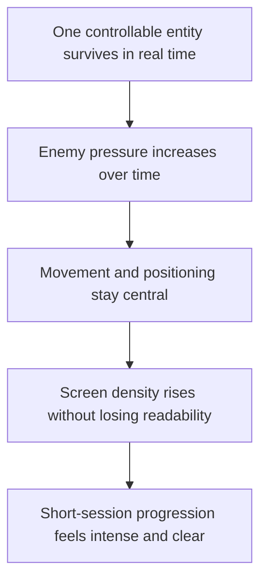

## prod_003_high_density_top_down_survival_action_direction - High-density top-down survival action direction
> Date: 2026-03-17
> Status: Draft
> Related request: `req_006_define_player_interactions_for_world_and_entities`
> Related backlog: (none yet)
> Related task: (none yet)
> Related architecture: `adr_003_define_coordinate_spaces_and_camera_contract`, `adr_004_run_simulation_on_a_fixed_timestep`, `adr_006_standardize_debug_first_runtime_instrumentation`
> Reminder: Update status, linked refs, scope, decisions, success signals, and open questions when you edit this doc.

# Overview
The long-term product direction is a top-down real-time survival action experience built around continuous movement, escalating enemy pressure, and strong readability under high on-screen density. The player should spend most of the session moving, surviving, and reacting to surrounding pressure rather than executing a large command vocabulary.

# Product problem
The project already has a strong early foundation around one controllable entity, a top-down world, and mobile-first movement. What is still missing is the longer-range product shape those systems are meant to support.

Without a clear long-term direction, map, entity, simulation, HUD, and performance decisions could drift toward incompatible styles of play. The project needs a product posture that keeps implementation choices aligned even before combat, enemy waves, or progression systems are fully defined.

# Target users and situations
- A player who wants a fast, readable, movement-centered survival loop on mobile or desktop.
- A player who should understand the core pressure quickly without needing complex command grammar.
- A developer or tester who needs a stable long-term reference for density, readability, and simulation decisions.

# Goals
- Build toward a top-down survival-action loop where movement remains the main player verb.
- Support high on-screen entity density without losing readability of threats, player presence, or motion.
- Preserve strong player feedback under growing pressure and crowded scenes.
- Favor short-to-medium sessions with quick understanding and immediate engagement.
- Make progression and escalation feel deliberate rather than noisy, even before the exact systems are finalized.

# Non-goals
- A tactics-heavy multi-unit control game.
- A menu-heavy or command-heavy primary interaction model.
- A slow-paced exploration-first structure where pressure is secondary.
- A visually dense but unreadable action experience.

# Scope and guardrails
- In: long-term player fantasy, readability posture, session feel, pressure curve direction, movement-central interaction philosophy.
- Out: exact combat rules, exact weapon systems, wave formulas, economy tuning, class taxonomy, or final progression design.

# Key product decisions
- Continuous movement should remain the core player action, not a secondary support verb.
- The player-controlled entity should stay visually readable even when many hostile or neutral entities are on screen.
- Rising density is a feature, but it must be paired with disciplined readability in silhouettes, spacing, motion, and feedback.
- The player should feel increasing pressure over time rather than a flat ambient world.
- Short-session clarity matters more than deep explanation; the runtime should be learnable quickly.
- Mobile-first input remains valid for this direction because movement and pressure readability are more important than broad verb complexity.
- Systems that scale entity count, visual effects, or overlays must be judged against readability first, not only spectacle.

# Success signals
- A player can quickly understand that survival depends on movement and positioning.
- Increasing enemy or hazard density feels intense without becoming visually unreadable.
- The controlled entity remains easy to track under pressure.
- The project’s systems naturally support escalation, density, and survival pressure instead of fighting those goals.
- Performance and diagnostics decisions stay aligned with a high-density runtime target.

# References
- `req_002_render_evolving_world_entities_on_the_map`
- `req_006_define_player_interactions_for_world_and_entities`
- `req_011_define_ui_hud_and_overlay_system`
- `req_012_define_performance_budgets_profiling_and_diagnostics`
- `req_014_define_world_occupancy_navigation_and_interaction_rules`
- `prod_000_initial_single_entity_navigation_loop`
- `prod_001_minimal_overlay_and_feedback_for_early_runtime`
- `prod_002_readable_world_traversal_and_presence`

# Open questions
- How early should surrounding hostile pressure appear in the playable loop versus staying implicit during the first movement-only slices?
- What is the right visual-density ceiling on mobile before readability drops too much?
- Which progression signals should appear first without turning the early runtime into a HUD-heavy screen?
