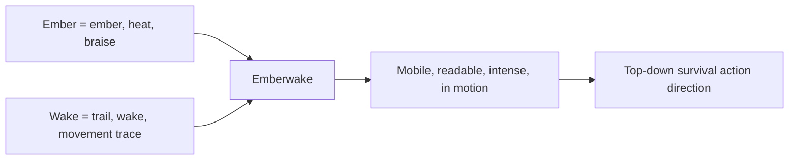

## prod_004_emberwake_name_and_brand_direction - Emberwake name and brand direction
> Date: 2026-03-17
> Status: Draft
> Related request: `req_015_define_release_workflow_and_deployment_operations`
> Related backlog: (none yet)
> Related task: (none yet)
> Related architecture: (none yet)
> Reminder: Update status, linked refs, scope, decisions, success signals, and open questions when you edit this doc.

# Overview
`Emberwake` is the chosen product name and identity direction for the project. The name evokes a wake of embers: a moving presence that leaves heat, light, and pressure in its path. It supports a top-down survival-action game where motion, pressure, and readable intensity are central.

# Product problem
The project now has a clearer long-term gameplay direction, but it still needs a stable naming and identity anchor. Without that, the tone of the UI, the feel of the world, the readability of the effects, and even the way the project is presented publicly can drift or stay too generic.

A product name should not just sound good. It should reinforce the kind of movement, intensity, and atmosphere the game is trying to create.

# Target users and situations
- A player discovering the game for the first time through a store page, repo, or preview build.
- A player who should immediately expect motion, heat, pressure, and survival tension from the name and presentation.
- A developer or collaborator who needs a stable identity reference for naming, UI tone, and presentation choices.

# Goals
- Fix `Emberwake` as the working product identity.
- Tie the name to the game’s long-term direction: continuous motion, pressure, density, and readability.
- Use the name to guide visual, tonal, and presentation decisions without overcommitting the project to one literal theme treatment.
- Keep the name compatible with a mobile-first action game and with public release positioning later.

# Non-goals
- A full lore bible.
- Final logo design.
- Final visual identity package.
- Locking every effect, color, or narrative motif immediately.

# Scope and guardrails
- In: name meaning, tonal direction, emotional associations, presentation implications, identity constraints.
- Out: final logo production, store-copy finalization, marketing campaign, legal trademark validation.

# Key product decisions
- `Emberwake` is the preferred project name going forward.
- The name should be understood as a compound idea:
  - `ember`: heat, braise, lingering energy
  - `wake`: a trail, disturbance, or moving trace left behind
- The identity should suggest movement and pressure, not static fire symbolism only.
- The tone should lean toward intense, readable, and kinetic rather than mystical-for-its-own-sake.
- Visual and UX decisions should support the idea of a player presence cutting through the world and leaving a sense of heated momentum.
- The name should support a world that feels alive, pressurized, and increasingly dangerous without requiring explicit narrative exposition.

# Success signals
- The name feels aligned with a top-down action-survival game centered on movement.
- The identity suggests intensity and motion without needing to cite another game.
- The project presentation becomes easier to keep coherent across README, release notes, UI tone, and future art direction.
- Internal decisions about effects, overlays, and atmosphere can refer back to one stable identity anchor.

# References
- `prod_000_initial_single_entity_navigation_loop`
- `prod_003_high_density_top_down_survival_action_direction`
- `req_006_define_player_interactions_for_world_and_entities`
- `req_012_define_performance_budgets_profiling_and_diagnostics`

# Open questions
- How literal should the ember or heat motif become in the world and effects?
- Should the identity lean more toward ash, cinder, ember, or flare in later art direction?
- At what point should the name be propagated into deployment and release-facing assets?
