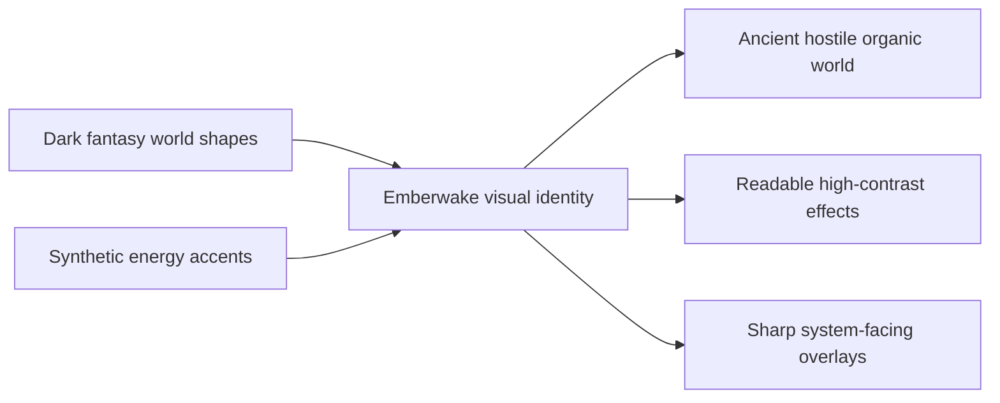

## prod_005_visual_identity_dark_fantasy_with_synthetic_energy_accents - Visual identity dark fantasy with synthetic energy accents
> Date: 2026-03-17
> Status: Draft
> Related request: `req_005_define_asset_pipeline_for_map_and_entities`
> Related backlog: (none yet)
> Related task: (none yet)
> Related architecture: `adr_002_separate_react_shell_from_pixi_runtime_ownership`, `adr_008_define_asset_logical_sizing_and_runtime_packaging_rules`
> Reminder: Update status, linked refs, scope, decisions, success signals, and open questions when you edit this doc.

# Overview
The visual identity of `Emberwake` should combine a dark-fantasy world language with high-contrast synthetic energy accents. The world, creatures, ruins, and spatial forms should feel ancient, hostile, and organic. Energy, UI, and special effects should bring sharper, more electric color accents inspired by synthetic or neon-like intensity without turning the whole game into visual noise.

# Product problem
The project now has a clear product name and a long-term survival-action direction, but it still lacks a visual rule set that explains how the world should look and feel. Without that, assets, effects, UI, and feedback could drift between generic fantasy, generic neon action, or mismatched visual layers.

The project needs a visual posture that is strong enough to guide assets and UI decisions, but disciplined enough to preserve readability under high motion and on-screen density.

# Target users and situations
- A player who should read the game as intense, supernatural, and in motion within a few seconds.
- A player who must still track the controlled entity, threats, and effects clearly on a mobile-sized screen.
- A developer or artist who needs clear rules for choosing colors, shapes, FX intensity, and UI contrast.

# Goals
- Establish a world language rooted in dark fantasy rather than generic sci-fi futurism.
- Use synthetic energy accents to create punch, pressure, and legibility in motion.
- Keep readability ahead of pure spectacle, especially during dense survival-action scenes.
- Separate the visual roles of world, entities, FX, and UI so the screen does not flatten into one noisy layer.
- Make the identity compatible with `Emberwake` as a name centered on embers, traces, pressure, and momentum.

# Non-goals
- A fully realistic fantasy art direction.
- A full cyberpunk city or techno-world setting.
- Permanent full-screen neon saturation.
- Locking the final asset production style or final logo treatment right now.

# Scope and guardrails
- In: world mood, palette families, contrast rules, readability priorities, world-versus-FX-versus-UI separation, artistic guardrails.
- Out: exact concept art, final shaders, final logo, final font package, detailed asset production brief.

# Key product decisions
- The world should feel dark-fantasy first: ruins, occult structures, ash, hostile terrain, creatures, and an old-world or ritual undertone.
- Synthetic color accents should mainly belong to energy, pressure, abilities, hazards, UI, and other intensity-signaling layers.
- The visual mix should not become a flat blend of fantasy props and neon everywhere. The fantasy layer defines the world; the synthetic layer defines force and activation.
- The background and environmental massing should remain more muted and desaturated than the action-signaling layers.
- The controlled entity should use a clear, warm, ember-like identity signal so it stays readable under pressure.
- Enemy or hazard families should use distinct chromatic ranges that stay readable against the world and against the player's own accent color.
- UI should read as sharper and more synthetic than the world, but should still stay restrained enough not to overpower gameplay.
- Glow, bloom, and saturation should be treated as scarce readability tools, not permanent screen-wide decoration.

# Palette direction
- Base world: charcoal, obsidian, ash-brown, smoke-purple, desaturated iron, dark mineral greens.
- Player emphasis: ember orange, heated gold, incandescent amber, controlled warm highlights.
- Hostile or danger accents: crimson, magenta-red, electric violet, toxic cyan, depending on faction or threat family.
- Rare or high-intensity energy states: concentrated neon-like cyan, magenta, or hot red used in short, high-signal moments.
- UI and system overlays: sharper, cleaner, and more synthetic than the world, but still contrast-managed.

# Readability rules
- The world should stay darker and quieter than action-signaling layers.
- The player silhouette must survive heavy motion, enemy density, and effect overlap.
- Hostile silhouettes and hostile energy must remain distinct from the player's warm identity color.
- FX should reinforce motion and danger, not hide occupancy and positioning.
- The screen should remain readable on mobile before it tries to look spectacular on large displays.

# Success signals
- A player can immediately read the game as supernatural, pressurized, and movement-centered.
- The visual contrast between world, player, threats, and UI remains stable under dense action.
- The game feels stylized and memorable without collapsing into generic fantasy or generic neon action.
- Asset and UI decisions become easier to arbitrate because each layer has a clear visual role.

# References
- `prod_003_high_density_top_down_survival_action_direction`
- `prod_004_emberwake_name_and_brand_direction`
- `req_005_define_asset_pipeline_for_map_and_entities`
- `req_011_define_ui_hud_and_overlay_system`
- `req_012_define_performance_budgets_profiling_and_diagnostics`

# Open questions
- How warm should the overall palette remain before danger accents lose their contrast advantage?
- Which hostile accent families should be reserved for enemy factions versus hazards versus elite states?
- How much synthetic energy should appear in the environment itself versus staying mostly attached to action and UI layers?
