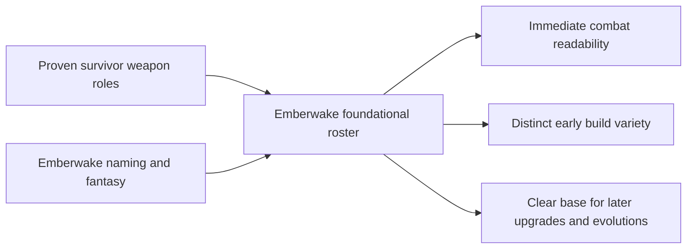

## prod_006_foundational_survivor_weapon_roster_for_emberwake - Foundational survivor weapon roster for Emberwake
> Date: 2026-03-23
> Status: Draft
> Related request: (none yet)
> Related backlog: (none yet)
> Related task: (none yet)
> Related architecture: `adr_019_keep_engine_pixi_as_adapter_and_game_as_runtime_scene_composer`, `adr_033_adopt_deterministic_movement_oriented_pseudo_physics_instead_of_a_full_physics_engine`, `adr_038_split_entity_player_rendering_into_stable_geometry_and_transient_combat_overlays`
> Reminder: Update status, linked refs, scope, decisions, success signals, and open questions when you edit this doc.

# Overview
`Emberwake` should establish a first weapon roster that deliberately covers the same core action roles proven by early survivor-likes, while still reading as Emberwake rather than as a literal copy of another game’s item list. The goal is not originality at all costs; the goal is to adopt a strong, readable baseline combat language quickly, then theme, name, and tune it into the project’s own identity.

# Product problem
The project now has a playable survival-action loop, but it does not yet have a clear weapon-system product posture. Without that, the combat layer risks growing through isolated one-off attacks instead of through a coherent roster with recognizable roles, progression possibilities, and readable tradeoffs.

There is already one existing automatic close-range frontal attack in the runtime. That attack can serve as the first member of a broader roster, but only if the product first decides what the foundational weapon family is supposed to cover and how strongly Emberwake is willing to inherit the genre grammar established by games like *Vampire Survivors*.

The practical product decision is:
- copy the role grammar
- do not copy the names, flavor, or surface presentation
- use the current attack as the Emberwake equivalent of a `Whip-like` starter weapon

# Target users and situations
- A player who should understand the first run within seconds and immediately feel different attack roles as the roster expands.
- A player who expects survivor-like readability: one weapon should say “close frontal sweep,” another should say “auto-target bolt,” another should say “orbiting defense,” without needing explanation.
- A designer or developer who needs a disciplined first weapon baseline before introducing upgrades, rarities, evolutions, or larger build systems.

# Goals
- Establish a first weapon roster that covers the essential survivor-action combat roles.
- Use the current attack as the first Emberwake weapon, functionally equivalent to a `Whip-like` close frontal starter.
- Give each foundational weapon a distinct role, spacing profile, and player-reading function.
- Rename and re-theme every weapon so the roster feels native to Emberwake’s world and visual identity.
- Optimize for fast implementation, fast learnability, and fast build-variety value rather than for novelty-first experimentation.
- Create a stable foundation for later upgrades, level-ups, support items, and weapon evolutions.

# Non-goals
- Inventing a fully original weapon grammar from scratch before the first roster exists.
- Copying `Vampire Survivors` names, iconography, or fantasy literally.
- Finalizing every long-term evolution, synergy, or meta-progression rule now.
- Building a huge launch roster before the first 6-10 foundational weapons are coherent.
- Turning Emberwake into a parody reskin of another survivor-like.

# Scope and guardrails
- In: first weapon-roster philosophy, role coverage, naming posture, thematic differentiation, first roster priorities, and how the existing attack maps into the roster.
- In: defining what should be copied functionally from proven genre patterns and what must be changed for Emberwake identity.
- Out: exact implementation details for every projectile, exact damage formulas, exact rarity tables, full upgrade trees, or final content counts beyond the first foundational roster.

# Key product decisions
- Emberwake should intentionally copy the foundational weapon-role grammar popularized by early survivor-likes because that grammar is already strong, readable, and efficient.
- The project should copy roles, not names. Functional equivalence is acceptable; surface identity must be Emberwake’s own.
- The current automatic frontal attack should become the roster’s first weapon and occupy the `Whip-like` role after adaptation into Emberwake’s language.
- The first roster should prioritize recognizable combat roles such as:
  - close frontal sweep
  - auto-target projectile
  - straight thrown line attack
  - high-arc or falling strike
  - orbiting defensive pressure
  - short-radius aura or proximity tool
  - piercing or tracing projectile
  - area denial placement
- Each weapon should be readable by function before it is impressive by spectacle.
- Names should evoke Emberwake’s dark-fantasy plus synthetic-energy identity rather than generic medieval loot labels or direct genre references.
- The roster should feel like a family, not a pile of references. Naming, FX, and signal language should share the same world.

# Starter roster posture
- First weapon:
  - current frontal auto-attack becomes the Emberwake equivalent of a `Whip-like` starter
  - it should remain a close-range arc or lash with clear spacing value and immediate readability
- First-wave roster target:
  - roughly `6-10` weapons
  - enough variety to form distinct early builds
  - not so many that tuning and readability collapse
- Functional baseline to cover:
  - frontal melee-like pressure
  - safe auto-target pressure
  - directional burst or line pressure
  - defensive orbit or zone control
  - proximity deterrent
  - area placement / delayed impact
  - piercing / path-based projectile

# Fusion readiness requirements
- The first weapon roster should not only cover attack roles; it should also leave clear room for later `active + passive` fusion logic.
- At least the first-wave active roster should include enough distinct weapon identities that future fusions do not all collapse into the same payoff pattern.
- The roster should cover a mix of weapons that naturally benefit from:
  - reach or area amplification
  - cadence or cooldown improvement
  - persistence or duration improvement
  - projectile count, spread, or path enhancement
  - force or damage amplification
- Each foundational weapon should be legible enough in its base form that a later fused form can feel like a meaningful transformation rather than a minor stat bump.
- The first active roster should prefer “fusionable archetypes” over exotic one-off mechanics that cannot pair cleanly with a passive later.
- The current `Whip-like` starter should specifically remain compatible with at least one clear future passive pairing that can evolve it into a stronger, more distinctive Emberwake form.

# Naming and identity rules
- Do not reuse iconic source names such as `Whip`, `Magic Wand`, `Knife`, `Axe`, `King Bible`, `Garlic`, or similar direct carryovers.
- Prefer Emberwake-native names tied to ash, embers, cinders, wards, sutras, shards, wake, ritual, heat, soot, or occult/synthetic force.
- Names should be short, memorable, and role-legible, but they should not feel legally or creatively derivative.
- FX and presentation should help differentiate Emberwake’s weapons even when the underlying role is genre-familiar.

# Product rationale
- This is a pragmatic product move, not a failure of creativity.
- Survivor-likes depend heavily on fast role recognition, and the early genre already solved many of those role shapes well.
- Copying those core shapes accelerates the project toward a fun and legible roster.
- The differentiation burden should fall on:
  - naming
  - theme
  - visual language
  - tuning
  - upgrade framing
  - eventual evolutions and synergies

# Success signals
- A new player quickly understands that Emberwake has a coherent weapon roster with clearly different combat roles.
- The first attack already feels like one deliberate member of a larger family rather than a placeholder mechanic.
- The weapon roster feels inspired by the survivor genre without reading as a direct naming or presentation clone.
- The team can discuss future upgrades and evolutions using a stable weapon-role vocabulary.
- Later requests for weapons, level-ups, passives, and evolutions have a strong product baseline to build on.
- The active roster already exposes obvious future fusion hooks instead of requiring retroactive redesign once evolutions are introduced.

# References
- `prod_001_minimal_overlay_and_feedback_for_early_runtime`
- `prod_003_high_density_top_down_survival_action_direction`
- `prod_005_visual_identity_dark_fantasy_with_synthetic_energy_accents`
- `prod_007_foundational_passive_item_direction_for_emberwake`
- `req_050_define_a_main_menu_polish_and_first_crystal_xp_progression_wave`
- `req_056_define_a_runtime_render_hot_path_optimization_wave_for_world_and_entity_drawing`

# Open questions
- Which exact `6-10` foundational roles should make the first Emberwake roster, and in what order should they land?
- How aggressive should the roster be about one-to-one functional equivalence versus small mechanical deviations per weapon?
- Should the first wave include passive/support items immediately, or only active weapons first?
- What naming family best fits Emberwake’s world: occult ritual, ash-forged arsenal, synthetic relics, or a hybrid of those?
- How early should weapon upgrades and evolutions appear once the baseline roster exists?
