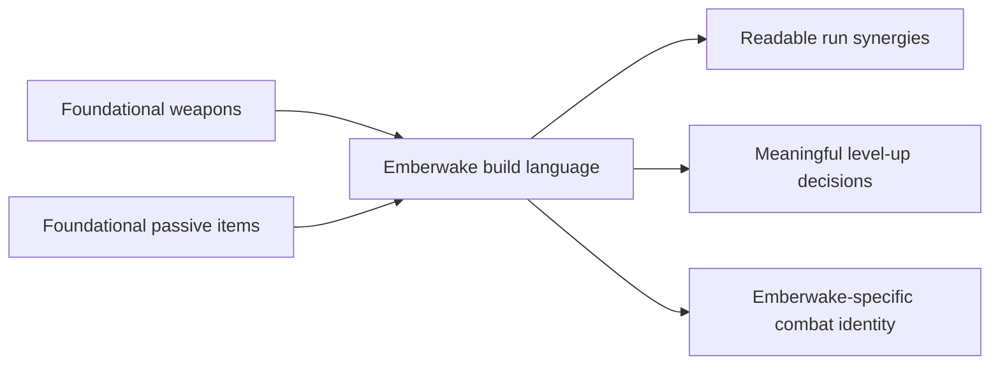

## prod_007_foundational_passive_item_direction_for_emberwake - Foundational passive item direction for Emberwake
> Date: 2026-03-23
> Status: Draft
> Related request: (none yet)
> Related backlog: (none yet)
> Related task: (none yet)
> Related architecture: `adr_019_keep_engine_pixi_as_adapter_and_game_as_runtime_scene_composer`, `adr_033_adopt_deterministic_movement_oriented_pseudo_physics_instead_of_a_full_physics_engine`, `adr_038_split_entity_player_rendering_into_stable_geometry_and_transient_combat_overlays`
> Reminder: Update status, linked refs, scope, decisions, success signals, and open questions when you edit this doc.

# Overview
`Emberwake` should define a first passive-item product direction before implementing a larger weapon-selection loop. In survivor-like combat systems, passive items are not minor stat clutter; they are the second half of build identity. They shape how weapons scale, what kinds of tradeoffs matter, and how a run transitions from “I picked attacks” to “I built a synergistic combat kit.”

The project should therefore treat passives as a foundational roster alongside weapons:
- weapons define active attack roles
- passives define build shaping, scaling, and synergy
- together they create the first real build language of the game

# Product problem
The project now has a product direction for copying the core role grammar of early survivor-like weapons while renaming and re-theming them for Emberwake. But that weapon direction is incomplete unless the project also decides what passive items are supposed to do.

Without a passive-item brief, several risks appear quickly:
- level-up choices become too weapon-heavy and repetitive
- scaling is pushed into weapon levels only, which flattens build variety
- future evolutions or combinations lack clear design anchors
- “builds” become lists of attacks instead of coherent combat identities

In games like *Vampire Survivors*, passives are important because they:
- modify core combat stats such as area, speed, cooldown, duration, might, or projectile count
- create synergy conditions for evolutions
- force slot decisions and tradeoffs
- give level-ups meaning even when the player is not taking a new weapon

Emberwake should adopt that product truth while changing the naming, fantasy, and surface identity to fit its own world.

# Target users and situations
- A player who wants level-up choices to feel meaningful beyond “pick another attack.”
- A player who should start feeling build identity emerge from combinations, not only from single weapons.
- A designer or developer who needs a stable passive vocabulary before implementing evolutions, synergies, and slot-limited build decisions.

# Goals
- Establish a foundational passive-item philosophy for Emberwake’s early build loop.
- Treat passive items as core build shapers rather than as filler stat picks.
- Define the main passive-role families the first game version should cover.
- Keep the system compatible with the survivor genre’s proven build grammar while renaming and re-theming it for Emberwake.
- Prepare a stable foundation for later weapon synergies, evolutions, and slot-based build strategy.

# Non-goals
- Finalizing the full passive roster and every exact number now.
- Copying source passive names directly from another game.
- Designing late-game meta-progression, relic systems, talent trees, or permanent unlock economies in this brief.
- Solving every future evolution recipe before the first passive language exists.
- Treating passive items as pure spreadsheet stats detached from fantasy and readability.

# Scope and guardrails
- In: passive-item product purpose, role families, naming/theming posture, slot-value philosophy, and relationship to weapons and future evolutions.
- In: defining what should be copied functionally from survivor-like passive systems and what should change for Emberwake identity.
- Out: exact balance values, full implementation details, exact UI flows for every level-up choice, or exhaustive evolution recipes.

# Key product decisions
- Emberwake should intentionally copy the broad passive-item grammar proven by survivor-likes because it produces readable build decisions quickly.
- The project should copy passive roles, not names or flavor.
- Passive items should be framed as combat disciplines, relics, wards, sutras, embers, or other Emberwake-native concepts rather than generic stat trinkets.
- The first passive roster should focus on high-legibility scaling categories such as:
  - cooldown / tempo
  - area / reach
  - duration / persistence
  - projectile count or spread
  - damage / force
  - pickup / economy support
  - defense / recovery
  - mobility / spacing support
- Each passive should have a readable strategic implication, not just a hidden math benefit.
- Passives should help define why two runs with the same weapon start can still diverge meaningfully.
- The passive layer should be designed with future weapon evolution pairings in mind, even if those pairings are not fully implemented yet.

# Passive roster posture
- First passive wave target:
  - roughly `6-10` passives
  - enough to create early synergy and slot pressure
  - not so many that the meaning of each passive becomes muddy
- Functional baseline to cover:
  - one or more tempo boosters
  - one or more area/reach boosters
  - one or more persistence/duration boosters
  - one or more damage/force boosters
  - one or more utility or economy boosters
  - one or more defensive or recovery boosters
- Build role:
  - passives should make weapons feel more specialized, not merely larger numbers
  - passives should help establish future evolution logic without requiring it immediately

# Fusion readiness requirements
- The first passive roster should explicitly include enough categories to support later `active + passive` fusions without reopening the passive taxonomy from scratch.
- At least the first passive wave should cover:
  - one clear cadence / cooldown family
  - one clear reach / area family
  - one clear duration / persistence family
  - one clear projectile-count or projectile-behavior family
  - one clear force / damage family
- These passive families should be readable enough that players can understand why a given passive could be the “missing half” of a future fusion.
- Passives should not all be generic efficiency buffs; some must feel like identity-defining upgrade anchors suitable for later evolution pairing.
- The first passive roster should be designed so that multiple weapon archetypes can each find at least one plausible future fusion partner.
- The passive layer should avoid becoming so broad and noisy that future fusion logic becomes arbitrary or hard to communicate.

# Naming and identity rules
- Do not reuse iconic passive names from source games.
- Prefer Emberwake-native names tied to ritual, ash, cinders, wake, relics, wards, sutras, brands, embercraft, or synthetic occult force.
- Passive names should sound like things the world of Emberwake would recognize, not imported arcade-stat labels.
- The naming family should remain coherent with the weapon family so the whole build system reads as one universe.

# Product rationale
- Survivor-like build systems become truly interesting when active weapons and passives interact.
- If Emberwake only copies the weapon layer, it will miss half of the genre’s decision structure.
- Passives are a pragmatic way to increase run variety without needing a huge number of unique weapons immediately.
- They also provide a clean path toward:
  - evolutions
  - support synergies
  - slot tension
  - mid-run identity

# Relationship to weapons
- Weapons should answer: “How do I attack?”
- Passives should answer: “What kind of build am I becoming?”
- The current frontal starter attack can remain the first weapon equivalent, but its long-term value depends on a passive layer that can:
  - widen or sharpen its reach
  - change its cadence
  - improve its damage or consistency
  - make it part of future evolution logic

# Success signals
- A player quickly understands that level-up choices can improve both attacks and build shape.
- Runs begin to diverge meaningfully through passive combinations, not only through weapon acquisition order.
- Passive picks feel strategically legible instead of like vague hidden-stat clutter.
- The roster feels survivor-inspired but not named or framed like a direct copy.
- Future requests for level-up flow, evolutions, and build slots have a stable product foundation.
- The passive roster already contains obvious “fusion key” candidates instead of needing emergency retrofits once active-weapon evolutions begin.

# References
- `prod_001_minimal_overlay_and_feedback_for_early_runtime`
- `prod_003_high_density_top_down_survival_action_direction`
- `prod_005_visual_identity_dark_fantasy_with_synthetic_energy_accents`
- `prod_006_foundational_survivor_weapon_roster_for_emberwake`
- `prod_008_active_passive_fusion_direction_for_emberwake`
- `req_050_define_a_main_menu_polish_and_first_crystal_xp_progression_wave`

# Open questions
- Which passive role families are strictly required in the first Emberwake build loop, and which can wait?
- Should passives be purely stat-facing, or should some include visible world/combat behaviors from the start?
- How many passive slots should a run ultimately allow relative to weapon slots?
- Which passive families should be reserved as future evolution keys?
- What naming family best fits passives in Emberwake: relics, sutras, brands, wards, ash-talismans, or a hybrid?
