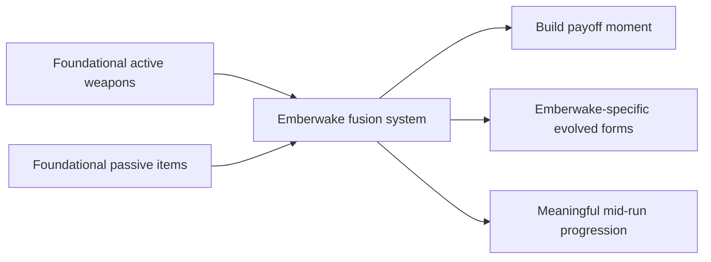

## prod_008_active_passive_fusion_direction_for_emberwake - Active passive fusion direction for Emberwake
> Date: 2026-03-23
> Status: Draft
> Related request: (none yet)
> Related backlog: (none yet)
> Related task: (none yet)
> Related architecture: `adr_019_keep_engine_pixi_as_adapter_and_game_as_runtime_scene_composer`, `adr_033_adopt_deterministic_movement_oriented_pseudo_physics_instead_of_a_full_physics_engine`, `adr_038_split_entity_player_rendering_into_stable_geometry_and_transient_combat_overlays`
> Reminder: Update status, linked refs, scope, decisions, success signals, and open questions when you edit this doc.

# Overview
`Emberwake` should adopt an `active + passive` fusion model as the payoff layer that sits on top of the foundational weapon roster and passive roster. Weapons define what the player attacks with. Passives define how the build scales and specializes. Fusions should define the moment where that build intention pays off in a legible, exciting, and strategically meaningful form.

The product goal is not to invent an entirely new progression grammar here. The goal is to copy the broad survivor-like fusion logic that players already understand, then re-theme and tune it into Emberwake’s own combat identity.

# Product problem
With only active weapons, a build system stays shallow. With active weapons plus passives, a build system becomes more interesting. But without fusions, the system still risks feeling like a loose collection of boosts rather than a progression arc with memorable payoffs.

In survivor-like games, fusion or evolution systems matter because they:
- reward deliberate build planning
- turn passive items into more than generic stat picks
- create memorable mid-run spikes
- give a run a sense of direction beyond “more levels, more numbers”

Emberwake now needs a clear product position on whether it wants that payoff layer, and if so, how close it should remain to the genre template.

The recommended answer is:
- yes, Emberwake should adopt active-passive fusions
- yes, the system can be structurally inspired by survivor-like evolution logic
- no, the fused forms should not read as direct naming or presentation clones

# Target users and situations
- A player who wants a clear payoff for committing to a build direction.
- A player who should feel that combining the right active and passive choices produces something meaningfully new, not just better numbers.
- A designer or developer who needs a stable product rule for deciding which weapon-passive pairs deserve evolved forms.

# Goals
- Establish a clear product direction for active-passive fusions in Emberwake.
- Make fusions a meaningful payoff for build intention, not an arbitrary hidden bonus.
- Ensure the active and passive rosters are designed to support fusions cleanly.
- Keep fused forms readable, desirable, and worth planning around.
- Preserve Emberwake identity through naming, theme, and presentation even when the fusion structure is genre-familiar.

# Non-goals
- Defining every exact fusion recipe now.
- Finalizing the exact trigger timing, chest rules, or upgrade UI in this brief.
- Introducing a huge matrix where every active can fuse with every passive.
- Treating fusions as purely numerical upgrades with no fantasy or gameplay identity shift.
- Replacing the foundational value of base weapons and passives with a system that only matters after fusion.

# Scope and guardrails
- In: fusion philosophy, product purpose, pairing logic, payoff rules, roster readiness requirements, and differentiation posture.
- In: defining the relationship between actives, passives, and future evolved forms.
- Out: exact implementation rules for all recipes, exact numbers, exact UI choreography, or exhaustive content lists.

# Key product decisions
- Emberwake should use a curated fusion model, not a combinatorial fusion matrix.
- A fusion should come from a deliberate relationship between one active weapon and one passive-item family.
- Not every active weapon needs a fusion immediately, but the first foundational roster should be selected with future fusion potential in mind.
- Not every passive should be a fusion key, but the passive roster should include several obvious key candidates.
- A fused form should feel like:
  - a recognizable continuation of the base weapon
  - a stronger fantasy statement
  - a meaningful gameplay shift or escalation
  - a visible reward for planning
- Fusions should reward intention, not pure randomness.
- The fused result should still look and sound like Emberwake rather than like a renamed import from another survivor-like.

# Fusion posture
- First fusion wave target:
  - small and curated
  - enough to prove the system
  - not so many that pairings become hard to teach or balance
- Good first-wave fusion qualities:
  - obvious relationship between active role and passive support
  - strong readability before and after fusion
  - noticeable upgrade in fantasy and function
  - easy player comprehension of “why these two belong together”
- Fusion-ready examples of pairing logic:
  - frontal lash + reach / area enhancer
  - auto-target projectile + cadence / projectile enhancer
  - orbiting defense + duration / persistence enhancer
  - area placement weapon + force / spread / persistence enhancer

# Relationship to active and passive briefs
- `prod_006` should guarantee that the active roster includes fusionable archetypes.
- `prod_007` should guarantee that the passive roster includes fusion-key families.
- This brief depends on both:
  - weapons must expose clear upgrade identities
  - passives must expose clear support identities
- If either roster cannot support several intuitive pairings, it should be corrected before a fusion request is opened.

# Naming and identity rules
- Do not copy iconic evolution names from source games.
- Fused forms should feel more elevated, occult, ash-forged, ritualized, or synthetic than their base forms, but still remain readable.
- The naming of fused forms should feel like an escalation of Emberwake’s own fantasy rather than a wink toward genre references.

# Product rationale
- Fusions are the payoff layer that turns “a list of picks” into “a build.”
- They also justify why passives matter beyond arithmetic.
- A curated fusion system gives Emberwake a strong source of memorable moments without requiring an enormous amount of base content.
- Because the project is still early, the system should start narrow and clear rather than broad and noisy.

# Success signals
- A player understands that some weapon-passive combinations are worth pursuing.
- Fused forms feel like meaningful mid-run milestones instead of invisible stat thresholds.
- The build system feels deeper without becoming harder to read.
- The active and passive rosters both feel validated because each now contributes to a shared payoff.
- Emberwake gains a survivor-like build payoff loop without reading as a direct clone in names or fantasy.

# References
- `prod_001_minimal_overlay_and_feedback_for_early_runtime`
- `prod_003_high_density_top_down_survival_action_direction`
- `prod_005_visual_identity_dark_fantasy_with_synthetic_energy_accents`
- `prod_006_foundational_survivor_weapon_roster_for_emberwake`
- `prod_007_foundational_passive_item_direction_for_emberwake`

# Open questions
- How many fusions should exist in the first playable implementation?
- When should a fusion trigger in the run structure: immediately on conditions met, through a later reward source, or through a special upgrade moment?
- Which passives should be reserved as explicit fusion keys versus remaining general-purpose support items?
- Should every foundational active eventually gain a fusion, or should some remain “pure base tools”?
- How dramatic should the gameplay shift be between a base weapon and its fused form?
