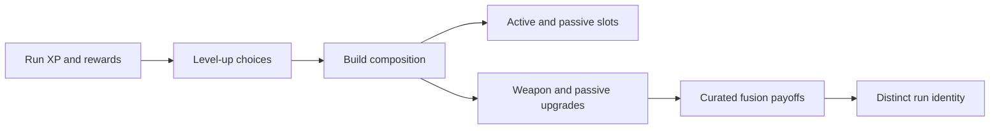

## prod_009_level_up_slots_and_run_progression_model_for_emberwake - Level-up slots and run progression model for Emberwake
> Date: 2026-03-23
> Status: Draft
> Related request: (none yet)
> Related backlog: (none yet)
> Related task: (none yet)
> Related architecture: `adr_019_keep_engine_pixi_as_adapter_and_game_as_runtime_scene_composer`, `adr_033_adopt_deterministic_movement_oriented_pseudo_physics_instead_of_a_full_physics_engine`, `adr_038_split_entity_player_rendering_into_stable_geometry_and_transient_combat_overlays`
> Reminder: Update status, linked refs, scope, decisions, success signals, and open questions when you edit this doc.

# Overview
`Emberwake` should adopt a run-progression model strongly inspired by the proven survivor-like structure used by games such as *Vampire Survivors*: one starting weapon, repeated level-up choices during the run, separate active and passive slots, upgrades that stack over time, and curated fusion payoffs once the right combinations are assembled.

This brief defines the product posture for how the player acquires, upgrades, and combines combat tools during a run. It is the connective layer between:
- foundational active weapons
- foundational passive items
- active + passive fusions

# Product problem
The project now has product direction for:
- foundational active weapons
- foundational passive items
- curated active + passive fusions

But those three layers are not yet enough to define the run experience. Without a clear progression model, the game still does not answer the most important player-facing question:

`How do I actually gain weapons, passives, upgrades, and fusions during a run?`

If this stays undefined, the build system risks becoming incoherent:
- active and passive rosters may exist without a clear acquisition grammar
- level-ups may feel arbitrary or overloaded
- fusion readiness may be conceptually sound but operationally vague
- slot pressure and build identity may remain weak

The project therefore needs a clear early product rule set for:
- slot counts
- level-up choice count
- what can appear in the level-up pool
- how upgrades are prioritized
- when fusions become eligible
- what secondary reward moments such as chests should do

# Target users and situations
- A player who wants quick, understandable build decisions during a run.
- A player who should feel progression through a rhythm of level-up choices and payoff moments rather than through opaque systems.
- A designer or developer who needs stable product defaults for implementing weapons, passives, upgrades, and fusion triggers.

# Goals
- Define a clear early-run and mid-run progression structure for Emberwake.
- Keep the build loop easy to understand for a first-time player.
- Create enough slot pressure and upgrade choice to support distinct builds.
- Preserve survivor-like clarity while re-theming the system for Emberwake.
- Ensure the progression loop supports the active, passive, and fusion briefs without reopening them.

# Non-goals
- Finalizing all exact XP curves and numeric tuning in this brief.
- Designing a permanent meta-progression or unlock tree.
- Defining every chest reward table or economy table exhaustively.
- Solving all future rarity systems, banish/reroll systems, or late-game modifiers right now.
- Turning the early model into a deeply novel progression grammar before the baseline loop exists.

# Scope and guardrails
- In: run-level progression structure, level-up choice posture, slot counts, upgrade flow, fusion eligibility posture, and secondary reward role.
- In: defining the genre-inspired defaults Emberwake should adopt first.
- Out: exact UI spec, exact XP formula math, full chest/drop implementation spec, or final long-term metagame.

# Key product decisions
- Emberwake should start from a clear survivor-like default model rather than inventing a new progression grammar from scratch.
- The player should begin a run with one starting active weapon tied to the character or loadout.
- Level-ups should be the primary source of build growth during a run.
- Level-up choices should draw from:
  - new active weapons
  - new passive items
  - upgrades to owned active weapons
  - upgrades to owned passive items
- Secondary reward moments such as chests should exist primarily as payoff and acceleration tools, not as the main build grammar.
- Fusion should be the payoff layer on top of the base progression loop, not a replacement for it.

# Recommended default model
- Active slots:
  - `6`
- Passive slots:
  - `6`
- Starting loadout:
  - `1` active weapon at run start
  - no passive at start by default unless a later character design explicitly changes that
- Level-up choice count:
  - `3` choices per standard level-up
- Early pool posture:
  - prefer offering new actives and passives while there are still open slots
- Mid-run posture:
  - once slots fill, shift the pool toward owned-item upgrades and fusion-enabling support
- Upgrade posture:
  - active weapons should support multiple levels and meaningful growth toward a fusion-ready state
  - passive items should support fewer but still meaningful levels
- Fusion posture:
  - fusions should require a specific active + passive relationship
  - fusion eligibility should depend on the required build pieces being owned and the active being sufficiently upgraded
- Secondary rewards:
  - chests or equivalent reward moments should provide upgrades and serve as likely fusion-trigger opportunities once eligibility is met

# Slot philosophy
- Separate active and passive slots are important because they preserve readable build grammar.
- The player should not feel forced to choose only attacks forever.
- Slot pressure should create identity:
  - which attacks did I commit to?
  - which support disciplines define my run?
- `6 / 6` is recommended because it is:
  - easy to understand
  - rich enough for builds
  - familiar to the genre
  - still manageable for early implementation

# Level-up choice philosophy
- `3` choices per level-up is the recommended early default.
- That number gives enough agency without creating heavy UI or decision drag.
- Level-up choices should feel:
  - fast
  - legible
  - exciting
  - rarely dead
- The pool should avoid showing choices that are low-value or nonfunctional in the current build state.

# Upgrade philosophy
- Upgrades should not merely inflate numbers; they should move items toward clearer role expression.
- Weapon upgrades should make a player feel a weapon becoming more itself.
- Passive upgrades should make a player feel a build becoming more committed.
- The progression model should support future “maxed and ready” states that make fusion feel earned rather than random.

# Fusion eligibility posture
- Fusions should not be available from the start of a run.
- They should emerge as a build payoff after the player has:
  - committed to an active
  - committed to the right passive support
  - invested enough upgrades into that path
- The trigger should feel readable and reward-oriented, not hidden and confusing.
- A chest-like reward source is the recommended early trigger posture because it creates a strong payoff moment.

# Pool and reward guardrails
- Early levels should emphasize build establishment.
- Mid-run levels should emphasize build shaping and completion.
- Once a build is largely assembled, rewards should more reliably strengthen owned items rather than pollute the pool with low-value noise.
- The system should minimize dead rolls and awkward “none of these matter” moments.

# Product rationale
- This model is deliberately conservative because the genre already proved it works.
- The project should spend originality budget on:
  - naming
  - fantasy
  - visual identity
  - weapon behavior tuning
  - fusion identities
- It should not spend that budget prematurely on reinventing the basic build-acquisition loop before the first fun baseline exists.

# Success signals
- A first-time player quickly understands how a run grows.
- Level-ups feel consistently useful and readable.
- Active and passive slots create real build identity.
- Fusions feel like earned payoffs rather than random surprises.
- The game gains a stable progression language that supports future content without constant redesign.

# References
- `prod_001_minimal_overlay_and_feedback_for_early_runtime`
- `prod_003_high_density_top_down_survival_action_direction`
- `prod_006_foundational_survivor_weapon_roster_for_emberwake`
- `prod_007_foundational_passive_item_direction_for_emberwake`
- `prod_008_active_passive_fusion_direction_for_emberwake`

# Open questions
- What is the right first-wave max level for active weapons and for passive items?
- Should Emberwake introduce reroll, skip, or banish tools early, or only after the baseline loop is proven?
- Should chest-like rewards always upgrade, or sometimes offer new items too?
- At what point should the game start biasing level-up pools toward fusion readiness?
- Should different characters alter the starting loadout or slot logic, or should the first implementation keep that fully standardized?
