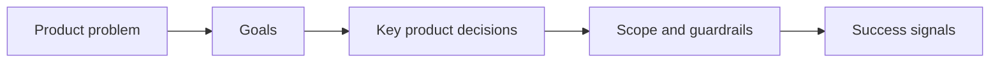

## prod_010_first_playable_techno_shinobi_build_content_and_progression_defaults - First playable techno-shinobi build content and progression defaults
> Date: 2026-03-28
> Status: Draft
> Related request: `req_059_define_a_first_playable_techno_shinobi_build_content_wave`
> Related backlog: `item_218_define_the_first_exact_techno_shinobi_active_roster_and_starter_weapon_delivery`, `item_219_define_the_first_exact_techno_shinobi_passive_roster_and_fusion_key_delivery`, `item_220_define_first_pass_level_up_pool_and_chest_rules_for_the_techno_shinobi_build_loop`, `item_221_define_the_first_curated_techno_shinobi_fusion_delivery_and_readiness_rules`, `item_222_define_player_facing_level_up_and_build_tracking_ui_for_the_first_techno_shinobi_loop`, `item_223_define_first_playable_tuning_and_validation_for_the_techno_shinobi_build_wave`
> Related task: `task_051_orchestrate_the_first_playable_techno_shinobi_build_content_wave`
> Related architecture: `adr_039_structure_the_first_survivor_build_loop_around_separate_active_and_passive_slots`, `adr_040_use_curated_active_passive_fusions_as_the_foundational_build_payoff_layer`, `adr_041_lock_the_first_playable_survivor_content_wave_to_one_character_and_a_small_curated_techno_shinobi_roster`
> Reminder: Update status, linked refs, scope, decisions, success signals, and open questions when you edit this doc.

# Overview
`Emberwake` now needs one concrete, playable content package for its first survivor-like build loop. The project already has the foundational direction for active weapons, passive items, fusions, and run progression; what is still missing is the first exact roster, first exact naming set, first exact fusion map, and the first default progression rules that players will actually experience.

This brief locks the first playable package to a small techno-shinobi roster:
- `6` active weapons
- `6` passive items
- `4` curated fusions
- `1` starting character loadout
- `1` first-pass level-up and chest grammar

The goal is not perfect balance. The goal is one legible, theme-coherent, first fun loop that proves the whole build system.

# Product problem
The current product corpus now explains:
- why Emberwake wants a survivor-like build grammar
- why active and passive slots should be separate
- why fusions should be curated rather than combinatorial
- why the first loop should stay small and legible

What it does not yet fix is the exact first playable answer to:

`What are the first actual weapons, passives, fusions, and progression rules the player gets?`

Without that concrete package:
- implementation slices will drift
- naming will remain unstable
- UI cannot present clear build choices
- tuning cannot start from a shared baseline
- balancing feedback will be noisy because too much is still undefined

# Goals
- Freeze the first exact techno-shinobi content package for the survivor-like build loop.
- Preserve the role grammar inspired by *Vampire Survivors* while making the roster read as Emberwake.
- Define a first playable progression grammar that is concrete enough for implementation and balancing.
- Keep the first loop small enough to ship and evaluate quickly.

# Non-goals
- Solving long-term unlock trees or meta-progression.
- Defining multiple playable characters in the first pass.
- Finalizing late-game economy, rarity, rerolls, banishes, or advanced build modifiers.
- Designing more than the first small wave of fusions.

# Theme guardrails
- The roster must read as `techno-shinobi`, not gothic fantasy and not generic cyberpunk.
- Names should feel disciplined, ritualized, sharp, and synthetic.
- VFX and presentation should imply signal, ash, seals, sutras, relays, threads, shards, and veils rather than guns, lasers, demons, or neon excess.
- The player should feel like they are assembling a covert combat rite, not a loot pile.

# First playable roster
## Active weapons
### 1. `Ash Lash`
- Role: short-range frontal sweep
- Genre mapping: `Whip-like`
- Start state: the current frontal automatic attack adapted into the roster starter
- Identity: a disciplined ash-trail strike that rewards spacing and forward positioning

### 2. `Guided Senbon`
- Role: auto-targeted precision projectile
- Genre mapping: `Magic Wand-like`
- Identity: a homing needle burst that stabilizes single-target pressure

### 3. `Shade Kunai`
- Role: forward thrown burst with directional commitment
- Genre mapping: `Knife-like`
- Identity: narrow but aggressive fan of thrown shadow blades

### 4. `Cinder Arc`
- Role: heavy lobbed strike with delayed impact
- Genre mapping: `Axe-like`
- Identity: a burning crest that rises, drops, and punishes clustered lanes

### 5. `Orbit Sutra`
- Role: orbiting defensive-offensive scripture ring
- Genre mapping: `King Bible-like`
- Identity: rotating etched sigils that protect space and punish nearby enemies

### 6. `Null Canister`
- Role: thrown area denial zone
- Genre mapping: `Santa Water-like`
- Identity: an impact canister that bursts into a temporary hush field

## Passive items
### 1. `Overclock Seal`
- Primary stat role: cooldown reduction / attack frequency
- Fusion-key family: tempo

### 2. `Hardlight Sheath`
- Primary stat role: base damage / impact force
- Fusion-key family: edge

### 3. `Wideband Coil`
- Primary stat role: area / footprint / sweep width
- Fusion-key family: space

### 4. `Echo Thread`
- Primary stat role: duration / persistence
- Fusion-key family: sustain

### 5. `Duplex Relay`
- Primary stat role: extra projectiles / duplicate casts
- Fusion-key family: multiplicity

### 6. `Vacuum Tabi`
- Primary stat role: pickup radius / run economy support
- Fusion-key family: flow

## Curated first-wave fusions
### `Ash Lash` + `Overclock Seal` -> `Redline Ribbon`
- Payoff: faster repeated frontal ribbons with a wider chained lash feel

### `Guided Senbon` + `Duplex Relay` -> `Choir of Pins`
- Payoff: doubled or chained precision volleys that aggressively reacquire targets

### `Shade Kunai` + `Hardlight Sheath` -> `Blackfile Volley`
- Payoff: denser forward burst with piercing or heavy over-penetration identity

### `Orbit Sutra` + `Wideband Coil` -> `Temple Circuit`
- Payoff: larger orbit footprint with stronger screen-control identity

# Levels and progression defaults
## Item levels
- Active weapon max level: `8`
- Passive item max level: `5`
- Fusion state: replaces the base active’s capped state with one evolved payoff form

## Starting loadout
- First playable character starts every run with `Ash Lash`
- No passive item at run start
- No character-specific alternate starter in the first implementation

## Slot model
- Active slots: `6`
- Passive slots: `6`

## Level-up posture
- Standard level-up offers: `3`
- Choice types:
  - new active
  - new passive
  - active upgrade
  - passive upgrade
- Early level-up bias:
  - strongly favor new actives and passives while open slots remain
- Mid-run bias:
  - favor owned upgrades and fusion-enabling picks once at least `4` active or passive slots are filled
- Late-run bias:
  - minimize dead rolls; prefer owned upgrades and valid fusion-path completion

## Chest posture
- Chests should not be the main acquisition grammar
- Default first-pass chest rule:
  - guarantee at least one owned-item upgrade
  - if a fusion path is ready, the chest may resolve that fusion
- Chests should not grant brand new active or passive items in the first pass

# First-pass UI posture
## Level-up choice screen
- Present `3` large cards with clear tags:
  - `Active`
  - `Passive`
  - `Upgrade`
  - `Fusion Path`
- Each card should show:
  - item name
  - short role line
  - current level to next level when applicable
  - one-line effect delta

## Build tracking
- The runtime feedback surface should expose the current build state:
  - active row
  - passive row
  - level pips or compact level markers
- Fusion-ready actives should receive a distinct but restrained techno-shinobi readiness indicator
- The UI should communicate readiness without turning the run into a spoiler checklist

# First-pass tuning defaults
These numbers are starting points for the first playable loop, not final balance targets.

## Weapon posture
- `Ash Lash`
  - low cooldown
  - short reach
  - medium width
  - high reliability
- `Guided Senbon`
  - medium cooldown
  - low projectile count
  - strong target acquisition
  - lower area footprint
- `Shade Kunai`
  - medium-low cooldown
  - high forward bias
  - low forgiveness
  - strong scaling with damage and projectile duplication
- `Cinder Arc`
  - slower cadence
  - higher damage
  - larger impact arc
  - delayed payoff
- `Orbit Sutra`
  - persistent zone pressure
  - lower burst
  - strong close-range control
- `Null Canister`
  - medium cadence
  - temporary ground control
  - high value against clusters

## Progression posture
- Early levels should come fast enough to establish the first two to three build pieces quickly
- First chest payoff should happen early enough to teach chest value, but not before the build grammar is understood
- Fusion should normally appear in the mid-run rather than the opening minute

# Explicit out-of-scope defaults
- First playable release ships all first-wave build content unlocked by default
- No meta-progression unlock tree is required for the first pass
- No second character is required for the first pass
- No character-specific starter divergence is required for the first pass

# Success signals
- A player can describe the first roster and its roles after one or two runs.
- Level-up choices feel understandable and rarely dead.
- Fusion paths feel intentional and readable.
- The theme reads as techno-shinobi across naming, UI, and payoff moments.
- The project gains a stable, concrete baseline for tuning and future content expansion.

# References
- `prod_003_high_density_top_down_survival_action_direction`
- `prod_005_visual_identity_dark_fantasy_with_synthetic_energy_accents`
- `prod_006_foundational_survivor_weapon_roster_for_emberwake`
- `prod_007_foundational_passive_item_direction_for_emberwake`
- `prod_008_active_passive_fusion_direction_for_emberwake`
- `prod_009_level_up_slots_and_run_progression_model_for_emberwake`

# Open questions
- Should `Null Canister` or `Cinder Arc` be in the first six, or should one be deferred in favor of a simpler aura-style active?
- Should `Vacuum Tabi` remain in the first six passives, or should the first passive set stay entirely combat-facing?
- How explicit should the first fusion-ready indicator be in the level-up and HUD surfaces?
