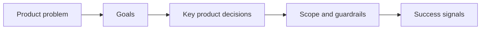

## prod_011_techno_shinobi_combat_skill_feedback_direction_for_first_playable_weapons - Techno-shinobi combat skill feedback direction for first playable weapons
> Date: 2026-03-28
> Status: Draft
> Related request: `req_061_define_a_first_combat_skill_feedback_wave_for_playable_weapons`
> Related backlog: `TBD after request approval`
> Related task: `TBD after request approval`
> Related architecture: `adr_042_separate_weapon_simulation_from_transient_combat_skill_feedback_presentation`
> Reminder: Update status, linked refs, scope, decisions, success signals, and open questions when you edit this doc.

# Overview
`Emberwake` now has the first playable techno-shinobi weapon roster implemented in simulation, but the player still does not meaningfully see those weapons at work on screen. Damage resolves, level-ups work, and fusions can trigger, yet the runtime mostly communicates combat through entity motion, attack bars, and floating damage numbers.

This brief defines the next product layer:

`make first-wave weapons readable as weapons, not just as hidden damage sources`

The goal is not full projectile realism. The goal is immediate combat legibility. Each first-wave weapon should create a short-lived techno-shinobi feedback signature that tells the player:
- what fired
- where it fired
- what kind of space it controlled
- whether the payoff was starter, upgraded, or fused

# Product problem
The current survivor-like build loop is structurally present, but visually under-expressed:
- `Ash Lash` behaves differently from `Guided Senbon`, but that difference is not strongly visible
- `Orbit Sutra` and `Null Canister` can exist in build logic without owning readable screen-space signatures
- fusion payoff can be numerically real while still feeling emotionally flat
- the player cannot yet learn the arsenal primarily through sight

Without a dedicated feedback layer:
- the first weapon wave feels less varied than it really is
- tuning feedback becomes harder because players cannot easily attribute results to weapon identity
- progression payoff is muted
- the techno-shinobi theme stays mostly in naming and HUD copy instead of entering combat rhythm

# Goals
- Give each first-wave active weapon a readable and distinct on-screen combat signature.
- Keep feedback aligned with the techno-shinobi language: disciplined, synthetic, ritualized, sharp.
- Make fusion payoff more visible without forcing a heavy simulation rewrite.
- Improve player learning and build readability through visual combat feedback.

# Non-goals
- Building a full projectile-simulation architecture for every weapon in this wave.
- Replacing the current damage model with a purely projectile-owned gameplay model.
- Designing final VFX polish, particles, audio, or post-processing.
- Reworking the whole entity renderer or combat UI.

# Theme guardrails
- The feedback language must read as `techno-shinobi`, not generic bullet hell neon and not medieval spellcasting.
- Shapes should feel precise and authored:
  - ribbons
  - needles
  - fans
  - sutras
  - seals
  - bursts
  - hush fields
- Effects should be brief and readable, not foggy and noisy.
- Fusion feedback should feel intensified and composed, not merely bigger and brighter.

# Direction
## Separate weapon logic from weapon feedback
The product posture should be:
- gameplay resolves the hit logic
- presentation resolves the readable combat signature

This means the first wave should prefer:
- short-lived attack events
- transient effect rendering
- bounded screen-space readability

instead of jumping immediately to:
- full persistent projectile simulation for every skill
- large numbers of long-lived runtime objects
- effect logic tightly coupled to damage logic

## First-wave feedback signatures
### `Ash Lash`
- Signature: short frontal ribbon slash
- Feeling: disciplined sweep with ember edge
- Readability target: the player clearly sees a slash window and frontal commitment

### `Guided Senbon`
- Signature: fast reacquiring needle lines
- Feeling: surgical lock-on puncture
- Readability target: targeted precision is visually obvious

### `Shade Kunai`
- Signature: narrow forward fan
- Feeling: committed burst release
- Readability target: directional commitment is immediately legible

### `Cinder Arc`
- Signature: lobbed crest into impact burst
- Feeling: delayed punish and clustered detonation
- Readability target: the player reads anticipation then drop payoff

### `Orbit Sutra`
- Signature: rotating pulse ring or scripture sweep
- Feeling: protective ritualized perimeter
- Readability target: close-range zone control is visible at a glance

### `Null Canister`
- Signature: impact marker into temporary hush field
- Feeling: thrown denial seal
- Readability target: temporary area-control ownership is obvious

## Fusion posture
Fusion should not require a separate presentation language family.
Instead:
- the base weapon signature remains recognizable
- the fused state intensifies cadence, multiplicity, footprint, or pattern
- the player can still identify the parent weapon instantly

Examples:
- `Redline Ribbon`: more aggressive chained lash pattern
- `Choir of Pins`: doubled or sequenced needle reacquisition
- `Blackfile Volley`: heavier denser forward file burst
- `Temple Circuit`: larger more sacred orbit rhythm

# Product principles
## 1. Readability before spectacle
The first pass should privilege:
- weapon identity
- target-space comprehension
- build payoff recognition

over:
- particle count
- visual noise
- cinematic excess

## 2. Short-lived feedback first
The first pass should lean on:
- attack flashes
- directional traces
- pulse arcs
- impact circles
- brief zone decals

These are enough to teach the arsenal without overcommitting architecture.

## 3. One-to-one mapping between role and signature
The player should be able to infer the weapon role from the feedback:
- frontal sweep
- homing precision
- forward burst
- delayed impact
- orbit control
- temporary denial field

## 4. Fusion payoff must be seen
A fusion that is only stronger numerically is not enough.
The player should feel:
- “this is the evolved form of what I already knew”
- not “the same thing but maybe better”

# Success signals
- Players can distinguish first-wave weapons by sight in normal play.
- Fusion states feel like a visible escalation, not only a stat change.
- Build choice comprehension improves because players can connect names, HUD chips, and combat signatures.
- The feedback layer does not materially regress runtime performance or renderer simplicity in the first pass.

# Risks
- Overbuilding into a full projectile architecture too early.
- Making all first-wave weapons read as the same cyan/orange slash language.
- Creating effects that look impressive in isolation but unreadable during swarm pressure.
- Letting fusion visuals become noisy and lose parent-weapon identity.

# Open questions
- Should the first visual-feedback slice include temporary ground markers for lob and zone skills, or stay purely instantaneous?
  Recommended default: include bounded temporary markers for `Cinder Arc` and `Null Canister`, because those roles rely on spatial anticipation.
- Should impact FX be entirely weapon-owned, or can some generic impact grammar be shared?
  Recommended default: share an underlying renderer substrate, but keep weapon-specific shape language.
- Should passive items influence visuals in the first pass?
  Recommended default: only indirectly through weapon multiplicity, cadence, and footprint. Avoid separate passive VFX in this wave.
