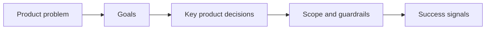

## prod_013_techno_shinobi_runtime_hud_and_menu_entry_direction - Techno-shinobi runtime HUD and menu entry direction
> Date: 2026-03-28
> Status: Validated
> Related request: `req_063_define_a_techno_shinobi_runtime_hud_relayout_and_mobile_menu_entry_wave`
> Related backlog: `item_238_define_a_compact_top_left_player_progression_hud_block`, `item_239_define_a_quiet_top_right_fps_text_and_compact_runtime_menu_trigger`, `item_240_define_a_bottom_right_reserved_build_slot_hud_for_active_and_passive_capacity`, `item_241_route_the_mobile_runtime_menu_trigger_to_the_full_screen_shell_surface`, `item_242_define_ui_steering_validation_for_the_runtime_hud_relayout_wave`
> Related task: `task_054_orchestrate_post_0_4_0_runtime_expression_and_progression_waves`
> Related architecture: `adr_016_define_shell_scene_state_and_meta_surface_ownership`, `adr_044_split_runtime_hud_into_anchored_blocks_and_route_mobile_menu_entry_to_the_full_screen_shell_surface`
> Reminder: Update status, linked refs, scope, decisions, success signals, and open questions when you edit this doc.

# Overview
The current runtime feedback surface exposes useful information, but it still reads as one compact dashboard card rather than a true combat HUD.

This brief defines the next product layer:

`turn runtime feedback into anchored techno-shinobi HUD chrome`

# Product problem
The current HUD mixes:
- player identity and progression
- gold
- FPS
- active skills
- passive skills

inside one contiguous panel.

That makes the runtime chrome:
- too card-like
- too central as a single block
- less edge-anchored than a real HUD
- weaker at teaching build capacity
- noisier than necessary for metrics like `FPS`

# Goals
- Split runtime feedback into anchored, role-specific HUD blocks.
- Make the player/progression cluster read as high-priority combat information.
- Keep utility metrics quiet.
- Turn build slots into compact HUD slots rather than text chips.
- Make the menu trigger feel like a compact runtime control.
- Route mobile menu entry through a full-screen shell model instead of a floating deck.

# Non-goals
- Reworking every shell overlay surface in the same wave.
- Designing final bespoke icon art for every skill slot.
- Adding new gameplay systems to support the HUD wave.
- Replacing the shell’s techno-shinobi direction with a new visual theme.

# Direction
## Three anchored blocks
- Top-left: player identity and progression
- Top-right: quiet utility, primarily `FPS`
- Bottom-right: reserved build-slot area with active and passive rows

## Reserved slot teaching
The HUD should teach capacity, not only current occupancy.
Empty slots are useful:
- they reserve space
- they teach remaining build room
- they make run growth more legible

## Compact menu control
The runtime menu entry should behave like a HUD affordance, not a promo card.

## Mobile uses full-screen shell entry
On mobile, the runtime menu trigger should not compete with the playfield by opening a floating panel.
The right posture is:
- trigger
- full-screen shell surface
- intentional navigation model

# Theme guardrails
- The HUD must stay `techno-shinobi`: compact, sharp, ritualized, synthetic.
- Avoid generic lozenge-SaaS HUDs.
- Avoid over-large hero controls.
- Use `logics-ui-steering` during implementation.

# Success signals
- The HUD feels more edge-native and less like one overlay card.
- The player block becomes easier to parse during combat.
- Build capacity becomes legible before the roster is full.
- The menu trigger feels proportionate.
- Mobile entry behavior becomes more coherent.

# Risks
- Overcompressing the HUD and hurting readability.
- Making empty slot reservations visually noisy.
- Letting mobile routing create confusion between shell scenes and runtime pause behavior.
