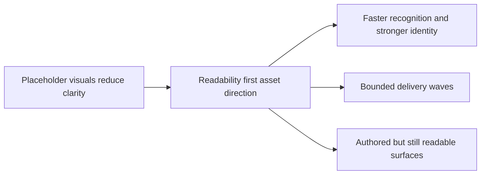

## prod_017_graphical_asset_direction_for_runtime_readability_and_shell_identity - Graphical asset direction for runtime readability and shell identity
> Date: 2026-03-29
> Status: Proposed
> Related request: `req_093_define_a_first_graphical_asset_integration_strategy_for_runtime_and_shell_surfaces`
> Related backlog: `item_342_define_a_first_graphical_asset_integration_strategy_for_runtime_and_shell_surfaces`
> Related task: `task_065_orchestrate_the_first_graphical_asset_integration_strategy_and_delivery_plan`
> Related architecture: `adr_052_adopt_a_content_driven_graphical_asset_pipeline_for_runtime_and_shell_surfaces`
> Reminder: Update status, linked refs, scope, decisions, success signals, and open questions when you edit this doc.

# Overview
Emberwake should start integrating authored graphical assets as a readability and identity program, not as a disconnected art dump. The first wave should make the runtime easier to parse in motion, then extend that visual language into shell surfaces that currently feel more placeholder than authored.

# Product problem
- The current playable build is coherent mechanically, but much of the visual language still reads as prototype or debug-first.
- In the runtime, that weakens quick recognition of threats, pickups, and blocking terrain.
- In the shell, that limits identity across build-facing, codex, and progression surfaces.
- If Emberwake starts integrating assets without product prioritization, it risks polishing low-value ambiance before it fixes the surfaces players need to read instantly.

# Target users and situations
- Players in the active runtime who must distinguish player position, enemy families, pickups, impacts, and traversal blockers quickly.
- Returning players navigating shell surfaces such as skills, talents, codex, and progression views.
- Mobile and PWA players who especially need strong silhouettes and uncluttered visual cues at smaller sizes.

# Goals
- Improve moment-to-moment gameplay readability before pursuing broad ambiance polish.
- Give Emberwake a more authored visual identity across both runtime and shell surfaces.
- Deliver assets in waves that can ship incrementally instead of waiting for a giant all-or-nothing art pass.
- Keep the first wave understandable enough that players can feel the difference immediately.

# Non-goals
- Producing final art for every entity, biome, panel, and codex surface in one release.
- Chasing photorealism, high-frame animation spectacle, or a total renderer rewrite.
- Replacing every procedural element, including telegraphs or diagnostics that are still better served by cheap procedural visuals.
- Turning the first wave into a pure branding exercise disconnected from gameplay clarity.

# Scope and guardrails
- In: a first runtime readability pack for player, core hostiles, pickups, projectile or hit-feedback surfaces, and critical world readability.
- In: a bounded shell identity follow-up for build-facing and codex or progression surfaces after the runtime pack proves sound.
- In: one shared visual language that can stretch across runtime and shell without collapsing into unrelated micro-styles.
- Out: a complete environment-art pass, full codex illustration library, or exhaustive assetization of every surface right now.
- Out: any wave that makes the game harder to read in motion just because it looks more detailed in static screenshots.

# Key product decisions
- Prioritize readability before ambiance. The first wave must help the player parse the game faster, not just make it prettier.
- Deliver art in coherent waves. The runtime readability pack comes before shell ambiance and broad decorative expansion.
- Keep one shared visual family. Runtime and shell should feel authored by the same product, not by parallel disconnected asset efforts.
- Preserve legibility on small screens. If an asset looks good only at large desktop sizes, it is not first-wave ready.
- Keep debug and fallback affordances available while the visual system grows.
- Prefer an operator-friendly asset workflow. Once the decorative targets are listed, the common path should let the team deposit correctly named files without reopening code for every single image.

# Success signals
- The player, hostile families, pickups, and blocking terrain become easier to distinguish in active play.
- Shell surfaces such as skills, talents, and codex-related views feel more native and less placeholder-driven.
- The first wave lands without obvious readability regressions or performance regression complaints.
- The team can describe a clear next visual wave because the first one left a coherent visual language behind.

# References
- `logics/request/req_093_define_a_first_graphical_asset_integration_strategy_for_runtime_and_shell_surfaces.md`
- `logics/backlog/item_342_define_a_first_graphical_asset_integration_strategy_for_runtime_and_shell_surfaces.md`
- `logics/tasks/task_065_orchestrate_the_first_graphical_asset_integration_strategy_and_delivery_plan.md`
- `logics/architecture/adr_052_adopt_a_content_driven_graphical_asset_pipeline_for_runtime_and_shell_surfaces.md`
- `src/game/entities/render/EntityScene.tsx`
- `src/game/world/render/WorldScene.tsx`
- `src/app/components/SkillIcon.tsx`

# Open questions
- How stylized should the first runtime pack be relative to the current techno-shinobi UI language?
- Which shell surfaces deserve true illustration in the first follow-up wave, and which should stay iconography-led for now?
- How much animation is necessary in the first pack before the marginal readability gains stop justifying the complexity?
- Which asset families are likely to need non-default metadata instead of the simple drop-in path?
