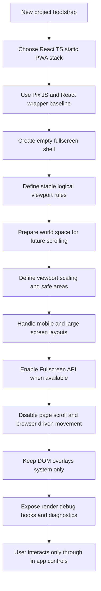

## req_000_bootstrap_fullscreen_2d_react_pwa_shell - Bootstrap fullscreen 2D React Pixi PWA shell
> From version: 0.1.1
> Status: Ready
> Understanding: 98%
> Confidence: 96%
> Complexity: Medium
> Theme: Rendering
> Reminder: Update status/understanding/confidence and references when you edit this doc.

# Needs
- Bootstrap a new 2D game/rendering project based on React and TypeScript with static hosting only, no backend runtime.
- Use PixiJS as the preferred 2D rendering engine baseline and integrate it through `@pixi/react` from day one, following patterns already used in other projects such as Sentry unless a later technical decision explicitly changes that choice.
- Ship the app as a PWA so the experience can run as an installable fullscreen-first web application.
- Deliver only an empty fullscreen shell for now; the first playable or visible scenario will be captured in a separate follow-up request.
- Make the rendering surface occupy the full available viewport and prevent page-level interactions such as scroll, overscroll bounce, pull-to-refresh, text selection, and other browser-driven movements that would interfere with in-app controls.
- Prepare responsive behavior for a mobile-first target around `900px` while still anticipating larger screens with a dedicated large-screen mode instead of assuming one fixed mobile layout.
- Enable a true fullscreen mode when supported by the browser through the Fullscreen API, while still providing a robust fullscreen-like standalone layout when API-based fullscreen is unavailable.
- Treat Pixi as the only interactive rendering surface inside the game area and keep React limited to the shell and system-level overlays around that surface.
- Define an explicit viewport sizing and scaling strategy early, including a logical mobile design target around `900px`, resize handling, and predictable fit behavior.
- Ensure viewport differences across mobile, desktop, and other screen classes do not arbitrarily alter the rendered scene scale or world positioning.
- Prepare the rendering shell for a potentially unbounded scrollable world space, such as an infinite map, without implementing map generation in this request.
- Support mobile safe areas from the start so fullscreen and fullscreen-like layouts behave correctly on devices with notches or browser UI insets.
- Treat pointer and touch as first-class input modes, with keyboard support available, and avoid assumptions that depend on mouse-only interaction.
- Route user interaction through the rendering layer itself so only the controls intentionally implemented in the game/runtime can affect the experience.
- Limit PWA offline scope to installability and shell caching for this bootstrap rather than full offline gameplay.
- Allow a thin DOM overlay layer above the Pixi surface only for system UI concerns such as fullscreen entry, install prompt, loading state, or debug markers.
- Restrict persistence in this bootstrap to local user preferences such as dismissed hints or fullscreen preference rather than gameplay save data.
- Start from a complete scaffold rather than a bare demo, including project structure, linting, typecheck, tests, CI-friendly commands, and PWA assets.
- Establish a project structure that is ready for future scenes and systems without requiring a directory rewrite in the next request.
- Anticipate rendering debug needs from the start by providing tools or hooks to inspect runtime behavior, viewport state, scaling, coordinates, and rendering-related issues during development.
- Provide a single standard debug entry point for rendering diagnostics, such as a developer overlay or dedicated debug service, rather than scattering ad hoc debug code across the app.
- Keep rendering diagnostics available in development and preview environments, while disabling or hiding them by default in production builds.
- Gracefully handle environments where true fullscreen, Pixi, WebGL, or equivalent rendering capabilities are unavailable by exposing a controlled fallback shell and visible diagnostics instead of failing silently.
- Define and persist local UI or developer preferences for shell-level features such as fullscreen preference and debug visibility.
- Establish shared technical vocabulary early for concepts such as world space, chunk space, screen space, camera state, entity state, and render layers so later requests build on a stable language model.
- Set an initial lightweight performance expectation for the shell so fullscreen interaction and debug overlays remain usable on a reference mobile-sized screen.

# Context
The project should start from a web stack that is simple to deploy and easy to iterate on: React, TypeScript, static assets, and no backend dependency. The initial goal is not to deliver gameplay yet, but to establish a reliable application shell for future 2D rendering work.

Current assumption: React owns the application shell, lifecycle wiring, responsiveness, and PWA integration, while PixiJS owns the main 2D scene rendering surface through `@pixi/react`. This integration path should be treated as mandatory for the initial bootstrap rather than optional, unless the team later records a different architecture decision.

The initial deliverable is intentionally narrow: an empty fullscreen-capable shell with the right rendering mount, viewport ownership, and input boundaries, but no first gameplay scenario yet. The next request will define that first scenario separately.

Responsive behavior should not lock the experience to a single orientation or one exact screen shape. The shell should accommodate a mobile-oriented baseline up to `900px` and a large-screen mode above `900px`. For this bootstrap, large-screen mode should stay simple: keep the same shell structure and render ownership model, but expose the sizing and layout tokens needed for future scenes to adapt cleanly without reworking the app shell.

Rendering ownership should stay strict: the interactive experience lives inside the Pixi surface, while React remains responsible for shell composition and thin system overlays only. This avoids mixing DOM-driven interaction and canvas-driven interaction inside the main runtime area.

The bootstrap should also establish a clear viewport strategy rather than merely stretching a canvas to the screen. That includes a logical design target, resize behavior, scale-to-fit rules, and safe-area awareness through browser inset variables so the shell remains robust across modern mobile devices.

Viewport variation across devices should not create hidden rendering drift. The shell should establish a stable logical coordinate space and explicit adaptation behavior so moving between mobile, desktop, and larger displays does not unexpectedly change scene scale, anchor points, or perceived world position. Any viewport adaptation should be deliberate and deterministic rather than emergent from raw canvas resizing.

The rendering model should also be compatible with a world that is not bounded to a single fixed screen-sized scene. Even though map generation is explicitly deferred to a follow-up request, the bootstrap should avoid assumptions that would block a later infinite-map or large-scrollable-world implementation, especially around camera ownership, world coordinates, and render container structure.

Input assumptions should be explicit from the start. Pointer and touch should be treated as first-class interaction modes, keyboard should remain supported, and the shell should avoid patterns that only work comfortably with a desktop mouse.

The bootstrap should favor the more complete quality profile already visible in the referenced projects. A quick review of `electrical-plan-editor` and `sentry` shows a recurring preference for React + TypeScript + Vite, PWA support, linting, typecheck, automated tests, and CI-oriented scripts; `sentry` also confirms PixiJS is already used there for arena rendering. This request should reuse that level of rigor even though this new project stays frontend-only.

The app must behave like a controlled runtime rather than a standard scrolling website. On desktop and mobile, the page should reserve the entire viewport for the render root, lock document scrolling, and suppress browser gestures that can displace the scene or break immersion. The interaction contract should favor pointer, touch, keyboard, and game-loop driven input managed inside the app surface.

Scope boundary: this request targets controls that the web app can reasonably own inside the browser page and installed PWA shell. It includes using the browser Fullscreen API when available, but the true fullscreen request should be triggered explicitly by user action rather than assumed to happen automatically. The request does not require overriding browser chrome, OS-reserved gestures, or platform security controls that are not technically controllable from a static web app.

Offline expectations should stay modest for this request: the PWA shell should be installable and cache the application shell assets, but gameplay-grade offline guarantees are out of scope until actual scenes and data flows exist. Likewise, persistence should stay limited to local UI preferences rather than save-game behavior.

The bootstrap may keep a minimal DOM overlay above the Pixi surface for system-level concerns that are simpler or more reliable in HTML than in canvas, such as fullscreen prompts, install affordances, or diagnostic labels. That overlay should remain intentionally thin and should not become the primary interaction layer for the runtime itself.

The initial codebase layout should anticipate future growth by separating app shell concerns, game runtime concerns, rendering integration, and shared utilities early. The goal is to make the next request additive rather than forcing a structural reorganization.

Debuggability should be treated as a first-class concern in the shell rather than something added later. The bootstrap should make it practical to inspect render timing, viewport metrics, scale behavior, logical coordinates, fullscreen state, and future camera-related issues while developing the app. This does not require a final in-game debug suite yet, but it should establish enough tooling, toggles, or developer-facing hooks to make rendering regressions diagnosable from the beginning.

The debug workflow should itself be structured. A single shell-level debug entry point is preferable to unrelated console helpers or one-off overlays, because later map, camera, and entity requests will need a common place to surface diagnostics.

Diagnostics should remain available in development and preview-style environments where rendering behavior needs to be inspected, but they should not leak as an always-on production feature. Shell-level UI and developer preferences such as fullscreen preference or debug-visibility toggles may be stored locally because they improve iteration without introducing gameplay persistence concerns.

The bootstrap should also assume imperfect runtime conditions. If the browser cannot grant true fullscreen or cannot initialize Pixi or the underlying rendering path correctly, the app should fail in a controlled and diagnosable way with a usable fallback shell rather than a blank screen.

This request should also anchor a shared vocabulary for the later world and entity layers. Terms such as world space, chunk space, screen space, camera state, entity state, and render layers should mean one thing across requests rather than drifting over time.

Even at bootstrap stage, a minimal performance bar is useful. The shell does not need a heavy optimization target yet, but interaction and diagnostics should remain usable on a representative mobile-sized screen so later layers inherit a practical baseline rather than an unconstrained debug build.

# Acceptance criteria
- AC1: The project bootstrap targets a frontend-only stack based on React and TypeScript and does not depend on a backend service for local development or production runtime.
- AC2: PixiJS is treated as the default 2D renderer for the bootstrap, with React used for the application shell and Pixi integration exposed through `@pixi/react` as a required part of the initial stack.
- AC3: The first delivery is an empty fullscreen shell only and does not yet include the first gameplay or rendering scenario beyond baseline mounting and runtime wiring.
- AC4: The app is configured as a PWA with installable metadata and a standalone-friendly shell suitable for a fullscreen-first experience.
- AC5: The main app container fills the full visible viewport on desktop and mobile, with `html`, `body`, and the root app host preventing document scroll and overflow.
- AC6: The shell includes responsive behavior that explicitly considers at least two layout modes: a mobile-oriented mode up to `900px` and a large-screen mode above that threshold, without forcing one orientation only.
- AC7: Large-screen mode does not introduce a different application shell yet; it keeps the same fullscreen render ownership model while exposing the layout and sizing hooks needed for future scene-specific adaptations.
- AC8: A real browser fullscreen entry path is available when supported through the Fullscreen API, and that entry path is initiated from an explicit user action, with an acceptable standalone fallback when fullscreen cannot be granted.
- AC9: Default page interactions that can disrupt the render surface are suppressed on the app surface, including scroll, overscroll chaining, pull-to-refresh style movement where browser-controlled CSS/JS mitigation is possible, and accidental text selection.
- AC10: The interactive runtime area is owned by Pixi, while any DOM layer above it is limited to thin system UI concerns such as fullscreen entry, install prompt, loading state, or diagnostics.
- AC11: The shell defines an explicit viewport sizing and scaling strategy, including resize handling, a logical mobile design target around `900px`, and support for browser safe-area insets.
- AC12: Viewport changes across device classes do not arbitrarily modify scene scale or world position; the shell uses a stable logical coordinate space and deterministic adaptation rules for resize behavior.
- AC13: The shell architecture is compatible with a future large or unbounded scrollable world space and does not assume that gameplay is limited to one fixed screen-sized scene, while map generation itself remains out of scope for this request.
- AC14: Input assumptions are explicit: pointer and touch are first-class, keyboard support remains possible, and the shell does not rely on mouse-only interaction patterns.
- AC15: The PWA scope for this bootstrap is limited to installability and shell asset caching; full offline gameplay behavior is not required yet.
- AC16: Persistence in this bootstrap is limited to local UI preferences rather than gameplay save data.
- AC17: The request explicitly treats browser- or OS-reserved controls as out of scope, so implementation focuses on the controls a static web app can own reliably.
- AC18: The bootstrap includes a complete project foundation aligned with the quality level used in the referenced projects, including linting, typecheck, test scaffolding, CI-friendly commands, and PWA assets.
- AC19: The initial project structure separates app shell concerns, game runtime concerns, rendering integration, and shared utilities so the next gameplay request can build on it without a structural rewrite.
- AC20: The bootstrap includes developer-facing rendering diagnostics or debug hooks sufficient to inspect viewport state, scale behavior, fullscreen state, and logical coordinate behavior during development.
- AC21: Rendering diagnostics are exposed through a single standard shell-level debug entry point rather than ad hoc disconnected tools.
- AC22: Shell-level rendering diagnostics are available in development and preview-style environments and are disabled or hidden by default in production builds.
- AC23: If Pixi, WebGL, or true fullscreen cannot be initialized, the shell degrades in a controlled way with visible diagnostics rather than failing silently.
- AC24: Local shell preferences such as fullscreen preference and debug visibility can be persisted without expanding into gameplay persistence.
- AC25: Shared technical vocabulary is established for later layers, including at least world space, chunk space, screen space, camera state, entity state, and render layers.
- AC26: The shell defines a lightweight performance expectation so fullscreen interaction and debug tooling remain usable on a representative mobile-sized screen.
- AC27: The resulting shell is suitable to host a future Pixi scene or game loop without requiring a later rewrite of the viewport, responsiveness, fullscreen entry, input ownership model, rendering coordinate assumptions, world-space scrolling model, or basic render-debug workflow.

# Definition of Ready (DoR)
- [x] Problem statement is explicit and user impact is clear.
- [x] Scope boundaries (in/out) are explicit.
- [x] Acceptance criteria are testable.
- [x] Dependencies and known risks are listed.

# Companion docs
- Product brief(s): (none yet)
- Architecture decision(s): `adr_000_adopt_feature_oriented_organic_frontend_structure`, `adr_001_enforce_bounded_file_size_and_isolate_react_side_effects`

# Backlog
- `item_000_bootstrap_react_pixi_pwa_project_foundation`
- `item_001_implement_fullscreen_viewport_ownership_and_input_isolation`
- `item_002_add_stable_logical_viewport_and_world_space_shell_contract`
- `item_003_add_render_diagnostics_fallback_handling_and_shell_preferences`
