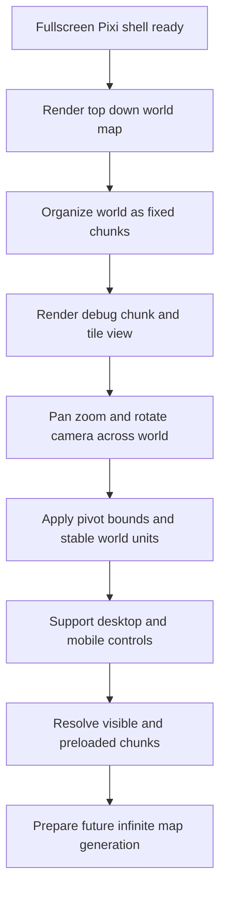

## req_001_render_top_down_infinite_chunked_world_map - Render top-down infinite chunked world map
> From version: 0.1.1
> Status: Ready
> Understanding: 98%
> Confidence: 95%
> Complexity: High
> Theme: World
> Reminder: Update status/understanding/confidence and references when you edit this doc.

# Needs
- Render the world in a top-down view only.
- Focus this request on displaying the world map and navigating through it, not on gameplay systems.
- Support desktop and mobile controls to scroll or pan across the world space, with zoom and camera rotation available from the start.
- Envision the world as potentially infinite and structure the rendering model around chunks, similar in spirit to a Minecraft-style chunked world, without requiring final map generation rules in this request.
- Build on the fullscreen Pixi shell defined in `req_000_bootstrap_fullscreen_2d_react_pwa_shell`.
- Start with a debug-friendly top-down map visualization based on chunks and visible tile or cell structure rather than final art direction.
- Keep chunk boundaries invisible in the player-facing experience while making them explicit in debug diagnostics.
- Use fixed square chunks as the default world partitioning model, with an initial target of `16x16` tiles or logical cells per chunk unless implementation constraints justify another equivalent fixed size.
- Introduce a free camera from the start, centered on world origin at boot, with support for negative and positive world coordinates.
- Treat camera manipulation as part of the minimum useful world-navigation kit from the start: pan, zoom in, zoom out, and rotation.
- Treat player-facing zoom and camera rotation as debug-oriented capabilities for the first product loop rather than mandatory player controls.
- Define clear camera pivot rules from the start so zoom and rotation behave around a stable reference point, preferably the viewport center by default.
- Define zoom bounds from the start so zoom behavior remains controlled and debuggable.
- Distinguish explicitly between world coordinates, chunk coordinates, and screen coordinates in the rendering design.
- Define stable logical world units and tile sizing independent from raw screen pixels so chunk math, camera math, and rendering scale remain coherent.
- Allow deterministic local chunk generation or stubbed chunk content in memory for this phase so the infinite-world model can be validated without backend dependencies.
- Define stable chunk identity from chunk coordinates, with future seed-based generation in mind even if the seed is not fully exploited yet.
- Prepare a lightweight internal map-rendering architecture with separate responsibilities for camera state, visible chunk resolution, and chunk rendering.
- Prepare render layers from the start so terrain or base cells, chunk debug overlays, and future interactive entities do not collapse into one flat draw structure.
- Anticipate screen-to-world conversion and debug picking needs, even if initial usage stays limited to development diagnostics.
- Expose development diagnostics for camera position, zoom level, current chunk, rendered chunk count, visible chunk bounds, and viewport metrics while this map layer is being developed.
- Provide debug reset controls or equivalent developer actions so camera position, zoom, and rotation can be restored quickly to a known state.
- Define the default desktop world-navigation controls explicitly, with pointer drag for panning, mouse wheel for zoom, and keyboard rotation controls such as `Q` and `E` unless later interaction testing requires another mapping.
- Define the default mobile world-navigation controls explicitly, with one-finger pan, pinch-to-zoom, and two-finger rotation as the baseline gesture model.
- Keep camera rotation free-form internally from the start, while leaving optional snapped rotation as a future extension rather than the default behavior.
- Introduce a global world seed concept early, even if the first map layer only uses it lightly for deterministic debug generation.
- Set a lightweight performance target for map navigation so pan, zoom, rotation, and chunk diagnostics remain usable on a representative mobile-sized screen.
- Preserve strict visual continuity when crossing chunk boundaries so navigation never reveals chunk seams.

# Context
This request comes after the rendering shell bootstrap. The shell already establishes PixiJS, fullscreen viewport ownership, stable coordinate assumptions, and preparation for large scrollable worlds. The next step is to make that shell actually display a world map from a top-down perspective and allow the user to move around that world.

The immediate goal is not to define gameplay, combat, units, or map generation algorithms. The goal is narrower: prove the rendering and navigation model for a world that can extend beyond a single screen and eventually beyond any fixed boundary.

The world should be treated as potentially unbounded. To keep that feasible, the request should assume a chunk-based world model where visible content can be organized, loaded, rendered, and eventually unloaded by chunk instead of treating the map as one giant monolithic surface. The default assumption for this phase is a fixed square chunk layout, initially modeled as `16x16` tiles or logical cells per chunk. The exact generation strategy for those chunks can remain simple or stubbed for now because a later request will define map generation in more detail.

The camera or viewport movement must remain stable across desktop and mobile. Moving through the world should not break the previously defined scale and positioning guarantees from `req_000_bootstrap_fullscreen_2d_react_pwa_shell`. Device class changes may affect available viewport space, but they should not unpredictably alter the logical world coordinates being displayed. The camera should start centered on world origin and the world model should support both positive and negative coordinates immediately.

Controls should be practical on both desktop and mobile. The default direction for this request is pointer drag panning on desktop, with optional keyboard movement if it fits the shell cleanly, and touch drag panning on mobile without reintroducing browser scrolling conflicts. This request should include zoom and rotation from the beginning so pan, scale, and camera orientation behavior can be validated together. The request should evaluate the navigation model as part of the rendering outcome, not as a separate afterthought.

The control mapping should not stay vague. A practical default is pointer drag for panning, mouse wheel for zoom, and keyboard rotation inputs such as `Q` and `E` on desktop, paired with one-finger pan, pinch-to-zoom, and two-finger rotation on mobile. Those mappings give the map layer a concrete manipulation contract while still leaving room for refinement later.

For the first player-facing loop, however, zoom and rotation should remain debug-oriented controls. The initial product experience should not require players to manipulate all camera degrees of freedom.

Rotation should be treated as a first-class camera capability rather than a later add-on. Even if the world remains top-down, the camera toolkit should already account for orientation changes so future interaction or navigation features do not require replacing the camera model after the first map-rendering iteration.

Camera behavior should also be explicit, not implicit. Zoom and rotation should happen around a well-defined pivot, preferably the viewport center by default, and zoom should stay within defined minimum and maximum bounds. Leaving those rules unspecified would make pan, zoom, rotation, and world picking harder to reason about and debug.

Rotation should remain free-form internally by default. If snapped angles become useful later for UX or debugging, they should layer onto the existing camera model rather than replacing the baseline behavior.

The first visual output should stay debug-friendly rather than presentation-focused. It is preferable to render chunk boundaries, tile or cell grids, coordinate labels, and state overlays that make chunk streaming and camera behavior obvious during development. That also aligns with the debugability requirement introduced in `req_000_bootstrap_fullscreen_2d_react_pwa_shell`.

That debug visibility should remain primarily a developer concern. The player-facing baseline should not depend on visible chunk structure to understand the world.

To keep the model scalable, chunk content may be generated deterministically in memory from chunk coordinates or provided through simple stubbed data. Chunks outside the active viewing area should not stay rendered forever; the request should anticipate visibility resolution, a small preload margin around the viewport, and bounded active rendering or caching behavior.

Even while chunks are streamed and debugged, movement through the world should feel visually continuous. Crossing chunk boundaries should not reveal seams or jumps in the rendered world.

The internal architecture should separate at least three concepts: camera state, visible chunk resolution, and chunk rendering. That separation should make it possible to evolve later toward richer generation and world interaction without replacing the map-rendering foundation.

Because rotation is now part of the minimum toolkit, visible-chunk resolution should not assume a simple axis-aligned viewport forever. The request should anticipate chunk visibility calculations that remain correct when the camera is rotated, especially near viewport corners and preload margins.

World math should be grounded in stable logical units rather than raw device pixels. A consistent tile or cell size in world space, combined with explicit world, chunk, and screen coordinate transforms, will make camera movement, chunk addressing, picking, and future gameplay interactions more reliable.

Input ownership should also be explicit. The request should anticipate how desktop and mobile gestures map to pan, zoom, and rotation so those interactions do not end up competing ambiguously on the same surface. Developer-focused reset controls should also exist so camera state can quickly return to a known baseline during testing.

Even in this debug-oriented phase, chunk identity should be deterministic from chunk coordinates and compatible with a future world-seed model. Likewise, render layers should be separated so base map rendering, chunk overlays, and future object/entity rendering can evolve independently.

The map request should also establish a world-seed concept early, even if the first visible effect is only deterministic debug content. That keeps future generation work aligned with a stable world identity instead of introducing it late.

As with the shell, a practical performance floor is useful. Pan, zoom, rotation, culling, and debug overlays should remain comfortably usable on a representative mobile-sized screen so the map layer does not normalize a slow debug experience.

# Acceptance criteria
- AC1: The rendered world is presented in a top-down view and does not introduce side-view, isometric, or perspective-specific assumptions.
- AC2: The scope of this request is limited to world-map display and world navigation; gameplay systems and final map generation rules are explicitly out of scope.
- AC3: The implementation builds on `req_000_bootstrap_fullscreen_2d_react_pwa_shell` and preserves its fullscreen, stable-viewport, and Pixi-based rendering assumptions.
- AC4: The world rendering model does not assume a single fixed screen-sized map and is compatible with a potentially infinite or very large world space.
- AC5: The world is structured conceptually around fixed square chunks so rendering and future loading behavior can scale beyond a single monolithic map surface, with an initial default target of `16x16` tiles or logical cells per chunk.
- AC6: The first rendered result is intentionally debug-friendly, making chunk boundaries, tile or cell structure, and coordinate behavior inspectable even if final visual styling is not yet defined.
- AC7: Chunk boundaries remain a debug-facing concern and are not required to stay visible in the player-facing presentation.
- AC8: The request does not require completed procedural generation logic yet; placeholder, deterministic, or manually defined chunk content is acceptable for proving the rendering model.
- AC9: The user can pan through the world on desktop using practical input such as pointer drag, with optional keyboard support if it fits the shell cleanly.
- AC10: The user can pan through the world on mobile using touch-first controls that do not reintroduce browser-page scrolling conflicts.
- AC11: Zoom is available from the start and behaves predictably alongside camera panning without breaking world-position stability.
- AC12: Camera rotation is available from the start and behaves predictably alongside pan and zoom without breaking coordinate consistency or viewport stability.
- AC13: Player-facing zoom and rotation are not required for the first interaction loop and may remain debug-oriented capabilities initially.
- AC14: Zoom and rotation operate around a defined pivot rule, preferably the viewport center by default, so camera behavior stays predictable and debuggable.
- AC15: Zoom behavior is constrained by explicit minimum and maximum bounds.
- AC16: Camera or viewport movement across the world keeps a stable logical coordinate system and does not introduce unpredictable scale drift, orientation drift, or world-position jumps across device classes.
- AC17: The design explicitly distinguishes world coordinates, chunk coordinates, and screen coordinates so camera, rendering, and future generation logic do not collapse into one mixed coordinate model.
- AC18: The world uses stable logical units and tile sizing independent from raw screen pixels so chunk math, camera math, and rendering scale stay coherent.
- AC19: The camera starts centered on world origin and the world model supports both positive and negative coordinates.
- AC20: Chunk organization and camera movement are compatible with a future infinite-map approach inspired by Minecraft-style chunking, without committing yet to a final data-generation algorithm.
- AC21: Chunk content can be produced locally in a deterministic or stubbed way from chunk coordinates so the infinite-world rendering model can be exercised without backend dependencies.
- AC22: Chunk identity is stable from chunk coordinates and remains compatible with a future world-seed-based generation model.
- AC23: The renderer resolves visible chunks based on camera and viewport state and anticipates a small preload margin around the visible area rather than keeping an unbounded number of chunks active.
- AC24: Visible-chunk resolution remains valid when the camera is rotated and does not rely solely on an axis-aligned viewport assumption.
- AC25: Chunks that move outside the active area are eligible to leave the active render set, with a bounded caching or retention strategy suitable for development.
- AC26: Development diagnostics are available while building this layer, including at least camera position, zoom level, rotation state, current chunk, rendered chunk count, and viewport-related metrics.
- AC27: Developer-facing reset controls or equivalent actions can restore camera position, zoom, and rotation to a known state quickly during testing.
- AC28: The internal design separates camera state, visible chunk resolution, and chunk rendering responsibilities.
- AC29: Render layers are separated so base map rendering, chunk overlays, and future world objects can evolve independently.
- AC30: Screen-to-world conversion is anticipated in the design and is usable at least for development diagnostics or debug picking.
- AC31: The default desktop control mapping is explicit, with pointer drag for pan, mouse wheel for zoom, and keyboard rotation controls such as `Q` and `E`.
- AC32: The default mobile control mapping is explicit, with one-finger pan, pinch-to-zoom, and two-finger rotation as the baseline gesture model.
- AC33: Camera rotation is free-form by default rather than snap-locked, while leaving snapped rotation as a possible future extension.
- AC34: The map layer introduces a global world-seed concept early enough to support deterministic debug generation and future procedural work.
- AC35: The map layer defines a lightweight performance target so pan, zoom, rotation, culling, and diagnostics remain usable on a representative mobile-sized screen.
- AC36: Crossing chunk boundaries preserves strict visual continuity and does not reveal seams in the rendered world.
- AC37: The resulting world-map layer is suitable for follow-up requests covering map generation, chunk population, and richer world interaction without forcing a rendering rewrite.

# Definition of Ready (DoR)
- [x] Problem statement is explicit and user impact is clear.
- [x] Scope boundaries (in/out) are explicit.
- [x] Acceptance criteria are testable.
- [x] Dependencies and known risks are listed.

# Companion docs
- Product brief(s): `prod_000_initial_single_entity_navigation_loop`
- Architecture decision(s): `adr_000_adopt_feature_oriented_organic_frontend_structure`, `adr_001_enforce_bounded_file_size_and_isolate_react_side_effects`

# Backlog
- `item_004_implement_camera_controls_for_pan_zoom_and_rotation`
- `item_005_define_deterministic_chunked_world_model_and_seed_contract`
- `item_006_render_debug_top_down_map_layers_and_coordinate_overlays`
- `item_007_add_chunk_visibility_preload_caching_and_rotated_camera_culling`
- `item_008_add_map_diagnostics_picking_and_camera_reset_workflow`
