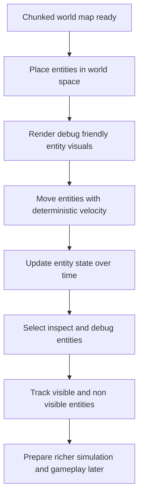

## req_002_render_evolving_world_entities_on_the_map - Render evolving world entities on the map
> From version: 0.1.0
> Status: Ready
> Understanding: 92%
> Confidence: 89%
> Complexity: High
> Theme: Entities
> Reminder: Update status/understanding/confidence and references when you edit this doc.

# Needs
- Render entities on top of the world map as objects that exist within the world space rather than as detached UI elements.
- Treat entities as objects that can move through the world and evolve over time.
- Build the entity layer on top of the chunked top-down world map defined in `req_001_render_top_down_infinite_chunked_world_map`.
- Focus this request on how entities are represented, updated, and displayed on the map, not on final gameplay systems or advanced AI.
- Keep the entity system compatible with the infinite-world, chunk-based model so entities can exist, move, and remain trackable across a large or unbounded map.
- Make the first entity rendering pass debug-friendly so position, movement, state changes, and world integration can be inspected during development.
- Define a minimum entity contract from the start, including at least stable identity, world position, orientation, visual representation, and mutable state.
- Start with a generic entity model and debug-oriented visual representation rather than a final gameplay taxonomy or final art direction.
- Begin with one generic movable entity archetype as the default first implementation rather than multiple gameplay-specific families.
- Give entities a simple physical footprint from the start, such as a radius or equivalent debug-friendly size model.
- Treat entity movement as deterministic or debug-driven for this first pass so rendering and state evolution can be validated without full AI or pathfinding systems.
- Use continuous world-space movement with velocity from the start rather than tile-by-tile stepping.
- Keep entity state, simulation or update logic, and rendering responsibilities explicitly separated.
- Make entities compatible with chunk-based spatial indexing so they can move across chunk boundaries without losing world continuity.
- Anticipate debug picking and entity inspection from the start so entity state can be selected and inspected in the rendered world.
- Support a simple selection model for entities, with single-entity selection sufficient for the first pass.
- Distinguish between entities that are currently rendered and entities that remain tracked outside the visible area.
- Provide a deterministic debug scenario for spawning and observing entities so movement and state changes can be reproduced reliably across runs.
- Allow optional debug labels, movement traces, and simple overlap diagnostics to help inspect entity behavior.
- Support controlled spawn and despawn behavior as part of the first entity lifecycle model.
- Use a fixed simulation-step mindset for entity updates even if rendering stays frame-based.
- Keep velocity as the default movement driver in the first pass without requiring acceleration yet.
- Treat entity orientation as immediately relevant for rendering and preserve it as future movement-facing data rather than cosmetic-only metadata.
- Make selection and inspection part of the same initial debug flow so selecting an entity reveals its inspectable state directly.
- Define a lightweight performance expectation for the entity layer so debug populations remain usable on a representative mobile-sized screen.

# Context
This request follows the shell bootstrap and the top-down chunked world-map request. The world layer is expected to provide a stable camera model, coordinate transforms, chunk visibility, and developer diagnostics. The next step is to place actual world entities into that environment.

Entities should be treated as world objects that belong to world coordinates and can appear, move, and evolve inside the rendered map. They should not be modeled as screen-space decorations. Their presentation should remain consistent with the existing camera system, including pan, zoom, and rotation.

The immediate goal is not to define the complete gameplay model behind those entities. Instead, this request should establish the minimum entity layer needed to prove that moving and evolving objects can be attached to the world, rendered correctly, and updated over time without breaking the chunked map architecture.

Because the world may be very large or effectively infinite, the entity design should avoid assumptions that all entities are always active or visible at once. Entity rendering and update ownership should remain compatible with chunked world organization, visibility rules, and future streaming behavior.

The first entity pass should stay highly inspectable. Debug rendering, labels, state markers, movement traces, or comparable diagnostics are acceptable and useful if they help validate entity position, orientation, motion, lifecycle, and relation to chunks or camera transforms.

For this phase, entities should follow a minimum shared contract rather than a large set of specialized gameplay types. A practical default is to give each entity a stable identifier, world position, facing or orientation, a simple visual form, and mutable state that can evolve over time. Different future entity families can build on that contract later.

The first implementation should stay intentionally narrow and start from one generic movable archetype. That is enough to validate the entity layer without prematurely designing full families such as units, projectiles, resources, structures, or NPC variants.

Entities should not be treated as mathematical points only. Even in a debug-first phase, each entity should have a simple footprint such as a radius or equivalent size indicator so picking, overlap reasoning, rendering, and future motion constraints have a more realistic base.

Movement should remain deterministic or developer-driven in the initial version. That keeps the request focused on the entity/map integration layer rather than introducing full autonomous behavior, pathfinding, or combat logic too early. A good baseline is continuous movement in world space driven by velocity, without requiring acceleration, collision resolution, or pathfinding yet.

Entities should be modeled as living in world space first and only indexed by chunks for visibility, lookup, or streaming purposes. They should not become permanently attached to one chunk because they need to move across chunk boundaries while preserving identity and state.

Rendering, entity state, and entity update logic should remain separate concerns. The request should not collapse those layers into a single object that mixes data, simulation, and display responsibilities because that would make later gameplay systems harder to evolve.

Entity updates should be thought of as simulation steps rather than arbitrary frame-side mutations. Rendering may remain frame-based, but the evolving state model should already be compatible with a fixed-step update mindset so debugging and determinism stay manageable.

The first pass should also support practical debug inspection. That means at least being able to pick or inspect entities in the world, view key state data, and observe simple spawn, despawn, and movement behavior in a reproducible way.

Selection and inspection should stay simple at first. Single-entity selection is enough for this phase, and selecting an entity should make it easy to inspect its debug data such as identity, state, chunk, position, facing, or velocity.

Orientation should matter immediately for rendering, not exist as dead metadata. Even if the first movement logic does not yet depend heavily on facing, the model should preserve orientation as a real part of the entity contract so later movement, steering, and animation systems can build on it.

The design should also distinguish between entities that are currently rendered and entities that remain tracked outside the current visible area. Rendering visibility and simulation tracking should not be treated as the same concept by default.

To support reliable debugging, the first entity scenario should be reproducible. A deterministic spawn setup, repeatable movement patterns, and optional debug labels or traces will make it much easier to validate chunk crossings, orientation, lifecycle transitions, and state changes.

Collision, combat rules, advanced AI, and full animation systems remain outside the scope of this request. If useful, simple overlap diagnostics may exist for debugging, but they should not expand into a real collision system yet.

As with the shell and map layers, a modest performance bar is useful here too. A representative debug population of entities should remain inspectable and interactive on a mobile-sized screen so the entity layer does not normalize an unusable baseline.

# Acceptance criteria
- AC1: Entities are rendered as world-space objects on top of the map, not as screen-space UI elements.
- AC2: The implementation builds on `req_001_render_top_down_infinite_chunked_world_map` and preserves its top-down, chunked-world, camera, coordinate, and debug assumptions.
- AC3: The scope of this request is limited to representing, updating, and rendering entities on the map; full gameplay rules, combat logic, and advanced AI remain out of scope.
- AC4: Entities can move through the world over time in a way that remains consistent with world coordinates, camera pan, zoom, and rotation.
- AC5: Entities can expose or transition through evolving state over time, even if the first implementation uses simple or placeholder state changes.
- AC6: Entity rendering remains compatible with a chunked infinite-world model and does not assume that all entities must be kept active or visible at once.
- AC7: Entity position and state remain stable across viewport changes and do not drift unpredictably when the camera moves, zooms, or rotates.
- AC8: The first entity layer uses a minimum shared entity contract that includes at least stable identity, world position, orientation, visual representation, and mutable state.
- AC9: The first implementation starts from one generic movable entity archetype rather than multiple gameplay-specialized entity families.
- AC10: Entities include a simple footprint model such as a radius or equivalent debug-friendly size indicator.
- AC11: The initial entity rendering is intentionally debug-friendly, using simple shapes, sprites, labels, direction markers, state colors, or comparable visual aids rather than depending on final art direction.
- AC12: The first entity layer is debug-friendly and provides enough diagnostics to inspect at least entity position, movement behavior, orientation, and current entity state during development.
- AC13: Initial entity movement can be deterministic, scripted, or developer-driven so the entity/world integration can be validated without requiring advanced AI or pathfinding.
- AC14: Entity movement uses continuous world-space motion and supports at least velocity-based updates in the first pass.
- AC15: Entities can cross chunk boundaries while preserving identity, position continuity, and state continuity.
- AC16: Entities belong to world space and may be spatially indexed by chunk, but they are not modeled as permanently owned by a single chunk.
- AC17: The design distinguishes at least two scopes for entities: rendered-visible entities and entities that remain tracked even when they are not currently visible.
- AC18: Entity state continuity is preserved when entities leave and re-enter the visible area.
- AC19: Debug picking or inspection is available at least for development purposes so an entity can be selected or inspected from the map view.
- AC20: A simple single-entity selection model is supported for debug and inspection purposes.
- AC21: Controlled entity spawning and despawning are supported as part of the first lifecycle model.
- AC22: A deterministic debug scenario exists for spawning and observing entities so movement and state changes can be reproduced reliably.
- AC23: Optional debug labels, movement traces, or simple overlap diagnostics are available to help inspect behavior during development.
- AC24: Render ordering or layer priority for entities is defined explicitly enough to avoid accidental or unstable draw order.
- AC25: Full collision, combat rules, and advanced animation systems are not required yet and remain out of scope for this request.
- AC26: The internal design anticipates a separation between entity data or state, entity update logic, and entity rendering so later gameplay features do not require replacing the entity foundation.
- AC27: Entity updates are compatible with a fixed simulation-step mindset even if rendering remains frame-based.
- AC28: Velocity is the default first-pass movement driver and acceleration is not required yet.
- AC29: Entity orientation affects rendering from the first pass and remains available as future movement-facing data.
- AC30: Selection and inspection are linked in the default debug flow so selecting an entity exposes its inspectable state directly.
- AC31: The entity layer defines a lightweight performance expectation so a representative debug population remains usable on a mobile-sized screen.
- AC32: The resulting entity layer is suitable for follow-up requests covering richer movement rules, behaviors, interactions, simulation systems, and future entity categories without forcing a rendering rewrite.

# Definition of Ready (DoR)
- [x] Problem statement is explicit and user impact is clear.
- [x] Scope boundaries (in/out) are explicit.
- [x] Acceptance criteria are testable.
- [x] Dependencies and known risks are listed.

# Companion docs
- Product brief(s): (none yet)
- Architecture decision(s): (none yet)

# Backlog
- (none yet)
