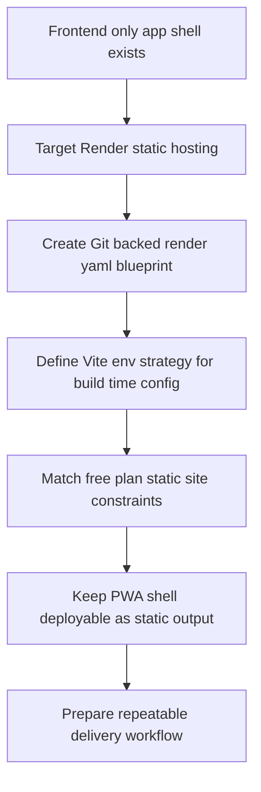

## req_003_create_render_static_free_plan_blueprint - Create Render static free plan blueprint
> From version: 0.1.2
> Status: Ready
> Understanding: 96%
> Confidence: 93%
> Complexity: Medium
> Theme: Delivery
> Reminder: Update status/understanding/confidence and references when you edit this doc.

# Needs
- Create a Render Blueprint for deploying the project as a static site on the Render free plan.
- Keep the deployment model aligned with the existing frontend-only architecture: no backend runtime, no database, no worker, and no paid infrastructure assumptions.
- Produce a Git-backed `render.yaml` configuration suitable for a static site deployment rather than an image-backed or server-backed setup.
- Treat the first delivery path as `release`-driven, without introducing preview or staging environments in this initial Blueprint scope.
- Ensure the deployment blueprint remains compatible with the React, TypeScript, PixiJS, and PWA shell already defined in `req_000_bootstrap_fullscreen_2d_react_pwa_shell`.
- Define the frontend environment-variable strategy for Vite so local development, production builds, and Render build-time configuration stay aligned.
- Treat `.env.production` as a non-versioned local mirror of Render-provided build variables rather than a committed source of truth.
- Treat Render-managed build variables as the canonical production source of truth, with local files used only to mirror or reproduce that setup outside Render.
- Treat this request as infrastructure-as-code for delivery readiness, not as a full production release procedure yet.

# Context
The project direction is explicitly frontend-only at this stage. The rendering shell is being built as a React, TypeScript, PixiJS, and PWA static application, which means the hosting model should stay as simple and reproducible as possible.

Render is the target hosting platform for this request, but the scope should stay limited to the static-site Blueprint path. The request is not asking for backend deployment, managed data services, private networking, or multi-service orchestration. It is specifically about creating the Render static-site Blueprint needed to host the app on the free plan.

The recommended default is to keep the first hosting path intentionally simple: a single production-like static site driven from the `release` branch. Preview environments or staging branches may be useful later, but they should not complicate the first Render Blueprint on the free plan.

The Blueprint should be expressed as code through `render.yaml` so deployment settings are versioned with the repository and can be reproduced later. The expected result is a minimal but correct static-site service definition that captures the build command, publish directory, and any static-delivery settings needed by the app shell.

Because the app is a static PWA shell, the Blueprint should not introduce assumptions that contradict the current architecture. It should work with the frontend build output, preserve the app as a static site, and avoid infrastructure choices that imply a backend or paid operational footprint.

The Vite environment-variable strategy should also be explicit in this request. On a Vite frontend, variables exposed through `import.meta.env` must use the `VITE_` prefix and must be treated as public because they are embedded into the client build output. That means the Blueprint and delivery workflow should assume build-time configuration for public frontend values, not runtime secret injection.

The repository should keep a versioned `.env.example` file to document expected frontend variables, while `.env.local` and `.env.production` remain non-versioned. In this model, `.env.production` acts only as a local mirror of the values that Render will inject at build time for production builds. It should help reproduce Render builds locally without becoming the canonical source of deployment configuration.

This request should also assume that Render is the source of truth for production build-time frontend variables. Local `.env.production` usage is a convenience for local reproduction only and must not become an alternate deployment configuration path.

This request should also stay compatible with later work on the world map and entity layers. The hosting blueprint is part of delivery readiness for the same app, not a separate deployment experiment disconnected from the existing Logics requests.

# Acceptance criteria
- AC1: The request produces a Render Blueprint for a static site and does not assume a backend runtime, database, worker, or other non-static service.
- AC2: The deployment model is expressed through a Git-backed `render.yaml` file rather than an ad hoc dashboard-only setup.
- AC3: The Blueprint targets the Render free plan static-site path and avoids assumptions that require paid-tier infrastructure.
- AC4: The Blueprint remains compatible with the frontend-only stack defined in `req_000_bootstrap_fullscreen_2d_react_pwa_shell`.
- AC5: The Blueprint captures the minimum required static deployment settings, including build command and publish directory.
- AC6: The request defines a Vite-compatible frontend env strategy in which public client variables use the `VITE_` prefix and are treated as build-time public values.
- AC7: The request treats `.env.example` as the versioned documentation source for expected frontend variables.
- AC8: The request treats `.env.local` and `.env.production` as non-versioned files, with `.env.production` explicitly positioned as a local mirror of Render build-time values rather than the source of truth.
- AC9: The request treats the initial deployment path as a `release`-driven free-plan static-site deployment without requiring preview or staging environments.
- AC10: The resulting deployment blueprint is suitable for later implementation without forcing the app into a backend or multi-service topology.

# Definition of Ready (DoR)
- [x] Problem statement is explicit and user impact is clear.
- [x] Scope boundaries (in/out) are explicit.
- [x] Acceptance criteria are testable.
- [x] Dependencies and known risks are listed.

# Companion docs
- Product brief(s): (none yet)
- Architecture decision(s): `adr_013_use_a_dedicated_release_branch_for_deployable_static_releases`

# Backlog
- `item_014_define_render_static_site_blueprint_and_build_contract`
- `item_015_define_frontend_env_mirroring_and_render_build_variable_contract`
- `item_016_define_free_plan_static_delivery_constraints_and_operating_notes`
