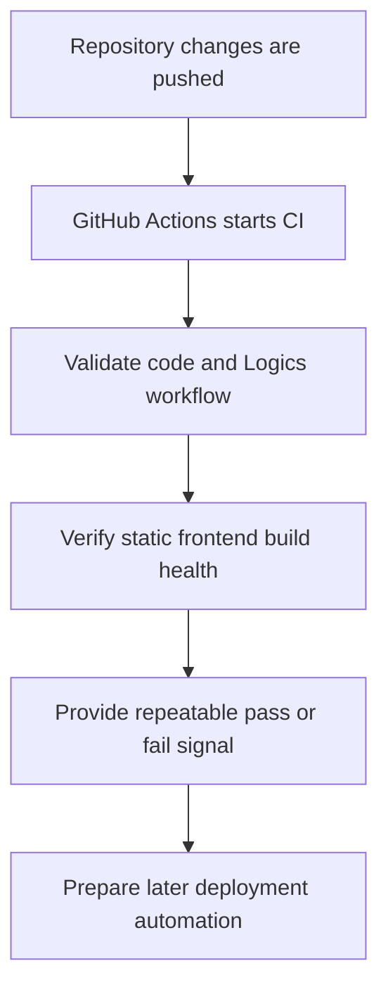

## req_004_prepare_github_actions_ci_pipeline - Prepare GitHub Actions CI pipeline
> From version: 0.1.1
> Status: Ready
> Understanding: 94%
> Confidence: 91%
> Complexity: Medium
> Theme: Delivery
> Reminder: Update status/understanding/confidence and references when you edit this doc.

# Needs
- Prepare a GitHub Actions CI pipeline for the repository.
- Keep the CI model aligned with the current frontend-only architecture: React, TypeScript, PixiJS, Vite, PWA, and Logics documentation workflow.
- Ensure the CI pipeline validates the project consistently before later deployment work is wired to Render.
- Define a minimal mandatory check set from the start: lint, typecheck, tests, build verification, and Logics lint.
- Trigger the first CI workflow on both `push` and `pull_request` events.
- Use dependency caching appropriate for the package manager in order to keep the baseline CI workflow practical.
- Treat this request as CI preparation and workflow definition rather than full CD or production release automation.
- Keep the pipeline compatible with a static-site delivery model and avoid assumptions that require backend services or paid infrastructure.

# Context
The project is currently being framed as a frontend-only static application with a PWA shell, chunked world rendering, and future entity systems. Before deployment is formalized, the repository needs a reliable CI pipeline that can validate both the codebase and the Logics workflow.

GitHub Actions is the target CI platform for this request. The pipeline should cover the baseline checks that matter for this stack: dependency installation, linting, typecheck, tests when available, build verification, and any repository-specific documentation or workflow validation that should block regressions.

The recommended default is to make the CI contract explicit from day one. The first protected workflow should run on both pushes and pull requests, and it should consider lint, typecheck, test execution, build verification, and `logics/` validation as the baseline pass or fail signal for the repository.

The CI pipeline should also remain compatible with the static hosting direction already defined in `req_003_create_render_static_free_plan_blueprint`. It should validate the frontend build output and repository health without assuming server-side runtime infrastructure.

Because this is expected to run frequently, dependency caching should be part of the baseline design rather than a later optimization, provided it does not make the workflow brittle.

Because the repository uses the `logics/` workflow, CI should not ignore those documents. It should at least leave room for Logics validation so requests, backlog items, tasks, and related docs can be checked consistently alongside code changes.

The first goal is repeatable repository validation, not full release automation. This request is about preparing a GitHub Actions workflow foundation that later deployment and release steps can build on safely.

# Acceptance criteria
- AC1: The request defines a GitHub Actions CI pipeline for the repository rather than a local-only validation approach.
- AC2: The CI scope remains compatible with the frontend-only static architecture and does not assume backend runtime services.
- AC3: The pipeline includes the baseline repository checks needed for this stack, such as install, lint, typecheck, and build verification, with tests included when relevant to the project state.
- AC4: The request treats lint, typecheck, tests, build verification, and Logics lint as the intended baseline mandatory checks for the initial CI workflow.
- AC5: The request treats `push` and `pull_request` as the default triggering events for the initial CI workflow.
- AC6: The CI design accounts for dependency caching suitable for the project's package-management setup.
- AC7: The CI design remains compatible with the delivery direction defined in `req_003_create_render_static_free_plan_blueprint`.
- AC8: The CI design accounts for Logics validation as part of repository quality rather than treating `logics/` as out-of-band documentation.
- AC9: The resulting pipeline foundation is suitable for later extension into deployment or release workflows without requiring a full CI redesign.

# Definition of Ready (DoR)
- [x] Problem statement is explicit and user impact is clear.
- [x] Scope boundaries (in/out) are explicit.
- [x] Acceptance criteria are testable.
- [x] Dependencies and known risks are listed.

# Companion docs
- Product brief(s): (none yet)
- Architecture decision(s): (none yet)

# Backlog
- `item_017_define_baseline_github_actions_workflow_triggers_and_dependency_caching`
- `item_018_define_mandatory_frontend_and_logics_quality_gates_in_ci`
- `item_019_define_ci_workflow_extension_points_for_later_delivery_and_release_automation`
