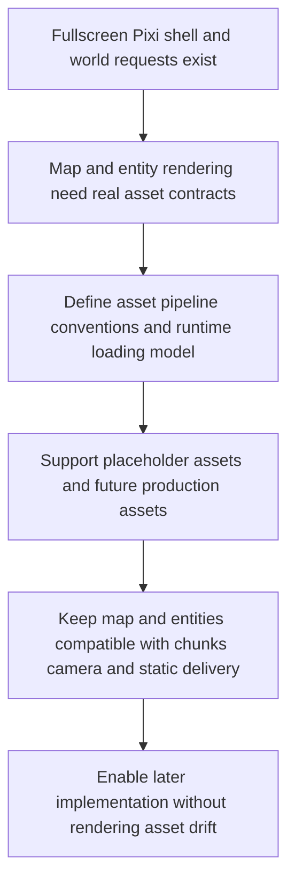

## req_005_define_asset_pipeline_for_map_and_entities - Define asset pipeline for map and entities
> From version: 0.1.1
> Status: Ready
> Understanding: 94%
> Confidence: 91%
> Complexity: Medium
> Theme: Rendering
> Reminder: Update status/understanding/confidence and references when you edit this doc.

# Needs
- Define the asset pipeline and conventions needed to support map rendering and entity rendering in the static top-down 2D application.
- Separate asset-pipeline concerns from gameplay logic so `req_001_render_top_down_infinite_chunked_world_map` and `req_002_render_evolving_world_entities_on_the_map` can rely on a stable asset contract.
- Cover both debug or placeholder assets and future production-ready assets without forcing final art direction decisions yet.
- Allow simple unitary placeholder assets during early implementation while defining atlases or spritesheets as the preferred target runtime packaging model.
- Establish how map assets, entity assets, and thin system UI overlays should be organized, named, loaded, and consumed at runtime.
- Ensure the asset approach remains compatible with PixiJS rendering, chunked infinite-world streaming, camera pan or zoom or rotation, and PWA static delivery constraints.
- Define stable logical sizing conventions shared across map and entity rendering, independent from source pixel density.
- Prepare a reproducible project structure and runtime-loading strategy that works in a frontend-only Vite application hosted as a static site.

# Context
The project has already defined a fullscreen React, TypeScript, PixiJS, and PWA shell, then a chunked top-down infinite-world map request, then an entity-rendering request. Those requests describe how the world should be navigated and how entities should exist in world space, but they do not yet define the assets that these systems will actually consume.

That gap is important because map rendering and entity rendering depend on more than just code. They need agreed conventions for tiles, sprites, atlases, image dimensions, pivots, orientation, layering expectations, and runtime loading. Without those conventions, later implementation work risks baking inconsistent assumptions into the world renderer, the entity renderer, or both.

This request should therefore focus on the asset contract and the asset pipeline, not on producing final game art. The immediate goal is to make debug-friendly placeholder assets first-class citizens while ensuring they can later be replaced by more polished assets without rewriting the rendering model.

The recommended baseline is pragmatic: early development may use simple standalone placeholder files where that keeps iteration fast, but the target runtime contract should already assume grouping through atlases or spritesheets once the asset set grows. This keeps the first implementation light without leaving the long-term runtime format undefined.

The scope should include the source and runtime formats used for map and entity assets, the folder layout and naming conventions, the distinction between authoring assets and build-consumed assets, and the runtime-loading strategy appropriate for a static frontend app. It should also cover the conventions that matter for world rendering: stable logical size, tile dimensions, sprite anchors or pivots, orientation compatibility, render-layer expectations, and asset-group separation between map, entities, and lightweight overlays.

Those conventions should assume one coherent logical-sizing model across map and entity assets so rendering math depends on world units rather than raw source-image pixels.

Because the project targets a static Vite and Render deployment path, the asset pipeline must stay compatible with build-time bundling or static hosting patterns rather than assuming backend-side asset processing. The request should also remain PWA-friendly, which means asset loading and caching considerations need to stay aligned with static delivery and future offline shell behavior.

The request should not lock the project into a final art style, animation system, or a complex editor workflow yet. It should instead define the minimal but robust asset conventions that allow the chunked map and evolving entities to move forward without introducing avoidable rendering debt.

# Acceptance criteria
- AC1: The request defines a dedicated asset-pipeline scope for map and entity rendering rather than mixing asset decisions implicitly into unrelated rendering requests.
- AC2: The request covers both map assets and entity assets, and distinguishes them from thin system-level overlays or debug UI assets.
- AC3: The request defines conventions for source assets and runtime-consumed assets, including at least naming, folder organization, and the expected delivery path inside the static frontend project.
- AC4: The request defines how placeholder or debug assets fit into the pipeline so early implementation can proceed without waiting for final art.
- AC5: The request defines a baseline position in which unitary placeholder assets are acceptable initially, while atlases or spritesheets remain the preferred target runtime packaging model.
- AC6: The request defines stable logical sizing expectations shared across map and entity rendering, including tile or sprite dimensions, anchors or pivots, and orientation compatibility where applicable.
- AC7: The request remains compatible with the PixiJS-based rendering stack, top-down world rendering, chunk-based map streaming, and camera pan or zoom or rotation already described in earlier requests.
- AC8: The request addresses runtime asset-loading expectations suitable for a Vite static frontend, including a compatibility stance on build-time bundling versus static asset hosting.
- AC9: The request addresses asset caching or loading behavior at a level sufficient to stay compatible with PWA static delivery and future performance work.
- AC10: The request explicitly avoids locking in final art direction, full animation production, or advanced editor tooling that belongs to later work.

# Definition of Ready (DoR)
- [x] Problem statement is explicit and user impact is clear.
- [x] Scope boundaries (in/out) are explicit.
- [x] Acceptance criteria are testable.
- [x] Dependencies and known risks are listed.

# Companion docs
- Product brief(s): (none yet)
- Architecture decision(s): (none yet)

# Backlog
- `item_020_define_asset_directory_naming_and_ownership_model_for_map_entities_and_overlays`
- `item_021_define_logical_sizing_pivot_and_orientation_conventions_for_runtime_assets`
- `item_022_define_placeholder_to_atlas_runtime_packaging_strategy`
- `item_023_define_asset_loading_caching_and_pwa_delivery_expectations`
