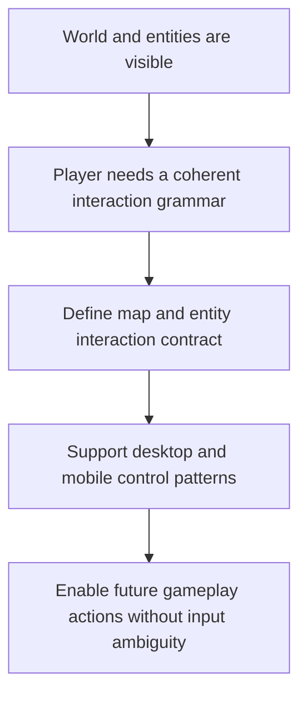

## req_006_define_player_interactions_for_world_and_entities - Define player interactions for world and entities
> From version: 0.1.1
> Status: Ready
> Understanding: 93%
> Confidence: 90%
> Complexity: Medium
> Theme: Gameplay
> Reminder: Update status/understanding/confidence and references when you edit this doc.

# Needs
- Define the player interaction model for navigating the world and acting on entities in the top-down 2D application.
- Cover desktop and mobile interaction patterns for selecting, inspecting, commanding, and manipulating the world view without conflicting with camera controls already defined in `req_001_render_top_down_infinite_chunked_world_map`.
- Treat selection and inspection as the primary first interaction layer, with richer command behaviors added after that base is stable.
- Align the first interaction slice with a mobile-first direct-control loop in which one entity is steered through the world with touch input similar to a virtual joypad.
- Treat the primary touch-drag gesture in the first player loop as entity steering rather than camera dragging.
- Use a visible virtual-stick model with a small dead zone and clamped proportional magnitude as the preferred baseline for the first mobile control scheme.
- Keep the first player-facing touch control model single-finger and avoid competing gesture ownership for movement.
- Treat free camera manipulation as a debug or development affordance in the first loop rather than a primary player control.
- Use keyboard movement such as `WASD` or arrows as the preferred desktop fallback for the first loop.
- On mobile, favor direct gestures for navigation and reserve explicit UI actions for ambiguous or stateful commands.
- Establish a stable interaction contract that future gameplay features can build on without reworking input ownership between the map, entities, and UI overlays.

# Context
The project already defines a fullscreen PixiJS rendering shell, a chunked infinite-world map, and evolving world entities. Those requests explain how the world is rendered and how entities exist in it, but they do not yet define what the player can do inside that world.

That gap is important because the system will soon need a clear interaction grammar: selecting entities, inspecting them, moving the camera, issuing commands, and handling desktop and mobile inputs without ambiguous ownership. If this contract is not defined early, later implementation will risk inconsistent input mappings and conflicts between camera manipulation, map interactions, and entity actions.

This request should therefore focus on the user-facing interaction model rather than low-level rendering math or AI behavior. It should define the initial command vocabulary, the distinction between world interactions and UI interactions, and the expected behavior for pointer, touch, and keyboard inputs where relevant.

The recommended default is to establish a very clear first priority: selecting and inspecting world objects should come before a broad command vocabulary. That gives the project a stable interaction foundation and avoids making early controls too ambiguous.

At the current product level, the first meaningful interaction slice should stay even narrower: one controllable entity in an infinite world, with touch drag acting as a directional control similar to a virtual joypad. That product assumption should shape the first input decisions even though richer interaction models may come later.

The recommended mobile baseline is a visible virtual stick anchored at touch start, with a small dead zone to avoid accidental drift and a proportional magnitude model clamped to a stable maximum. This should feel like steering the entity, not like dragging the camera.

The scope should remain compatible with the existing top-down world, chunked streaming, entity selection and inspection needs, and the thin DOM overlay approach already anticipated elsewhere. It should also remain debug-friendly and avoid assuming a final gameplay loop or a full control scheme for every future feature.

On mobile specifically, navigation should prefer direct gestures such as touch drag or camera manipulation, while commands that would conflict with those gestures should be surfaced through explicit UI affordances instead of overloaded touch behavior.

For the first loop, gesture ownership should stay simple: one finger for entity steering, no competing gesture grammar for the same action space, and free camera controls reserved for debug usage or later phases.

# Acceptance criteria
- AC1: The request defines a player interaction scope dedicated to world and entity interactions rather than leaving input behavior implicit across rendering requests.
- AC2: The request defines the first interaction verbs relevant to the project, including at least selecting, inspecting, commanding, and camera-related interactions where ownership matters.
- AC3: The request treats selection and inspection as the primary first interaction layer, with command behaviors layered on afterward.
- AC4: The request remains compatible with a first mobile-first direct-control slice in which a single entity is steered through the world using a touch drag input similar to a virtual joypad.
- AC5: The request treats the primary touch-drag gesture in the first player loop as entity steering rather than camera dragging.
- AC6: The request defines a visible virtual-stick baseline with a small dead zone and clamped proportional magnitude for the first mobile control scheme.
- AC7: The request keeps the first player-facing movement gesture model single-finger and avoids conflicting concurrent gesture ownership for movement.
- AC8: The request distinguishes between interactions targeting the world, interactions targeting entities, and interactions targeting UI or system overlays.
- AC9: The request covers both desktop and mobile interaction expectations at a product level, with `WASD` or arrow-key movement treated as the preferred desktop fallback and direct gestures favored for movement on mobile.
- AC10: The request stays compatible with the camera pan or zoom or rotation model defined in `req_001_render_top_down_infinite_chunked_world_map` while allowing free camera manipulation to remain debug-oriented in the first loop.
- AC11: The request remains compatible with the entity rendering and inspection expectations defined in `req_002_render_evolving_world_entities_on_the_map`.
- AC12: The request avoids prematurely locking in advanced gameplay systems that belong to later requests.

# Definition of Ready (DoR)
- [x] Problem statement is explicit and user impact is clear.
- [x] Scope boundaries (in/out) are explicit.
- [x] Acceptance criteria are testable.
- [x] Dependencies and known risks are listed.

# Companion docs
- Product brief(s): `prod_000_initial_single_entity_navigation_loop`
- Architecture decision(s): `adr_000_adopt_feature_oriented_organic_frontend_structure`, `adr_001_enforce_bounded_file_size_and_isolate_react_side_effects`
# Backlog
- `item_024_define_single_entity_control_contract_and_input_ownership_boundaries`
- `item_025_define_mobile_virtual_stick_steering_model_for_the_first_player_loop`
- `item_026_define_desktop_fallback_controls_and_debug_input_separation`
- `item_027_define_selection_inspection_and_contextual_interaction_flow`
