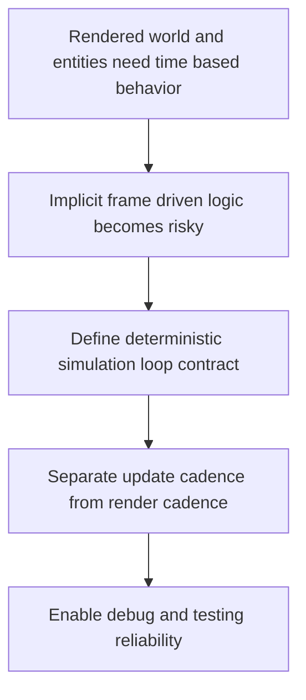

## req_007_define_simulation_loop_and_deterministic_update_model - Define simulation loop and deterministic update model
> From version: 0.1.1
> Status: Ready
> Understanding: 93%
> Confidence: 90%
> Complexity: Medium
> Theme: Gameplay
> Reminder: Update status/understanding/confidence and references when you edit this doc.

# Needs
- Define the simulation-loop model that will drive world updates, entity updates, and time-based state changes independently from rendering cadence.
- Establish a deterministic update contract suitable for debugging, testing, and later gameplay systems.
- Clarify how simulation timing should relate to rendering, pause behavior, speed control, and debug stepping without tying logic correctness to frame rate.
- Treat a strict fixed-timestep simulation model as the default baseline for logic updates.
- Include debug-oriented controls for pause, single-step progression, and simulation-speed adjustment.

# Context
The project now includes requests for the rendering shell, the chunked world map, and evolving entities. Those elements imply ongoing state changes, but they do not yet define how simulation time is advanced or how updates should remain predictable across different devices and frame rates.

That is a structural gap. Once camera movement, chunk visibility, entity movement, and future world generation begin interacting, a weak or implicit simulation model will create hard-to-debug differences between machines and make automated testing fragile. A fixed and well-defined update contract is therefore an architectural requirement, not a later optimization.

This request should define the high-level simulation model for the frontend application, including the distinction between simulation ticks and render frames, the role of deterministic updates, and the expectations around pause, slowdown, fast-forward, or frame stepping in debug contexts if relevant.

The recommended baseline is a strict fixed-timestep simulation loop. Rendering may stay frame-driven, but authoritative state changes should not depend on variable frame deltas if the project wants reproducible behavior across devices and meaningful automated tests.

The scope should stay compatible with a frontend-only PixiJS application and with the debugging and testing ambitions already implied by earlier requests. It should not yet define full gameplay rules, AI systems, or network synchronization.

# Acceptance criteria
- AC1: The request defines a dedicated simulation-loop scope rather than leaving update timing implicit inside rendering concerns.
- AC2: The request defines the relationship between simulation updates and rendering frames.
- AC3: The request treats a strict fixed-timestep simulation loop as the intended baseline for logic updates.
- AC4: The request defines a deterministic or reproducible update expectation suitable for debugging and automated testing.
- AC5: The request covers pause, simulation stepping, and speed-adjustment expectations where they affect the update model.
- AC6: The request remains compatible with the world and entity requests already written.
- AC7: The request does not prematurely assume multiplayer or backend-driven synchronization.

# Definition of Ready (DoR)
- [x] Problem statement is explicit and user impact is clear.
- [x] Scope boundaries (in/out) are explicit.
- [x] Acceptance criteria are testable.
- [x] Dependencies and known risks are listed.

# Companion docs
- Product brief(s): (none yet)
- Architecture decision(s): (none yet)

# Backlog
- `item_028_define_fixed_timestep_simulation_loop_contract`
- `item_029_define_render_and_simulation_cadence_separation`
- `item_030_define_pause_step_and_simulation_speed_debug_controls`
