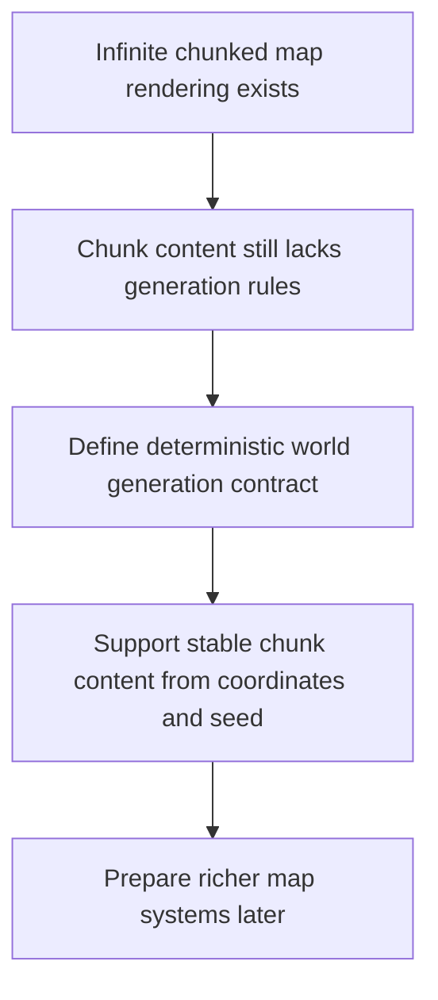

## req_008_define_infinite_chunked_world_generation_model - Define infinite chunked world generation model
> From version: 0.5.0
> Status: Done
> Understanding: 100%
> Confidence: 98%
> Complexity: High
> Theme: World
> Reminder: Update status/understanding/confidence and references when you edit this doc.
> Schema version: 1.0

# Needs
- Define the world-generation model for the infinite chunked top-down map so new chunks can be produced consistently as the camera explores the world.
- Establish a deterministic generation contract that can later support seeds, biome or layer logic, and richer map content without breaking the chunk model already defined in `req_001_render_top_down_infinite_chunked_world_map`.
- Treat identical seed and coordinate inputs as producing identical world results, including early terrain variation and decorative outcomes once they exist.
- Start from a simple terrain-layer baseline while leaving hooks for additional generation layers later.
- Keep the scope focused on generation rules and structure rather than on final art assets or entity behaviors.

# Context
The world-map request already anticipates an infinite chunked world, but generation itself was intentionally deferred. That means the rendering model exists without a corresponding contract for how chunk content is created, reproduced, or evolved from coordinates and a future world seed.

This is a separate concern from rendering. The map renderer needs visible chunks, but the generation system decides what those chunks contain and how that content remains stable across sessions, camera movement, and future persistence. If generation stays vague, later map work risks mixing rendering and content production in the same layer.

This request should therefore define the generation-side rules for an infinite chunked world: how chunks derive content, how a seed participates, what level of determinism is required, and how future concepts such as layers, terrain classes, or biome systems might fit without being fully implemented now.

The recommended default is strong determinism: the same seed and the same chunk coordinates should always yield the same chunk result. The initial model can stay simple, with one main terrain layer and extension points for richer generation layers later.

The request should remain compatible with the top-down viewpoint, chunk-based streaming, world-space coordinate model, and future entity placement or occupancy systems. It should not yet require a full content editor, handcrafted level authoring workflow, or advanced procedural-tuning UI.

# Acceptance criteria
- AC1: The request defines a dedicated world-generation scope rather than leaving chunk content as an informal rendering concern.
- AC2: The request defines deterministic expectations for chunk content generation.
- AC3: The request treats identical seed and coordinate inputs as producing identical world results.
- AC4: The request addresses the role of chunk coordinates and a future global seed in generation.
- AC5: The request remains compatible with the chunked streaming model and top-down rendering model already defined.
- AC6: The request treats a simple terrain-layer baseline as sufficient for the first generation model while anticipating later richness such as extra layers or biome-like variation.
- AC7: The request does not conflate generation rules with final visual assets or entity logic.

# Definition of Ready (DoR)
- [x] Problem statement is explicit and user impact is clear.
- [x] Scope boundaries (in/out) are explicit.
- [x] Acceptance criteria are testable.
- [x] Dependencies and known risks are listed.

# Companion docs
- Product brief(s): (none yet)
- Architecture decision(s): (none yet)

# AI Context
- Summary: Define the world-generation model for the infinite chunked top-down map so new chunks can be produced consistently as...
- Keywords: infinite, chunked, world, generation, model, the, world-generation, for
- Use when: Use when framing scope, context, and acceptance checks for Define infinite chunked world generation model.
- Skip when: Skip when the work targets another feature, repository, or workflow stage.

# Backlog
- `item_031_define_global_world_seed_and_chunk_identity_contract`
- `item_032_define_deterministic_chunk_generation_baseline`
- `item_033_define_initial_terrain_layer_and_variation_model`
- `item_034_define_generation_boundaries_versus_rendering_assets_and_entities`
