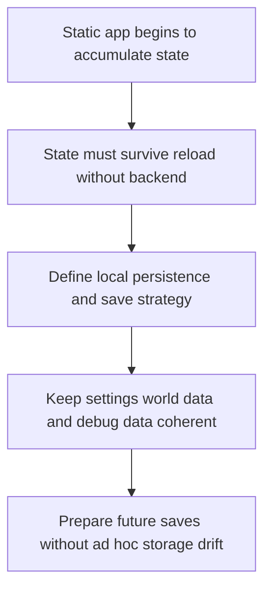

## req_009_define_local_persistence_and_save_strategy - Define local persistence and save strategy
> From version: 0.1.1
> Status: Ready
> Understanding: 93%
> Confidence: 90%
> Complexity: Medium
> Theme: Data
> Reminder: Update status/understanding/confidence and references when you edit this doc.

# Needs
- Define the local persistence strategy for the static frontend application so world state, preferences, and useful debug data can survive reloads without requiring a backend.
- Clarify what should be persisted first, what should remain ephemeral, and how save data should stay compatible with deterministic world generation and future evolution of the project.
- Treat user preferences, world seed, and camera state as the first persistence scope before richer world or entity state.
- Include explicit local-save versioning from the beginning so persisted data can evolve safely.
- Keep the scope frontend-only and appropriate for a static PWA deployment.

# Context
The project is intentionally frontend-only and static-hosted for now, but several already-defined requests imply the need for persistence. Camera preferences, debug settings, world seeds, future save snapshots, and entity state all become more valuable once the world can be explored and interacted with across sessions.

Without an explicit persistence strategy, later implementation will likely scatter local storage decisions across unrelated features. That would make save compatibility, versioning, and debugging difficult very early in the project. A dedicated request is therefore useful before multiple systems begin persisting their own data ad hoc.

This request should define the first local-save model for the application, including what categories of data deserve persistence, what mechanisms are acceptable in a frontend-only environment, and how persistence should remain robust as the world, entities, and settings evolve.

The recommended default is to start small and predictable: persist preferences, world seed, and camera state first, while treating deeper world or entity persistence as later slices. Even at that stage, local data should still have a version marker so migrations or resets can be handled intentionally.

The scope should stay aligned with the static Vite and Render architecture, the PWA direction, and the earlier requests on deterministic world behavior. It should not yet introduce accounts, cloud sync, or backend save services.

# Acceptance criteria
- AC1: The request defines a dedicated local persistence scope suitable for a static frontend application.
- AC2: The request identifies the first categories of data that may need persistence and distinguishes them from transient runtime state.
- AC3: The request treats preferences, world seed, and camera state as the intended first persistence scope before richer world or entity state.
- AC4: The request remains compatible with deterministic world or seed-driven behavior already anticipated elsewhere.
- AC5: The request addresses versioning or evolution concerns for saved local data at an appropriate level, with explicit save-version handling expected from the start.
- AC6: The request remains frontend-only and does not assume accounts, backend storage, or cloud sync.
- AC7: The request stays compatible with the PWA and static-hosting direction.

# Definition of Ready (DoR)
- [x] Problem statement is explicit and user impact is clear.
- [x] Scope boundaries (in/out) are explicit.
- [x] Acceptance criteria are testable.
- [x] Dependencies and known risks are listed.

# Companion docs
- Product brief(s): (none yet)
- Architecture decision(s): (none yet)

# Backlog
- `item_035_define_first_local_persistence_scope_for_preferences_seed_and_camera_state`
- `item_036_define_local_save_versioning_migration_and_invalidation_policy`
- `item_037_define_deterministic_world_reconstruction_versus_persisted_state_boundaries`
- `item_038_define_browser_and_pwa_storage_operational_constraints`
