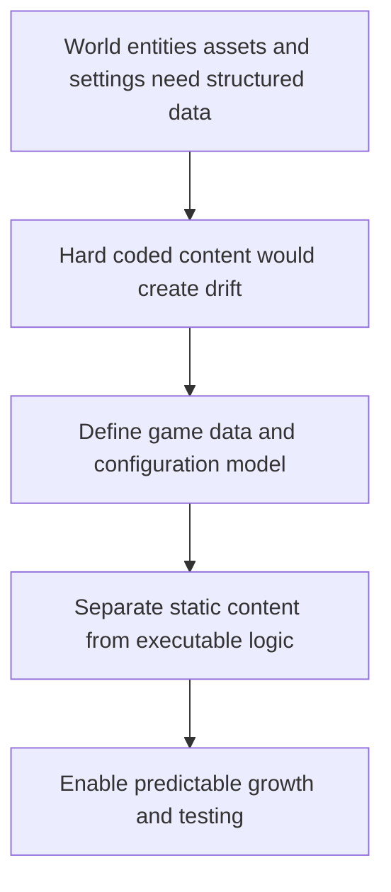

## req_010_define_game_data_and_configuration_model - Define game data and configuration model
> From version: 0.5.0
> Status: Done
> Understanding: 100%
> Confidence: 98%
> Complexity: Medium
> Theme: Data
> Reminder: Update status/understanding/confidence and references when you edit this doc.
> Schema version: 1.0

# Needs
- Define how game data and configuration should be structured so map content, entities, balance values, and future rules do not become hard-coded across the frontend codebase.
- Establish a clean distinction between code, static data, debug scenario data, and configurable content.
- Treat typed TypeScript-backed configuration as the default starting point rather than raw JSON-only content files.
- Reserve an explicit place for reproducible debug-scenario data from the start.
- Prepare a data model that remains compatible with a static frontend application and a deterministic world.

# Context
The current requests describe systems for rendering, world structure, entities, assets, and delivery. As those systems move toward implementation, the project will need a consistent way to represent content and configuration data without embedding everything directly in TypeScript logic.

That matters because chunk generation, entity archetypes, debug scenarios, asset references, tuning values, and UI settings can quickly spread across the codebase if no dedicated data model exists. A request focused on data and configuration gives the project a clean foundation for future content growth and for easier testing and balancing.

This request should define the first approach for static game data and runtime configuration. It should clarify how data files, typed schemas, code-defined constants, and environment-driven config should relate to each other, while staying compatible with the frontend-only deployment model.

The recommended baseline is to start with typed TypeScript-defined content and configuration contracts, because that keeps iteration fast and tightly aligned with the codebase. Pure data files can still be introduced later where they add value, but the first model should prioritize type safety and maintainability over early format generality.

The scope should include debug and deterministic data use cases but should avoid overreaching into a full editor stack, modding system, or external CMS. The goal is not content-authoring tooling yet; it is a coherent contract for how the application consumes structured data.

That baseline should include an official place for reproducible debug scenarios so world, entity, testing, and first-loop product workflows can share the same deterministic fixtures.

# Acceptance criteria
- AC1: The request defines a dedicated data and configuration scope rather than leaving content modeling implicit in code.
- AC2: The request distinguishes between static game data, runtime configuration, debug scenario data, and executable logic.
- AC3: The request treats typed TypeScript-backed configuration as the intended initial baseline, while leaving room for additional data-file formats later.
- AC4: The request reserves an explicit place for reproducible debug-scenario data.
- AC5: The request remains compatible with the static frontend architecture and deterministic world assumptions.
- AC6: The request addresses typed or validated data expectations at an appropriate level.
- AC7: The request stays compatible with future asset, map, and entity systems.
- AC8: The request does not require a full editor or external content-management platform.

# Definition of Ready (DoR)
- [x] Problem statement is explicit and user impact is clear.
- [x] Scope boundaries (in/out) are explicit.
- [x] Acceptance criteria are testable.
- [x] Dependencies and known risks are listed.

# Companion docs
- Product brief(s): (none yet)
- Architecture decision(s): (none yet)

# AI Context
- Summary: Define how game data and configuration should be structured so map content, entities, balance values, and future rules...
- Keywords: game, data, and, configuration, model, how, structured, map
- Use when: Use when framing scope, context, and acceptance checks for Define game data and configuration model.
- Skip when: Skip when the work targets another feature, repository, or workflow stage.

# Backlog
- `item_039_define_domain_owned_typed_typescript_configuration_structure`
- `item_040_define_official_debug_scenario_data_model`
- `item_041_define_validation_typing_and_runtime_configuration_boundaries`
- `item_042_define_data_reference_contracts_across_world_entities_and_assets`
