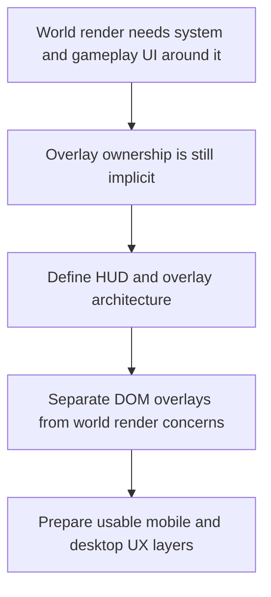

## req_011_define_ui_hud_and_overlay_system - Define UI HUD and overlay system
> From version: 0.5.0
> Status: Done
> Understanding: 100%
> Confidence: 98%
> Complexity: Medium
> Theme: UX
> Reminder: Update status/understanding/confidence and references when you edit this doc.
> Schema version: 1.0

# Needs
- Define the UI, HUD, and overlay system that will sit above or alongside the world render while remaining compatible with the fullscreen PixiJS application shell.
- Establish the role of lightweight DOM overlays versus world-space rendering for system UI, inspection UI, prompts, and future gameplay HUD elements.
- Treat fullscreen entry prompts, system prompts, and debug or inspection panels as DOM-owned by default.
- Favor contextual overlays at first and keep any permanently visible HUD extremely light.
- Keep the UX layer coherent across mobile and desktop without undermining the full-screen world ownership model.

# Context
The current requests focus mainly on the rendering shell, world map, entities, assets, and delivery infrastructure. However, the product will also need a coherent overlay layer for fullscreen prompts, debug diagnostics, selection and inspection surfaces, and later gameplay information such as HUD elements.

This cannot remain an implicit detail because the project already assumes a thin DOM overlay policy and a PixiJS-owned interactive world surface. Without a dedicated request, later implementation may blur system UI, gameplay HUD, and debug overlays into ad hoc layers with unclear ownership.

This request should define the UI and overlay model for the application: what belongs in DOM, what belongs in Pixi or world space, how overlays should behave over a moving and rotating camera, and how mobile and desktop layouts should stay readable without breaking immersion or control clarity.

The recommended default is to keep system-level UI in the DOM layer, especially fullscreen entry prompts, install or browser prompts, and debug or inspection panels. That plays to the strengths of the browser and keeps the world renderer focused on world-space content.

The scope should include product-level overlay architecture and UI ownership, but it should not yet lock in final visual design language, every gameplay screen, or a complete menu system.

At this stage, overlays should be mostly contextual rather than building a heavy always-on HUD. A minimal persistent layer may exist where needed, but the baseline should keep permanent chrome sparse.

# Acceptance criteria
- AC1: The request defines a dedicated UI or HUD or overlay scope rather than leaving overlay behavior implicit inside rendering requests.
- AC2: The request distinguishes between world-space visuals and screen-space UI or system overlays.
- AC3: The request treats fullscreen entry prompts, system prompts, and debug or inspection panels as DOM-owned by default.
- AC4: The request remains compatible with the fullscreen shell and thin DOM overlay direction already established.
- AC5: The request addresses mobile and desktop overlay behavior at a product level.
- AC6: The request favors contextual overlays first and keeps permanent HUD expectations intentionally light.
- AC7: The request stays compatible with debug diagnostics, selection or inspection surfaces, and future gameplay HUD needs.
- AC8: The request does not prematurely lock final art direction or every future menu flow.

# Definition of Ready (DoR)
- [x] Problem statement is explicit and user impact is clear.
- [x] Scope boundaries (in/out) are explicit.
- [x] Acceptance criteria are testable.
- [x] Dependencies and known risks are listed.

# Companion docs
- Product brief(s): `prod_001_minimal_overlay_and_feedback_for_early_runtime`, `prod_005_visual_identity_dark_fantasy_with_synthetic_energy_accents`
- Architecture decision(s): (none yet)

# AI Context
- Summary: Define the UI, HUD, and overlay system that will sit above or alongside the world render while remaining...
- Keywords: hud, and, overlay, system, the, will, sit, above
- Use when: Use when framing scope, context, and acceptance checks for Define UI HUD and overlay system.
- Skip when: Skip when the work targets another feature, repository, or workflow stage.

# Backlog
- `item_043_define_system_overlay_ownership_and_fullscreen_install_prompt_behavior`
- `item_044_define_minimal_player_facing_runtime_feedback_and_onboarding_surfaces`
- `item_045_define_contextual_inspection_panels_across_mobile_and_desktop`
- `item_046_define_debug_overlay_separation_from_player_facing_hud`
