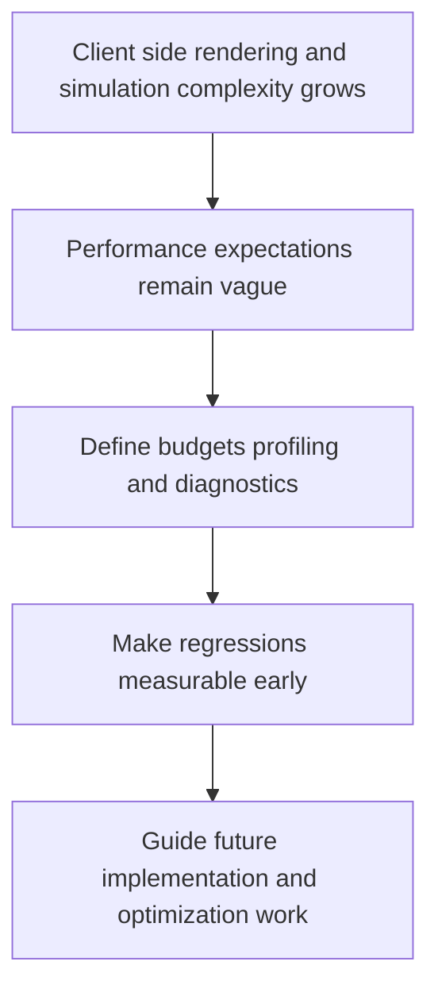

## req_012_define_performance_budgets_profiling_and_diagnostics - Define performance budgets profiling and diagnostics
> From version: 0.1.1
> Status: Ready
> Understanding: 93%
> Confidence: 90%
> Complexity: Medium
> Theme: Performance
> Reminder: Update status/understanding/confidence and references when you edit this doc.

# Needs
- Define performance budgets, profiling expectations, and diagnostics conventions for the static top-down 2D application.
- Establish which metrics matter first for the fullscreen shell, chunked world rendering, entity rendering, asset loading, and overlays.
- Define an explicit minimum-performance target for a mobile-sized reference experience rather than leaving "good enough" implicit.
- Require in-app diagnostics visibility for core runtime metrics, not only browser-devtools inspection.
- Make performance and diagnostics an explicit product or engineering contract rather than an ad hoc debugging activity.

# Context
The project already anticipates a fullscreen PixiJS shell, a moving and rotating camera, an infinite chunked world, evolving entities, debug overlays, and an asset pipeline. Those systems create real runtime risks on mobile and large screens, especially in a static frontend application where all rendering and simulation work happen client-side.

Performance therefore needs its own request rather than being left as a generic quality concern. The project should decide early what “acceptable” means for frame stability, chunk or entity counts, load behavior, and diagnostic visibility. Without that, later features may ship against vague expectations and only become measurable after regressions appear.

This request should define the first performance budgets and profiling contract for the project. It should cover useful budgets, observable metrics, profiling tools or hooks, and diagnostic visibility needed for development and future backlog work.

The recommended baseline is to define a concrete minimum target around a mobile-sized reference experience with visible chunks, preload margin, and debug entities still navigable smoothly. The exact numbers can evolve later, but the request should not stay purely qualitative.

The scope should stay compatible with frontend-only execution, PixiJS rendering, static delivery, and the debug-oriented posture already present in earlier requests. It should not yet require a full external observability platform or backend telemetry pipeline.

Diagnostics should also be visible inside the app during development, not only in browser tooling. Metrics such as FPS, frame time, visible chunks, visible entities, and approximate memory or asset pressure should be easy to inspect while the world is running.

For the first controllable-entity loop, the in-app diagnostics should also expose the most actionable movement and world metrics, such as controlled-entity position, movement speed or vector, current chunk, and camera state.

# Acceptance criteria
- AC1: The request defines dedicated performance and diagnostics expectations for the frontend application.
- AC2: The request identifies the first metrics or budgets relevant to shell rendering, world rendering, entity rendering, or loading behavior.
- AC3: The request defines an explicit minimum-performance target for a mobile-sized reference experience rather than relying only on qualitative language.
- AC4: The request requires in-app visibility for core diagnostics such as FPS, frame time, and world-load indicators during development.
- AC5: The request treats controlled-entity position, speed or movement vector, current chunk, and camera state as part of the preferred first in-app diagnostic set.
- AC6: The request remains compatible with the debug overlay and diagnostics direction already anticipated.
- AC7: The request addresses profiling expectations appropriate for a frontend-only static application.
- AC8: The request remains compatible with mobile and large-screen usage expectations.
- AC9: The request does not assume backend telemetry or paid observability tooling.

# Definition of Ready (DoR)
- [x] Problem statement is explicit and user impact is clear.
- [x] Scope boundaries (in/out) are explicit.
- [x] Acceptance criteria are testable.
- [x] Dependencies and known risks are listed.

# Companion docs
- Product brief(s): (none yet)
- Architecture decision(s): (none yet)

# Backlog
- `item_047_define_core_runtime_performance_budgets_and_mobile_reference_target`
- `item_048_define_the_standard_in_app_diagnostics_metric_set`
- `item_049_define_profiling_workflow_and_regression_review_expectations`
