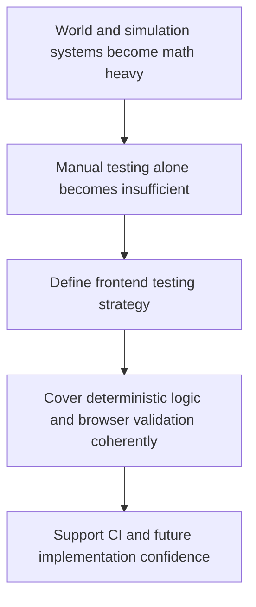

## req_013_define_frontend_testing_strategy_for_rendering_simulation_and_world_logic - Define frontend testing strategy for rendering simulation and world logic
> From version: 0.5.0
> Status: Done
> Understanding: 100%
> Confidence: 98%
> Complexity: Medium
> Theme: Quality
> Reminder: Update status/understanding/confidence and references when you edit this doc.
> Schema version: 1.0

# Needs
- Define the frontend testing strategy for rendering invariants, simulation behavior, world logic, and related deterministic systems.
- Clarify which parts of the project should be covered by unit tests, integration tests, scenario tests, or browser-level validation.
- Prioritize camera or transform invariants, chunk-visibility logic, and deterministic simulation checks as the first high-value automated targets.
- Include lightweight browser smoke validation early rather than postponing all browser-level checks.
- Ensure the testing model is aligned with the static React, PixiJS, Vite, and GitHub Actions direction already being prepared.

# Context
The project will soon combine rendering math, camera transforms, chunk visibility, deterministic world generation, simulation timing, entity updates, persistence, and overlay behavior. Many of the future bugs in such a system will not be ordinary UI bugs; they will be logic or coordinate bugs that need reproducible automated checks.

That makes testing a first-class concern. If the test strategy is not defined early, the project risks relying on manual playtesting for systems that actually need deterministic verification and browser-level regression coverage. A separate request is therefore appropriate before implementation spreads too far.

This request should define the testing strategy for the frontend application, including what kinds of tests are appropriate for math-heavy rendering logic, simulation loops, chunked world systems, entity state updates, and delivery-critical behavior such as static builds or basic smoke validation.

The recommended first priorities are the systems most likely to fail silently: camera or coordinate transforms, visible-chunk resolution, and deterministic simulation updates. Those areas carry more architectural risk than ordinary UI text or layout checks at this stage.

The scope should stay compatible with a frontend-only application and with the CI request already created. It should not yet require exhaustive end-to-end product coverage or enterprise-grade testing infrastructure.

Browser-level validation should still enter early in a lightweight form. A small smoke suite is more valuable now than a large end-to-end matrix that the project cannot maintain yet.

Once the first controllable-entity loop exists, the next high-value browser scenario should validate the core player path from directional drag input to visible entity movement, but only after the world and transform math is considered trustworthy.

# Acceptance criteria
- AC1: The request defines a dedicated testing strategy scope for the frontend project.
- AC2: The request distinguishes between at least some of the relevant test levels, such as unit, integration, browser, or scenario validation.
- AC3: The request treats camera or transform invariants, chunk-visibility logic, and deterministic simulation behavior as the first high-priority automated targets.
- AC4: The request includes lightweight browser smoke validation as an early part of the strategy.
- AC5: The request treats world or camera transform math as a higher early automation priority than the first player-loop browser scenario.
- AC6: Once the first controllable-entity loop exists, the strategy includes a browser-level check that validates directional input leading to visible entity movement.
- AC7: The request remains compatible with deterministic world or simulation behavior already anticipated in other requests.
- AC8: The request stays compatible with the future GitHub Actions CI pipeline.
- AC9: The request addresses testing concerns for rendering or coordinate logic at an appropriate level rather than treating the project as ordinary form-based UI only.
- AC10: The request does not require a disproportionate testing platform relative to the current project stage.

# Definition of Ready (DoR)
- [x] Problem statement is explicit and user impact is clear.
- [x] Scope boundaries (in/out) are explicit.
- [x] Acceptance criteria are testable.
- [x] Dependencies and known risks are listed.

# Companion docs
- Product brief(s): (none yet)
- Architecture decision(s): (none yet)

# AI Context
- Summary: Define the frontend testing strategy for rendering invariants, simulation behavior, world logic, and related deterministic systems.
- Keywords: frontend, testing, strategy, for, rendering, simulation, and, world
- Use when: Use when framing scope, context, and acceptance checks for Define frontend testing strategy for rendering simulation and world logic.
- Skip when: Skip when the work targets another feature, repository, or workflow stage.

# Backlog
- `item_050_define_unit_and_integration_testing_priorities_for_transforms_world_and_simulation`
- `item_051_define_browser_smoke_strategy_for_runtime_and_first_player_loop`
- `item_052_define_deterministic_fixtures_and_scenarios_for_automated_tests`
- `item_053_define_ci_test_execution_tiers_and_gating_rules`
