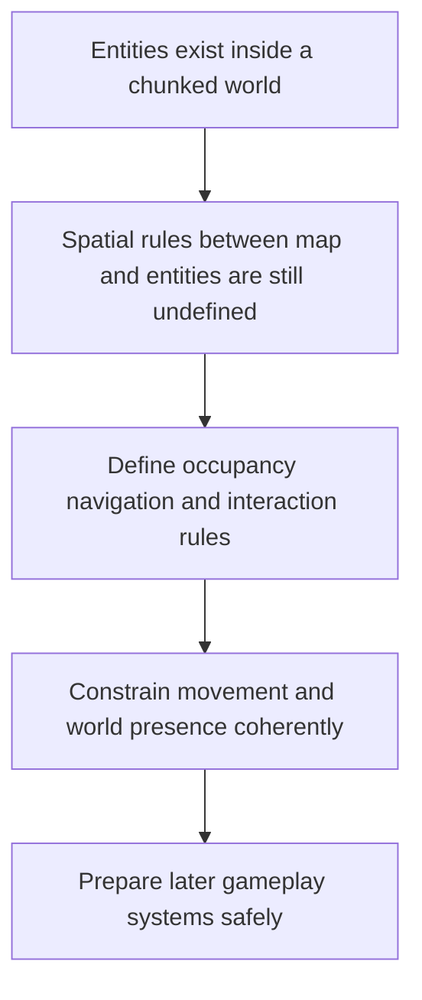

## req_014_define_world_occupancy_navigation_and_interaction_rules - Define world occupancy navigation and interaction rules
> From version: 0.5.0
> Status: Done
> Understanding: 100%
> Confidence: 98%
> Complexity: Medium
> Theme: Gameplay
> Reminder: Update status/understanding/confidence and references when you edit this doc.
> Schema version: 1.0

# Needs
- Define the rules that govern how entities occupy world space, move through it, and interact with terrain or other spatial constraints.
- Establish the first navigation and occupancy contract needed once entities stop being only visible objects and begin behaving inside the chunked world.
- Treat world space as continuous by default, with grid or tile structure used as a helper for some rules rather than the sole movement model.
- Tolerate overlaps initially where useful for debugging, while exposing them clearly through diagnostics rather than pretending resolution rules already exist.
- Keep the scope centered on spatial rules and interaction constraints rather than on AI sophistication or final gameplay balance.

# Context
The project already plans for a chunked infinite world and world entities that move and evolve. Those requests describe rendering and entity-state concerns, but they do not yet define the spatial rules that connect entities to the world itself.

That missing layer will become critical as soon as movement must respect terrain, entity footprints, navigation constraints, or occupancy decisions. If those rules are not explicitly designed, later implementation may let rendering assumptions drive world behavior, which would be the wrong dependency direction.

This request should define the first world-occupancy and navigation model for the project. It should cover how entities relate to tiles or world space, what it means to occupy an area, how movement interacts with the map, and what baseline interaction constraints are expected before more advanced AI or pathfinding layers exist.

The recommended baseline is a continuous world model with grid or tile structures used only where they add value to reasoning, indexing, or constraints. That stays consistent with the camera and rendering model already defined and avoids prematurely turning the world into a rigid tile game if that is not desired.

The scope should stay compatible with the top-down view, chunked streaming, entity footprints, and future interaction systems. It should not yet require a full pathfinding stack, combat system, or advanced physics engine.

For early slices, overlap situations can be tolerated and surfaced through diagnostics rather than fully resolved. That keeps the rules honest while avoiding premature complexity in collision or separation systems.

# Acceptance criteria
- AC1: The request defines a dedicated spatial-rules scope connecting entities and world space.
- AC2: The request addresses occupancy expectations for entities in relation to tiles or world coordinates.
- AC3: The request treats world space as continuous by default, with grid or tile structure used as a helper rather than the only movement model.
- AC4: The request addresses baseline navigation or traversal rules at a product or architecture level.
- AC5: The request remains compatible with the chunked world model and entity footprint expectations already defined elsewhere.
- AC6: The request allows early overlap situations to be tolerated and diagnosed before a fuller resolution model exists.
- AC7: The request does not overreach into advanced AI, combat, or full physics systems.
- AC8: The request remains compatible with future interaction and simulation requests.

# Definition of Ready (DoR)
- [x] Problem statement is explicit and user impact is clear.
- [x] Scope boundaries (in/out) are explicit.
- [x] Acceptance criteria are testable.
- [x] Dependencies and known risks are listed.

# Companion docs
- Product brief(s): `prod_002_readable_world_traversal_and_presence`, `prod_003_high_density_top_down_survival_action_direction`
- Architecture decision(s): (none yet)

# AI Context
- Summary: Define the rules that govern how entities occupy world space, move through it, and interact with terrain or...
- Keywords: world, occupancy, navigation, and, interaction, rules, the, govern
- Use when: Use when framing scope, context, and acceptance checks for Define world occupancy navigation and interaction rules.
- Skip when: Skip when the work targets another feature, repository, or workflow stage.

# Backlog
- `item_054_define_entity_occupancy_model_and_footprint_rules_in_world_space`
- `item_055_define_traversal_overlap_and_early_movement_constraint_behavior`
- `item_056_define_future_facing_navigation_and_terrain_interaction_contract`
- `item_057_define_player_facing_continuity_and_world_presence_expectations`
