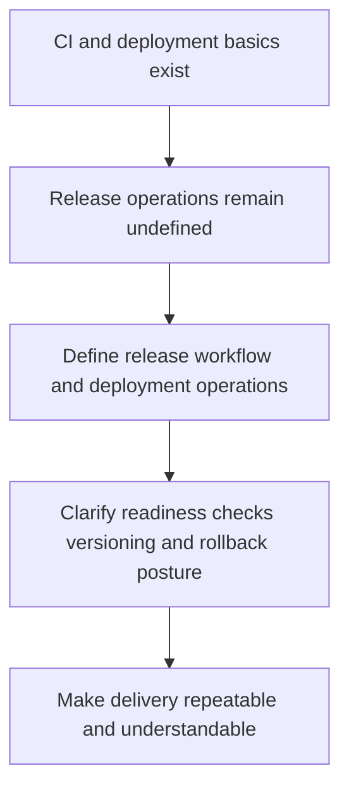

## req_015_define_release_workflow_and_deployment_operations - Define release workflow and deployment operations
> From version: 0.1.2
> Status: Ready
> Understanding: 95%
> Confidence: 92%
> Complexity: Medium
> Theme: Delivery
> Reminder: Update status/understanding/confidence and references when you edit this doc.

# Needs
- Define the release workflow and deployment operations needed after CI and Render static hosting basics are in place.
- Establish how validated builds should move toward deployable or released states, including versioning, smoke validation, rollback thinking, and operational hygiene appropriate for the project stage.
- Treat lightweight semantic versioning and a simple changelog discipline as the default release-identification model.
- Require a curated changelog that is up to date for every tagged release.
- Require a minimal post-deployment smoke check before considering a release healthy.
- Keep the scope pragmatic and aligned with a static frontend product deployed on Render.

# Context
The project now has separate requests for Render Blueprint delivery and GitHub Actions CI preparation. Those requests cover infrastructure readiness, but they do not yet define how the team should treat releases operationally once builds are passing and deployment becomes routine.

That operational gap matters because release quality is not the same as deployment configuration. A static site still benefits from clear versioning expectations, promotion or validation steps, rollback thinking, and a documented release workflow. Without that, delivery will remain technically possible but operationally vague.

This request should define the release workflow and deployment-operations model appropriate for the project. It should cover how the frontend build is considered ready to release, what checks should gate release confidence, how release artifacts or versions are identified, and what operational practices are expected for a static Render-hosted application.

The recommended baseline is intentionally lightweight: semantic versioning can stay simple, and the changelog can remain concise, but releases should still be explicitly identifiable rather than informal. Every tagged release should have a curated changelog entry or file that matches the released version, rather than relying only on generated notes or commit history. Likewise, a minimal post-deployment smoke check should exist so a deployed build is not assumed healthy without verification.

If preview-style environments are introduced later, they should start as technical validation surfaces rather than as separate product release channels with their own semantics.

The scope should stay aligned with the current scale of the project. It should not assume a complex platform team, multi-environment enterprise process, or backend operational stack. It should complement rather than duplicate the Render Blueprint and GitHub Actions requests.

# Acceptance criteria
- AC1: The request defines a release-workflow scope distinct from raw deployment configuration.
- AC2: The request remains compatible with the static Render-hosting model and the future GitHub Actions CI pipeline.
- AC3: The request treats lightweight semantic versioning and a curated changelog discipline as the intended default release-identification model, with no tagged release considered complete without an up-to-date changelog.
- AC4: The request addresses at least release readiness, version identification, and operational validation expectations, including a minimal post-deployment smoke check.
- AC5: If preview-style environments are introduced later, the request treats them first as technical validation surfaces rather than as separate product release channels.
- AC6: The request addresses rollback or recovery thinking appropriate to a static-site deployment.
- AC7: The request does not assume a backend service topology or an enterprise-grade release-management stack.
- AC8: The request complements rather than duplicates the Render Blueprint request.

# Definition of Ready (DoR)
- [x] Problem statement is explicit and user impact is clear.
- [x] Scope boundaries (in/out) are explicit.
- [x] Acceptance criteria are testable.
- [x] Dependencies and known risks are listed.

# Companion docs
- Product brief(s): (none yet)
- Architecture decision(s): `adr_012_require_curated_versioned_changelogs_for_releases`

# Backlog
- `item_058_define_release_readiness_gates_and_deployable_artifact_identification`
- `item_059_define_semantic_versioning_and_changelog_operating_model`
- `item_060_define_post_deployment_smoke_checks_and_rollback_posture`
- `item_061_define_preview_environment_role_in_the_delivery_workflow`
