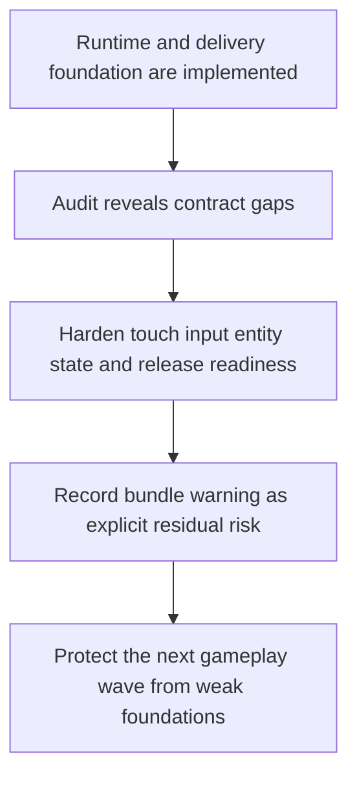

## req_016_harden_runtime_interaction_state_release_readiness_and_bundle_risk - Harden runtime interaction state release readiness and bundle risk
> From version: 0.1.0
> Status: Ready
> Understanding: 97%
> Confidence: 94%
> Complexity: Medium
> Theme: Quality
> Reminder: Update status/understanding/confidence and references when you edit this doc.

# Needs
- Harden the first playable runtime against behavior that currently contradicts the intended product and architecture contracts.
- Prevent mobile camera-debug gestures from leaking into the player-facing steering loop.
- Preserve the real simulation state of selected entities instead of overwriting it with selection UI state.
- Tighten release-readiness behavior so the command and workflow reflect the documented `release`-branch contract and required checks.
- Capture the remaining Pixi bundle-size warning as an explicit delivery and performance risk instead of leaving it as a known but undocumented warning.

# Context
The project now has a substantial runtime foundation, diagnostics, browser smoke coverage, and release workflow helpers. A global review of the implementation found that most of the stack is coherent and validated, but a few cross-cutting issues remain that should be fixed before the next gameplay wave builds on them.

The first issue is input ownership on mobile. The current player loop is designed around direct steering of a single entity, with camera debug controls intentionally separated from player controls. However, the runtime still allows multi-touch camera gestures to manipulate the camera even when camera debug mode is not enabled. That creates a real product contradiction on touch devices: a second finger can move the camera during the main loop instead of being rejected or ignored.

The second issue is state integrity. The runtime currently rewrites an entity's simulation state to `selected` when that entity is selected for inspection. This makes the selected entity easier to style in the UI, but it destroys the distinction between selection state and real simulation state such as `idle`, `moving`, or `inactive`. That weakens diagnostics, complicates future gameplay logic, and already forces browser smoke coverage to avoid relying on the inspection state field.

The third issue is release-readiness semantics. The project now documents a dedicated `release` branch and a release workflow with explicit gates, but the current helper script allows advisory execution from non-release branches and does not itself enforce the listed checks beyond the presence of `dist/`. That makes the command weaker than the documented intent and risks creating false confidence around release readiness.

The final issue is a residual risk rather than a current bug: the main Pixi bundle still crosses Vite's chunk-size warning threshold. Builds pass, but the warning is significant enough to deserve explicit handling in product or engineering planning. If ignored too long, that risk can turn into slower startup, weaker cache posture, or more expensive future optimization work once the runtime grows.

This request should therefore define a hardening slice that closes those correctness gaps and records the residual bundle risk as an explicit quality concern. It should remain compatible with the current shell, world, entity, CI, and release contracts. It should not turn into a broad rewrite of input, selection, or bundling architecture.

# Acceptance criteria
- AC1: The request fixes the mobile-input contract so player-facing touch steering does not accidentally trigger camera-debug gestures when debug camera mode is not active.
- AC2: The request separates selection or inspection state from the underlying simulation state so selected entities can still report their real gameplay state.
- AC3: The request aligns release-readiness behavior with the documented `release`-branch contract and required validation gates rather than leaving the helper command semantically weaker than the documentation.
- AC4: The request keeps browser smoke and diagnostics compatible with the corrected runtime state model.
- AC5: The request captures the current Pixi bundle-size warning as an explicit residual delivery or performance risk with a defined follow-up direction.
- AC6: The request remains compatible with the current static frontend, Render delivery model, and GitHub Actions workflow.
- AC7: The request stays scoped to hardening and correctness rather than broad product redesign.

# Definition of Ready (DoR)
- [x] Problem statement is explicit and user impact is clear.
- [x] Scope boundaries (in/out) are explicit.
- [x] Acceptance criteria are testable.
- [x] Dependencies and known risks are listed.

# Companion docs
- Product brief(s): `prod_000_initial_single_entity_navigation_loop`, `prod_002_readable_world_traversal_and_presence`
- Architecture decision(s): `adr_003_define_coordinate_spaces_and_camera_contract`, `adr_007_isolate_runtime_input_from_browser_page_controls`, `adr_013_use_a_dedicated_release_branch_for_deployable_static_releases`

# Backlog
- `item_062_harden_touch_input_ownership_against_camera_debug_gesture_leakage`
- `item_063_separate_entity_selection_presentation_from_simulation_state`
- `item_064_enforce_release_readiness_against_release_branch_and_required_gates`
- `item_065_capture_and_reduce_pixi_bundle_warning_risk`
